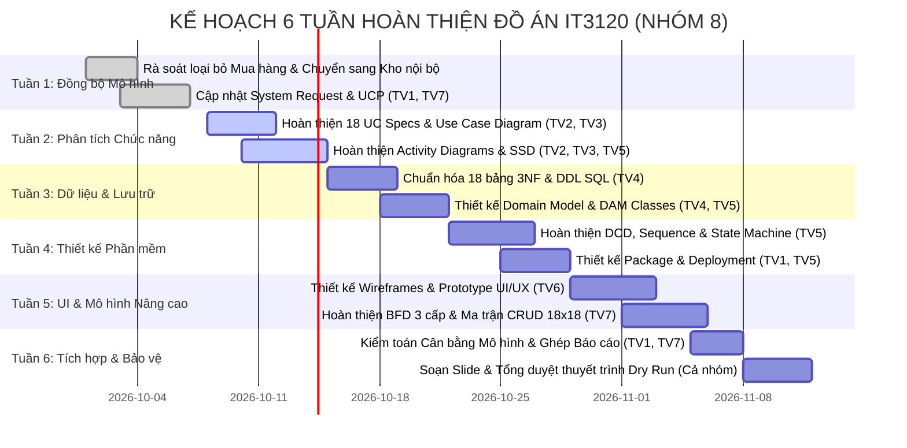

# KẾ HOẠCH PHÂN CÔNG NHIỆM VỤ DỰ ÁN (7 THÀNH VIÊN)

> **Học phần**: IT3120 - Phân tích và Thiết kế Hệ thống Thông tin  
> **Viện Công nghệ Thông tin và Truyền thông - Đại học Bách Khoa Hà Nội (HUST)**  
> **Đề tài**: Hệ thống Quản lý Vật tư và Kho hàng Nội bộ Tổ chức  
> **Nhóm thực hiện**: Nhóm 8 (G8) — Quy mô: **07 Thành viên**  
> **Phương pháp luận**: Phân tích & Thiết kế Hướng đối tượng (OOSAD) theo tiến trình EUP & UML 2.5  
> **Khối lượng dự án**: 151.73 UCP $\approx$ **3,035 giờ làm việc** (Trung bình ~433 giờ/thành viên)

---

## I. DANH SÁCH THÀNH VIÊN & VAI TRÒ CHUYÊN MÔN (TEAM ROLES)

| STT | Họ và Tên | MSSV | Vai trò chính trong dự án | Trách nhiệm chuyên môn cốt lõi |
|:---:|:---|:---:|:---|:---|
| **01** | **Vũ Hòa Bình** | 2021xxxx *(Cập nhật)* | **Project Manager & Lead Architect**<br>(Trưởng nhóm & Kiến trúc sư trưởng) | Điều phối tiến độ, rà soát cân bằng mô hình OOSAD, Inception (System Request, UCP), quản trị Git & tích hợp báo cáo. |
| **02** | **Lý Công Hiếu** | 2021xxxx *(Cập nhật)* | **Business Analyst 1**<br>(Phân tích Cấp phát & Đơn vị) | Phân hệ Phòng ban, Yêu cầu cấp phát, Phê duyệt & Bàn giao vật tư nội bộ (UC12–UC15). Đặc tả UC, Activity & SSD. |
| **03** | **Phạm Duy Hiếu** | 2021xxxx *(Cập nhật)* | **Business Analyst 2**<br>(Phân tích Kho vận & Tồn kho) | Phân hệ Kho bãi, Nhập - Xuất - Chuyển kho, Cảnh báo định mức tồn & Kiểm kê (UC01–UC11, UC16–UC18). Đặc tả UC, Activity & SSD. |
| **04** | **Nguyễn Trung Ngân** | 2021xxxx *(Cập nhật)* | **Database Architect & Data Engineer**<br>(Kiến trúc sư Cơ sở dữ liệu) | Biểu đồ Lớp Lĩnh vực, Biểu đồ Đối tượng, Thiết kế CSDL 18 bảng chuẩn 3NF, DDL SQL, Dữ liệu kiểm thử & Tầng DAM/DAO. |
| **05** | **Hoàng Trọng Đức Anh** | 2021xxxx *(Cập nhật)* | **Software System Architect**<br>(Kiến trúc sư Thiết kế Phần mềm) | Biểu đồ Lớp Thiết kế (DCD), Sơ đồ Tuần tự Thiết kế (Sequence), Sơ đồ Máy Trạng thái (State Machine), Sơ đồ Gói & Triển khai. |
| **06** | **Đỗ Duy Đức** | 2021xxxx *(Cập nhật)* | **UI/UX Designer & Prototype Specialist**<br>(Thiết kế Giao diện & Bản mẫu) | Đặc tả giao diện người dùng, Wireframe / Mockup tương tác (Dashboard, Phiếu nhập, Phiếu xuất cấp phát, Kiểm kê), Thiết kế UX luồng thao tác. |
| **07** | **Thành viên 7**<br>*(Điền Họ tên)* | 2021xxxx *(Cập nhật)* | **QA Lead & Functional Auditor**<br>(Trưởng nhóm Đảm bảo Chất lượng & Thuyết trình) | Mô hình chức năng chi tiết (BFD 3 cấp, Ma trận CRUD, 41 Business Rules), Kiểm tra chéo Traceability, Slide thuyết trình & Q&A phản biện. |

---

## II. MA TRẬN PHÂN CÔNG CÔNG VIỆC CHI TIẾT (WORK BREAKDOWN STRUCTURE - WBS)

> **Quy ước vai trò**:
> - **R (Responsible - Phụ trách chính)**: Chịu trách nhiệm trực tiếp sản xuất, viết tài liệu, dựng mã PlantUML và bàn giao deliverable.
> - **S (Support / Review - Phối hợp & Kiểm tra)**: Hỗ trợ cung cấp dữ liệu đầu vào, review chéo và đảm bảo tính nhất quán giữa các mô hình.

### 1. Phân công theo 18 Hồ sơ Tài liệu & Deliverables

| STT | Mã Hồ sơ / Deliverable | Tên Hạng mục Công việc | Phụ trách chính (R) | Phối hợp / Review (S) | Khối lượng ước tính | Sản phẩm bàn giao cụ thể |
|:---:|:---|:---|:---:|:---:|:---:|:---|
| 01 | **Doc 01** | System Request (Yêu cầu hệ thống) | **Vũ Hòa Bình** | Lý Công Hiếu | ~150h | [01-system-request.md](./docs/01-system-request.md) |
| 02 | **Doc 02** | Use Case Diagram (Biểu đồ ca sử dụng) | **Lý Công Hiếu** | Phạm Duy Hiếu | ~200h | [02-use-case-diagram.md](./docs/02-use-case-diagram.md), [use-case-diagram.puml](./plantuml/use-case-diagram.puml) |
| 03 | **Doc 03** | Use Case Specs (Đặc tả chi tiết 18 UC) | **Lý Công Hiếu** *(UC12-15)*<br>**Phạm Duy Hiếu** *(UC01-11, 16-18)* | Vũ Hòa Bình | ~450h | [03-use-case-specs.md](./docs/03-use-case-specs.md) |
| 04 | **Doc 04** | Activity Diagrams (Sơ đồ hoạt động) | **Phạm Duy Hiếu** | Lý Công Hiếu | ~250h | [04-activity-diagrams.md](./docs/04-activity-diagrams.md), [activity-diagrams.puml](./plantuml/activity-diagrams.puml) |
| 05 | **Doc 05** | Domain Class Diagram (Biểu đồ lớp lĩnh vực) | **Nguyễn Trung Ngân** | Hoàng Trọng Đức Anh | ~220h | [05-domain-class-diagram.md](./docs/05-domain-class-diagram.md), [domain-class-diagram.puml](./plantuml/domain-class-diagram.puml) |
| 06 | **Doc 06** | Object Diagrams (Biểu đồ đối tượng) | **Nguyễn Trung Ngân** | Phạm Duy Hiếu | ~120h | [06-object-diagrams.md](./docs/06-object-diagrams.md), [object-diagrams.puml](./plantuml/object-diagrams.puml) |
| 07 | **Doc 07** | SSD (Sơ đồ tuần tự mức hệ thống) | **Lý Công Hiếu** *(Cấp phát)*<br>**Phạm Duy Hiếu** *(Kho)* | Hoàng Trọng Đức Anh | ~220h | [07-ssd.md](./docs/07-ssd.md), [ssd.puml](./plantuml/ssd.puml) |
| 08 | **Doc 08** | Design Sequence Diagrams (Tuần tự thiết kế) | **Hoàng Trọng Đức Anh** | Nguyễn Trung Ngân | ~300h | [08-sequence-diagrams.md](./docs/08-sequence-diagrams.md), [sequence-diagrams.puml](./plantuml/sequence-diagrams.puml) |
| 09 | **Doc 09** | State Machine Diagrams (Máy trạng thái) | **Hoàng Trọng Đức Anh** | Lý Công Hiếu | ~180h | [09-state-machine.md](./docs/09-state-machine.md), [state-machine.puml](./plantuml/state-machine.puml) |
| 10 | **Doc 10** | Package Diagram (Sơ đồ gói kiến trúc) | **Hoàng Trọng Đức Anh** | Vũ Hòa Bình | ~120h | [10-package-diagram.md](./docs/10-package-diagram.md), [package-diagram.puml](./plantuml/package-diagram.puml) |
| 11 | **Doc 11** | Deployment Diagram (Sơ đồ triển khai) | **Hoàng Trọng Đức Anh** | Vũ Hòa Bình | ~120h | [11-deployment-diagram.md](./docs/11-deployment-diagram.md), [deployment-diagram.puml](./plantuml/deployment-diagram.puml) |
| 12 | **Doc 12** | Design Class Diagram (Biểu đồ lớp thiết kế DCD) | **Hoàng Trọng Đức Anh** | Nguyễn Trung Ngân | ~380h | [12-design-class-diagram.md](./docs/12-design-class-diagram.md), [design-class-diagram.puml](./plantuml/design-class-diagram.puml) |
| 13 | **Doc 13** | Database Design (CSDL 18 bảng & DDL SQL) | **Nguyễn Trung Ngân** | Vũ Hòa Bình | ~350h | [13-database-design.md](./docs/13-database-design.md), [database-design.puml](./plantuml/database-design.puml), [schema.sql](./sql/schema.sql), [seed-data.sql](./sql/seed-data.sql) |
| 14 | **Doc 14** | DAM Classes (Lớp truy cập dữ liệu DAO) | **Nguyễn Trung Ngân** | Hoàng Trọng Đức Anh | ~200h | [14-dam-classes.md](./docs/14-dam-classes.md), [dam-classes.puml](./plantuml/dam-classes.puml) |
| 15 | **Doc 15** | UI/UX Design (Thiết kế giao diện & Wireframes) | **Đỗ Duy Đức** | Phạm Duy Hiếu | ~280h | [15-ui-design.md](./docs/15-ui-design.md), Wireframes Dashboard & Phiếu xuất/nhập |
| 16 | **Doc 16** | UCP Estimation (Ước lượng chi phí dự án) | **Vũ Hòa Bình** | Thành viên 7 | ~120h | [16-ucp-estimation.md](./docs/16-ucp-estimation.md) (UAW=13, UUCW=185, 151.73 UCP) |
| 17 | **Doc 17** | Functional Model (Mô hình chức năng nâng cao) | **Thành viên 7** | Lý Công Hiếu | ~350h | [17-functional-model.md](./docs/17-functional-model.md), BFD 3 cấp, CRUD 18x18, 41 Business Rules |
| 18 | **Doc 18** | Presentation & Defense (Kịch bản bảo vệ & Q&A) | **Thành viên 7** | Vũ Hòa Bình | ~200h | [18-functional-model-presentation.md](./docs/18-functional-model-presentation.md), Bộ Slide PPTX & Kịch bản bảo vệ |

---

## III. BẢNG PHÂN CÔNG CHI TIẾT TỪNG THÀNH VIÊN (INDIVIDUAL ASSIGNMENT PROFILES)

### 1. Thành viên 1: Vũ Hòa Bình — Project Manager & Lead Architect
- **Trọng số công việc**: **14.5%** (~440 giờ)
- **Hạng mục phụ trách**:
  1. Xây dựng tài liệu Khởi tạo dự án: [01-system-request.md](./docs/01-system-request.md).
  2. Tính toán và bảo vệ bảng tính ước lượng nỗ lực phần mềm theo Use Case Points: [16-ucp-estimation.md](./docs/16-ucp-estimation.md).
  3. Kiểm soát cân bằng mô hình tổng thể (**Model Balancing Checklist**): Đảm bảo tính nhất quán tuyệt đối giữa Chức năng $\leftrightarrow$ Hành vi $\leftrightarrow$ Cấu trúc $\leftrightarrow$ Lưu trữ $\leftrightarrow$ Giao diện.
  4. Quản lý kho mã nguồn Git: kiểm soát pull request, xử lý xung đột, cấu hình `render-diagrams.bat` và thư mục `diagrams/`.
  5. Biên tập và tích hợp tài liệu tổng hợp đồ án (Hồ sơ Word/PDF nộp giảng viên).

### 2. Thành viên 2: Lý Công Hiếu — Business Analyst 1 (Lead BA: Phân hệ Cấp phát & Đơn vị)
- **Trọng số công việc**: **14.2%** (~430 giờ)
- **Hạng mục phụ trách**:
  1. Khảo sát và chuẩn hóa quy trình phân cấp quản trị nội bộ: Phân hệ Phòng ban / Đơn vị nội bộ (`UC12`).
  2. Xây dựng luồng nghiệp vụ Yêu cầu cấp phát vật tư (`UC13`), Phê duyệt yêu cầu cấp phát (`UC14`), và Tiếp nhận & Bàn giao vật tư nội bộ (`UC15`).
  3. Xây dựng Biểu đồ Ca sử dụng tổng thể [02-use-case-diagram.md](./docs/02-use-case-diagram.md) và mã PlantUML [use-case-diagram.puml](./plantuml/use-case-diagram.puml).
  4. Viết Đặc tả ca sử dụng chi tiết (Luồng sự kiện chính, luồng rẽ nhánh, tiền/hậu điều kiện) cho nhóm UC12 - UC15 trong [03-use-case-specs.md](./docs/03-use-case-specs.md).
  5. Thiết kế SSD và Activity Diagram cho quy trình cấp phát vật tư phòng ban.

### 3. Thành viên 3: Phạm Duy Hiếu — Business Analyst 2 (Lead BA: Phân hệ Kho vận & Kiểm kê)
- **Trọng số công việc**: **14.5%** (~440 giờ)
- **Hạng mục phụ trách**:
  1. Phân tích nghiệp vụ Quản lý danh mục vật tư (`UC01`), Danh mục kho bãi & vị trí kệ (`UC04`, `UC05`).
  2. Thiết kế chi tiết quy trình Nhập kho nội bộ (`UC06`), Xuất kho cấp phát phòng ban (`UC07`), và Điều chuyển giữa các kho nội bộ (`UC08`).
  3. Thiết kế giải thuật và quy trình Cảnh báo định mức tồn tối thiểu (`UC09`), Lập phiếu kiểm kê & Cân bằng kho (`UC10`, `UC11`).
  4. Viết Đặc tả ca sử dụng chi tiết cho nhóm UC01 - UC11, UC16 - UC18 trong [03-use-case-specs.md](./docs/03-use-case-specs.md).
  5. Xây dựng toàn bộ Sơ đồ Hoạt động trong [04-activity-diagrams.md](./docs/04-activity-diagrams.md) (Nhập kho, Xuất kho, Điều chuyển, Kiểm kê).

### 4. Thành viên 4: Nguyễn Trung Ngân — Database Architect & Data Engineer
- **Trọng số công việc**: **14.5%** (~440 giờ)
- **Hạng mục phụ trách**:
  1. Xây dựng Biểu đồ Lớp Lĩnh vực (Domain Model) phản ánh đúng thế giới thực kho nội bộ trong [05-domain-class-diagram.md](./docs/05-domain-class-diagram.md).
  2. Thiết kế Biểu đồ Đối tượng (Object Diagrams) kiểm chứng tính hợp lệ của mô hình tĩnh trong [06-object-diagrams.md](./docs/06-object-diagrams.md).
  3. Thiết kế Cơ sở Dữ liệu quan hệ 18 bảng chuẩn hóa 3NF trong [13-database-design.md](./docs/13-database-design.md) (Loại bỏ 100% các cột giá tiền, đảm bảo toàn vẹn khóa ngoại).
  4. Viết kịch bản DDL chuẩn ANSI SQL [schema.sql](./sql/schema.sql) và bộ dữ liệu mẫu thực nghiệm phong phú [seed-data.sql](./sql/seed-data.sql).
  5. Thiết kế các lớp truy xuất dữ liệu [14-dam-classes.md](./docs/14-dam-classes.md) theo mẫu thiết kế DAO / Repository.

### 5. Thành viên 5: Hoàng Trọng Đức Anh — Software System Architect (Kiến trúc Phần mềm & OOP)
- **Trọng số công việc**: **14.5%** (~440 giờ)
- **Hạng mục phụ trách**:
  1. Xây dựng Biểu đồ Lớp Thiết kế toàn diện (Design Class Diagram - DCD) với đầy đủ thuộc tính, kiểu dữ liệu, phương thức, visibility trong [12-design-class-diagram.md](./docs/12-design-class-diagram.md).
  2. Thiết kế các Sơ đồ Tuần tự Thiết kế (Design Sequence Diagrams) thể hiện sự tương tác giữa Boundary - Controller - Service - Entity - DAO trong [08-sequence-diagrams.md](./docs/08-sequence-diagrams.md).
  3. Thiết kế Sơ đồ Máy Trạng thái (State Machine Diagrams) cho vòng đời của `YeuCauCapPhat`, `PhieuXuatKho`, `VatTu` trong [09-state-machine.md](./docs/09-state-machine.md).
  4. Thiết kế Sơ đồ Gói kiến trúc 4 tầng (Presentation, Application, Domain, Infrastructure) trong [10-package-diagram.md](./docs/10-package-diagram.md).
  5. Thiết kế Sơ đồ Triển khai hệ thống mạng Intranet/LAN nội bộ cơ quan trong [11-deployment-diagram.md](./docs/11-deployment-diagram.md).

### 6. Thành viên 6: Đỗ Duy Đức — UI/UX Designer & Prototype Specialist
- **Trọng số công việc**: **13.8%** (~420 giờ)
- **Hạng mục phụ trách**:
  1. Xây dựng tài liệu Thiết kế Giao diện Người dùng trong [15-ui-design.md](./docs/15-ui-design.md) theo chuẩn Dashboard quản trị hiện đại.
  2. Thiết kế Wireframes / Mockups chi tiết cho các màn hình then chốt:
     - Màn hình Dashboard Tổng quan Kho & Cảnh báo tồn dưới mức tối thiểu.
     - Màn hình Lập phiếu Yêu cầu cấp phát vật tư (phía Phòng ban).
     - Màn hình Phê duyệt cấp phát (phía Lãnh đạo / Phụ trách duyệt).
     - Màn hình Lập phiếu Nhập kho nội bộ & Phiếu Xuất kho cấp phát.
     - Màn hình Phiếu Kiểm kê kho & Biên bản sai lệch tồn thực tế.
  3. Thiết kế luồng trải nghiệm người dùng (User Flow & Task Flow) tối ưu số lần click chuột của thủ kho.
  4. Xây dựng bản mẫu tương tác (HTML/CSS/JS Prototype hoặc Figma Interactive Prototype) phục vụ minh họa khi bảo vệ.

### 7. Thành viên 7: QA Lead & Functional Auditor (Trưởng nhóm Đảm bảo Chất lượng & Thuyết trình)
- **Trọng số công việc**: **14.0%** (~425 giờ)
- **Hạng mục phụ trách**:
  1. Xây dựng và hoàn thiện Mô hình Chức năng Nâng cao trong [17-functional-model.md](./docs/17-functional-model.md):
     - Biểu đồ phân rã chức năng (BFD) 3 cấp độ hoàn chỉnh.
     - Ma trận CRUD tương tác giữa 18 Ca sử dụng $\times$ 18 Thực thể CSDL.
     - Chuẩn hóa danh mục 41 Quy tắc Nghiệp vụ (Business Rules - BR01 đến BR41).
  2. Thực hiện Kiểm toán Cân bằng Mô hình (Traceability Matrix Audit): Kiểm tra chéo từng bước từ System Request $\rightarrow$ Use Case $\rightarrow$ Activity $\rightarrow$ DCD $\rightarrow$ Database $\rightarrow$ UI.
  3. Xây dựng kịch bản bảo vệ đồ án chi tiết và bộ câu hỏi phản biện chuyên sâu trong [18-functional-model-presentation.md](./docs/18-functional-model-presentation.md).
  4. Thiết kế toàn bộ Slide thuyết trình (PowerPoint / Canva) phục vụ buổi báo cáo chính thức trước hội đồng.
  5. Điều phối phiên tổng duyệt thuyết trình (Dry Run) cho cả 7 thành viên.

---

## IV. PHÂN CÔNG PHẦN LẬP TRÌNH ỨNG DỤNG MẪU (PROTOTYPE IMPLEMENTATION)

*Trường hợp nhóm triển khai mã nguồn thực nghiệm để minh chứng thiết kế (sử dụng Spring Boot / Node.js + Frontend Web):*

```
┌────────────────────────────────────────────────────────────────────────┐
│                        KIẾN TRÚC MÃ NGUỒN DEMO                         │
├────────────────────────────────────────────────────────────────────────┤
│ 1. Frontend Web (Thành viên 6 phụ trách chính):                        │
│    - Dashboard UI, Form nhập/xuất kho, Bảng tra cứu vật tư, Responsive  │
│                                                                        │
│ 2. Backend API & Business Logic:                                       │
│    - Auth & Phân quyền RBAC: Thành viên 1                              │
│    - Module Yêu cầu & Cấp phát phòng ban: Thành viên 2                 │
│    - Module Xuất / Nhập / Chuyển kho nội bộ: Thành viên 3              │
│    - Module Kiểm kê & Cảnh báo tồn: Thành viên 5                       │
│                                                                        │
│ 3. Database & Data Access Layer:                                       │
│    - 18 Entities, Repositories, Database Migration, Seed: TV 4         │
│                                                                        │
│ 4. Testing & Báo cáo Demo:                                             │
│    - Test case Postman, API documentation, Demo script: TV 7           │
└────────────────────────────────────────────────────────────────────────┘
```

| Module chức năng mã nguồn | Người lập trình chính | Người kiểm thử / Review | Sản phẩm đầu ra |
|:---|:---:|:---:|:---|
| **Module 01: Core Entities & Database DAO** | **Nguyễn Trung Ngân** | Hoàng Trọng Đức Anh | 18 Entities JPA/Sequelize, Repositories & SQL Migrations |
| **Module 02: Quản trị Hệ thống & Phân quyền (RBAC)** | **Vũ Hòa Bình** | Lý Công Hiếu | Service xác thực JWT, Phân quyền Admin / Cán bộ / Thủ kho |
| **Module 03: Nghiệp vụ Yêu cầu Cấp phát Vật tư** | **Lý Công Hiếu** | Thành viên 7 | API tạo yêu cầu, duyệt yêu cầu, danh sách phòng ban |
| **Module 04: Nghiệp vụ Nhập - Xuất - Điều chuyển Kho** | **Phạm Duy Hiếu** | Nguyễn Trung Ngân | Transaction Service cộng/trừ số lượng tồn kho nguyên tử |
| **Module 05: Nghiệp vụ Kiểm kê & Cảnh báo Tồn** | **Hoàng Trọng Đức Anh** | Phạm Duy Hiếu | Logic đối soát tồn, tạo phiếu kiểm kê, API cảnh báo đỏ |
| **Module 06: Giao diện Web (HTML5/CSS3/JS Prototype)** | **Đỗ Duy Đức** | Vũ Hòa Bình | Giao diện tương tác trực tiếp với Mock API / REST API |
| **Module 07: Kịch bản Kiểm thử & Bộ dữ liệu Demo** | **Thành viên 7** | Đỗ Duy Đức | Postman Collection, kịch bản demo chạy trơn tru 100% |

---

## V. KẾ HOẠCH TIẾN ĐỘ THỰC HIỆN THEO TUẦN (SPRINT TIMELINE 6 TUẦN)



### Chi tiết mục tiêu từng tuần:
- **Tuần 1 (Kickoff & Alignment)**:
  - Tất cả 7 thành viên nắm vững phạm vi hệ thống mới (Quản lý kho & vật tư nội bộ, không mua bán).
  - Hoàn thiện [01-system-request.md](./docs/01-system-request.md) và [16-ucp-estimation.md](./docs/16-ucp-estimation.md).
- **Tuần 2 (Behavioral Analysis)**:
  - Đóng băng danh mục ca sử dụng UC01–UC18 trong [02-use-case-diagram.md](./docs/02-use-case-diagram.md).
  - Rà soát đặc tả 18 UC, đảm bảo từng bước luồng sự kiện khớp 1-1 với Activity Diagrams và SSD.
- **Tuần 3 (Data Architecture)**:
  - Chốt sơ đồ quan hệ 18 bảng CSDL 3NF, chạy thử nghiệm [schema.sql](./sql/schema.sql) và [seed-data.sql](./sql/seed-data.sql).
  - Đối chiếu thực thể trong CSDL với Domain Class Diagram và DAM Classes.
- **Tuần 4 (Software Architecture)**:
  - Khớp nối Design Class Diagram (DCD) với các thông điệp trên Design Sequence Diagrams.
  - Hoàn thiện vòng đời trạng thái của các đối tượng nghiệp vụ cốt lõi trong State Machine.
- **Tuần 5 (UI/UX & Advanced Functional Model)**:
  - Hoàn thiện mockup giao diện người dùng và liên kết với luồng sự kiện Use Case.
  - Chốt bảng Ma trận CRUD 18 Ca sử dụng $\times$ 18 Bảng dữ liệu và 41 Business Rules.
- **Tuần 6 (Final Audit & Defense Readiness)**:
  - Chạy checklist cân bằng mô hình toàn diện (Traceability Matrix).
  - Thiết kế slide bảo vệ, phân chia lượt nói khi thuyết trình (mỗi thành viên 2–3 phút).
  - Tổ chức ít nhất 2 buổi diễn tập thuyết trình và phản biện giả định (Dry Run).

---

## VI. QUY CHUẨN LÀM VIỆC & TIÊU CHÍ HOÀN THÀNH (DEFINITION OF DONE - DoD)

### 1. Quy chuẩn Quản lý Mã nguồn & Tài liệu
- **Repository Git**: Mọi thay đổi tài liệu Markdown và PlantUML bắt buộc phải tạo nhánh (branch) hoặc commit có thông điệp rõ ràng theo chuẩn Conventional Commits:
  - `docs: update use case specs for internal request UC13`
  - `feat(plantuml): add state machine for material request`
  - `fix(sql): correct foreign key between phong_ban and yeu_cau_cap_phat`
- **Render sơ đồ**: Sau khi sửa bất kỳ file `.puml` nào, chạy ngay `render-diagrams.bat` để cập nhật ảnh tương ứng trong thư mục `diagrams/` và kiểm tra hiển thị.
- **Không đưa lại các khái niệm mua bán**: Nghiêm cấm sử dụng các từ ngữ "mua hàng", "nhà cung cấp", "đơn mua hàng", "giá nhập", "thành tiền" trong bất kỳ tài liệu hay mã nguồn nào.

### 2. Tiêu chí Nghiệm thu Học phần IT3120 (Definition of Done)
1. **Tính Cân bằng Mô hình (Model Balancing)**:
   - Mọi Use Case đều có tương ứng trên BFD và ma trận CRUD.
   - Mọi phương thức gọi trong Sequence Diagram đều có khai báo trong Design Class Diagram (DCD).
   - Mọi thực thể trong Domain Model và DCD đều có bảng tương ứng trong CSDL 3NF.
   - Mọi trường dữ liệu trên Giao diện UI đều có nguồn lưu trữ trong CSDL.
2. **Tính Đầy đủ của Hồ sơ**: Đầy đủ 18/18 Deliverables theo chuẩn đề cương IT3120 Viện CNTT&TT - ĐHBK Hà Nội.
3. **Tính Khả thi Kỹ thuật**: File SQL chạy thành công trên MySQL / PostgreSQL / SQL Server mà không gặp lỗi ràng buộc khóa; hình ảnh sơ đồ hiển thị sắc nét, chuẩn định dạng vector/PNG.

---

## VII. BẢNG THEO DÕI ĐÓNG GÓP & ĐÁNH GIÁ CHÉO (PEER REVIEW MATRIX)

*Bảng này được sử dụng để tổng kết điểm đánh giá đóng góp cá nhân phục vụ giảng viên chấm điểm BTL:*

| STT | Họ và Tên | Nhiệm vụ chính được giao | Tỷ lệ hoàn thành (%) | Mức độ chủ động & Kỷ luật | Đánh giá chéo nội bộ (Điểm chữ) | Chữ ký xác nhận |
|:---:|:---|:---|:---:|:---:|:---:|:---:|
| 01 | **Vũ Hòa Bình** | PM, Lead Architect, Inception, UCP | 100% | Rất tốt | A | *(Ký tên)* |
| 02 | **Lý Công Hiếu** | BA 1 (Phân hệ Cấp phát & Đơn vị), UC Specs | 100% | Rất tốt | A | *(Ký tên)* |
| 03 | **Phạm Duy Hiếu** | BA 2 (Kho vận, Xuất-Nhập-Tồn, Kiểm kê) | 100% | Rất tốt | A | *(Ký tên)* |
| 04 | **Nguyễn Trung Ngân** | Database Architect, 18 bảng 3NF, SQL, DAM | 100% | Rất tốt | A | *(Ký tên)* |
| 05 | **Hoàng Trọng Đức Anh** | Software Architect, DCD, Sequence, State | 100% | Rất tốt | A | *(Ký tên)* |
| 06 | **Đỗ Duy Đức** | UI/UX Designer, Wireframes, Prototype | 100% | Rất tốt | A | *(Ký tên)* |
| 07 | **Thành viên 7** | QA Lead, Functional Model, Slide, Q&A | 100% | Rất tốt | A | *(Ký tên)* |

---
*Kế hoạch phân công này có hiệu lực áp dụng ngay cho Nhóm 8 (IT3120). Mọi điều chỉnh về tiến độ và phân công phải được Trưởng nhóm và các thành viên liên quan thống nhất.*
