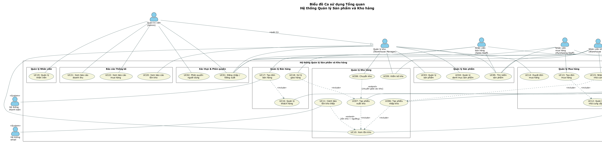

# 02 - Biểu đồ Ca sử dụng Tổng quan (Use Case Diagram)

## Danh sách các Tác nhân (Actors)

| Tác nhân | Loại | Trọng số UCP | Mô tả |
|----------|------|-------------|-------|
| Quản trị viên (Admin) | Complex | 3 | Quản lý toàn bộ hệ thống: nhân viên, phân quyền, báo cáo tổng hợp |
| Quản lý kho (Warehouse Manager) | Complex | 3 | Quản lý sản phẩm, danh mục, duyệt đơn mua, kiểm kê, báo cáo tồn kho |
| Nhân viên bán hàng (Sales Staff) | Complex | 3 | Tạo đơn bán hàng, quản lý khách hàng |
| Nhân viên mua hàng (Purchasing Staff) | Complex | 3 | Tạo đơn mua hàng, quản lý nhà cung cấp |
| Nhân viên kho (Warehouse Staff) | Complex | 3 | Thực hiện nhập/xuất kho, kiểm kê, giao hàng |
| Hệ thống thanh toán | Simple | 1 | API thanh toán bên ngoài (well-defined API) |
| Hệ thống email | Simple | 1 | Dịch vụ gửi email thông báo |

**Tổng UAW (Unadjusted Actor Weight) = 5×3 + 2×1 = 17**

## Danh sách các Ca sử dụng

| ID | Tên ca sử dụng | Tác nhân chính | Nhóm | Loại | Trọng số |
|----|----------------|----------------|------|------|---------|
| UC01 | Đăng nhập / Đăng xuất | Tất cả | Xác thực | Simple (1-3 trans.) | 5 |
| UC02 | Phân quyền người dùng | Admin | Xác thực | Average (4-7 trans.) | 10 |
| UC03 | Quản lý sản phẩm | Quản lý kho | Sản phẩm | Average | 10 |
| UC04 | Quản lý danh mục sản phẩm | Quản lý kho | Sản phẩm | Simple | 5 |
| UC05 | Tìm kiếm sản phẩm | Tất cả | Sản phẩm | Simple | 5 |
| UC06 | Tạo phiếu nhập kho | NV Kho | Kho hàng | Complex (>7 trans.) | 15 |
| UC07 | Tạo phiếu xuất kho | NV Kho | Kho hàng | Complex | 15 |
| UC08 | Chuyển kho | Quản lý kho | Kho hàng | Average | 10 |
| UC09 | Kiểm kê kho | Quản lý kho, NV Kho | Kho hàng | Complex | 15 |
| UC10 | Xem tồn kho | Quản lý kho, NV Kho | Kho hàng | Average | 10 |
| UC11 | Cảnh báo tồn kho thấp | Hệ thống (sự kiện trạng thái) | Kho hàng | Simple | 5 |
| UC12 | Quản lý nhà cung cấp | NV Mua hàng | Mua hàng | Average | 10 |
| UC13 | Tạo đơn mua hàng | NV Mua hàng | Mua hàng | Complex | 15 |
| UC14 | Duyệt đơn mua hàng | Quản lý kho | Mua hàng | Average | 10 |
| UC15 | Nhận hàng từ nhà cung cấp | NV Kho | Mua hàng | Complex | 15 |
| UC16 | Quản lý khách hàng | NV Bán hàng | Bán hàng | Average | 10 |
| UC17 | Tạo đơn bán hàng | NV Bán hàng | Bán hàng | Complex | 15 |
| UC18 | Xử lý giao hàng | NV Kho | Bán hàng | Average | 10 |
| UC19 | Quản lý nhân viên | Admin | Nhân viên | Average | 10 |
| UC20 | Xem báo cáo tồn kho | Quản lý kho | Báo cáo | Average | 10 |
| UC21 | Xem báo cáo doanh thu | Admin | Báo cáo | Average | 10 |
| UC22 | Xem báo cáo mua hàng | Admin | Báo cáo | Average | 10 |

**Tổng UUCW (Unadjusted Use Case Weight) = 5×5 + 13×10 + 4×15 = 25 + 130 + 60 = 215**

## Các mối quan hệ giữa các Ca sử dụng

### Quan hệ Include (bao gồm)
| Ca sử dụng gốc | Ca sử dụng được bao gồm | Lý do |
|----------------|-------------------------|-------|
| UC06 (Tạo phiếu nhập kho) | UC10 (Xem tồn kho) | Sau khi nhập kho, tồn kho được cập nhật và hiển thị |
| UC07 (Tạo phiếu xuất kho) | UC10 (Xem tồn kho) | Trước khi xuất kho, cần kiểm tra tồn kho |
| UC15 (Nhận hàng từ NCC) | UC06 (Tạo phiếu nhập kho) | Nhận hàng luôn kèm theo tạo phiếu nhập kho |
| UC18 (Xử lý giao hàng) | UC07 (Tạo phiếu xuất kho) | Giao hàng luôn kèm theo tạo phiếu xuất kho |
| UC13 (Tạo đơn mua hàng) | UC12 (Quản lý NCC) | Cần chọn nhà cung cấp khi tạo đơn mua |
| UC17 (Tạo đơn bán hàng) | UC16 (Quản lý KH) | Cần chọn khách hàng khi tạo đơn bán |

### Quan hệ Extend (mở rộng)
| Ca sử dụng gốc | Ca sử dụng mở rộng | Điều kiện kích hoạt |
|----------------|---------------------|---------------------|
| UC10 (Xem tồn kho) | UC11 (Cảnh báo tồn kho thấp) | Khi tồn kho giảm dưới ngưỡng cho phép |
| UC07 (Tạo phiếu xuất kho) | UC08 (Chuyển kho) | Khi xuất kho để chuyển sang kho khác |

## Sơ đồ Ca sử dụng Tổng quan



File mã nguồn PlantUML: [use-case-diagram.puml](../plantuml/use-case-diagram.puml)

Để re-render sơ đồ, sử dụng lệnh:
```bash
java -jar plantuml.jar plantuml/use-case-diagram.puml -o ../diagrams/
```

## Phân loại sự kiện

| Sự kiện | Loại | Ca sử dụng tương ứng |
|---------|------|---------------------|
| Khách hàng đặt mua sản phẩm | Sự kiện ngoại | UC17 |
| Nhà cung cấp giao hàng | Sự kiện ngoại | UC15 |
| Quản lý yêu cầu duyệt đơn mua | Sự kiện ngoại | UC14 |
| Nhân viên tạo phiếu nhập/xuất kho | Sự kiện ngoại | UC06, UC07 |
| Cuối tháng: tạo báo cáo | Sự kiện thời gian | UC20, UC21, UC22 |
| Tồn kho giảm dưới ngưỡng | Sự kiện trạng thái | UC11 |
