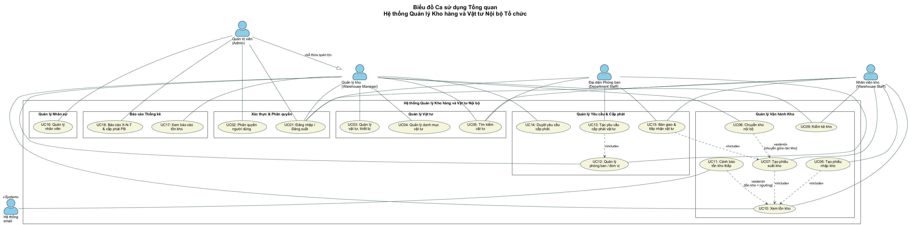

# 02 - Biểu đồ Ca sử dụng Tổng quan (Use Case Diagram)

## Danh sách các Tác nhân (Actors)

| Tác nhân | Loại | Trọng số UCP | Mô tả |
|----------|------|-------------|-------|
| Quản trị viên (Admin) | Complex | 3 | Quản trị toàn bộ hệ thống: quản lý tài khoản, phân quyền vai trò (RBAC), sao lưu dữ liệu |
| Quản lý kho (Warehouse Manager) | Complex | 3 | Quản lý danh mục vật tư, phê duyệt yêu cầu cấp phát, điều phối chuyển kho, kiểm kê, báo cáo |
| Đại diện Phòng ban (Department Staff) | Complex | 3 | Cán bộ đại diện phòng ban lập yêu cầu cấp phát vật tư, theo dõi tiến độ và ký nhận bàn giao |
| Nhân viên kho / Thủ kho (Warehouse Staff) | Complex | 3 | Tiếp nhận vật tư nhập kho, xuất kho cấp phát, bàn giao tài sản và thực hiện kiểm đếm thực tế |
| Hệ thống email (SMTP Service) | Simple | 1 | Dịch vụ gửi email thông báo kết quả duyệt cấp phát và gửi cảnh báo tồn kho tự động |

**Tổng UAW (Unadjusted Actor Weight) = 4 × 3 + 1 × 1 = 12 + 1 = 13**

---

## Danh sách các Ca sử dụng

| ID | Tên ca sử dụng | Tác nhân chính | Nhóm chức năng | Phân loại | Trọng số |
|----|----------------|----------------|----------------|-----------|---------|
| UC01 | Đăng nhập / Đăng xuất | Tất cả | Xác thực | Simple (1-3 trans.) | 5 |
| UC02 | Phân quyền người dùng | Admin | Xác thực | Average (4-7 trans.) | 10 |
| UC03 | Quản lý vật tư, thiết bị | Quản lý kho | Vật tư | Average | 10 |
| UC04 | Quản lý danh mục vật tư | Quản lý kho | Vật tư | Simple | 5 |
| UC05 | Tìm kiếm & tra cứu vật tư | Tất cả | Vật tư | Simple | 5 |
| UC06 | Tạo phiếu nhập kho nội bộ | NV Kho | Vận hành kho | Complex (>7 trans.) | 15 |
| UC07 | Tạo phiếu xuất kho nội bộ | NV Kho | Vận hành kho | Complex | 15 |
| UC08 | Chuyển kho nội bộ | Quản lý kho | Vận hành kho | Average | 10 |
| UC09 | Kiểm kê kho hàng | Quản lý kho, NV Kho | Vận hành kho | Complex | 15 |
| UC10 | Xem tồn kho & vị trí lưu | Quản lý kho, NV Kho | Vận hành kho | Average | 10 |
| UC11 | Cảnh báo tồn kho dưới ngưỡng | Hệ thống (sự kiện trạng thái) | Vận hành kho | Simple | 5 |
| UC12 | Quản lý phòng ban / đơn vị | Quản lý kho, Admin | Yêu cầu & Cấp phát | Average | 10 |
| UC13 | Tạo yêu cầu cấp phát vật tư | Đại diện Phòng ban | Yêu cầu & Cấp phát | Complex | 15 |
| UC14 | Duyệt yêu cầu cấp phát | Quản lý kho | Yêu cầu & Cấp phát | Average | 10 |
| UC15 | Bàn giao & tiếp nhận vật tư | NV Kho, Đại diện Phòng ban | Yêu cầu & Cấp phát | Complex | 15 |
| UC16 | Quản lý nhân viên | Admin | Nhân sự | Average | 10 |
| UC17 | Xem báo cáo tồn kho | Quản lý kho | Báo cáo | Average | 10 |
| UC18 | Báo cáo X-N-T & cấp phát PB | Admin, Quản lý kho | Báo cáo | Average | 10 |

**Tổng UUCW (Unadjusted Use Case Weight) = 4 × 5 + 9 × 10 + 5 × 15 = 20 + 90 + 75 = 185**

---

## Các mối quan hệ giữa các Ca sử dụng

### Quan hệ Include (Bao gồm)
| Ca sử dụng gốc | Ca sử dụng được bao gồm | Lý do nghiệp vụ |
|----------------|-------------------------|-----------------|
| UC06 (Tạo phiếu nhập kho) | UC10 (Xem tồn kho) | Sau khi nhập kho, dữ liệu tồn kho được tự động cập nhật và hiển thị |
| UC07 (Tạo phiếu xuất kho) | UC10 (Xem tồn kho) | Trước khi xuất kho, hệ thống bắt buộc kiểm tra tồn kho khả dụng để chống xuất âm |
| UC15 (Bàn giao & tiếp nhận vật tư) | UC07 (Tạo phiếu xuất kho) | Bàn giao vật tư cấp phát cho phòng ban luôn đi kèm thủ tục tạo phiếu xuất kho |
| UC13 (Tạo yêu cầu cấp phát) | UC12 (Quản lý phòng ban) | Cần chọn phòng ban/đơn vị hợp lệ trực thuộc tổ chức khi tạo phiếu yêu cầu |

### Quan hệ Extend (Mở rộng)
| Ca sử dụng gốc | Ca sử dụng mở rộng | Điều kiện kích hoạt |
|----------------|---------------------|---------------------|
| UC10 (Xem tồn kho) | UC11 (Cảnh báo tồn kho thấp) | Kích hoạt khi số lượng tồn kho giảm xuống dưới ngưỡng an toàn |
| UC07 (Tạo phiếu xuất kho) | UC08 (Chuyển kho nội bộ) | Mở rộng khi mục đích xuất là điều chuyển hàng hóa sang chi nhánh kho khác |

---

## Sơ đồ Ca sử dụng Tổng quan

File mã nguồn PlantUML: [use-case-diagram.puml](../plantuml/use-case-diagram.puml)

---

## Phân loại sự kiện nghiệp vụ

| Sự kiện kích hoạt | Loại sự kiện | Ca sử dụng tương ứng |
|-------------------|--------------|---------------------|
| Đơn vị cấp trên bàn giao hoặc phòng ban hoàn nhập vật tư | Sự kiện ngoại | UC06 |
| Phòng ban gửi yêu cầu cấp phát vật tư | Sự kiện ngoại | UC13, UC14 |
| Nhân viên kho lập phiếu xuất/nhập kho nội bộ | Sự kiện ngoại | UC06, UC07, UC15 |
| Định kỳ cuối tháng / quý: tạo báo cáo thống kê | Sự kiện thời gian | UC17, UC18 |
| Số lượng vật tư giảm dưới ngưỡng định mức an toàn | Sự kiện trạng thái | UC11 |