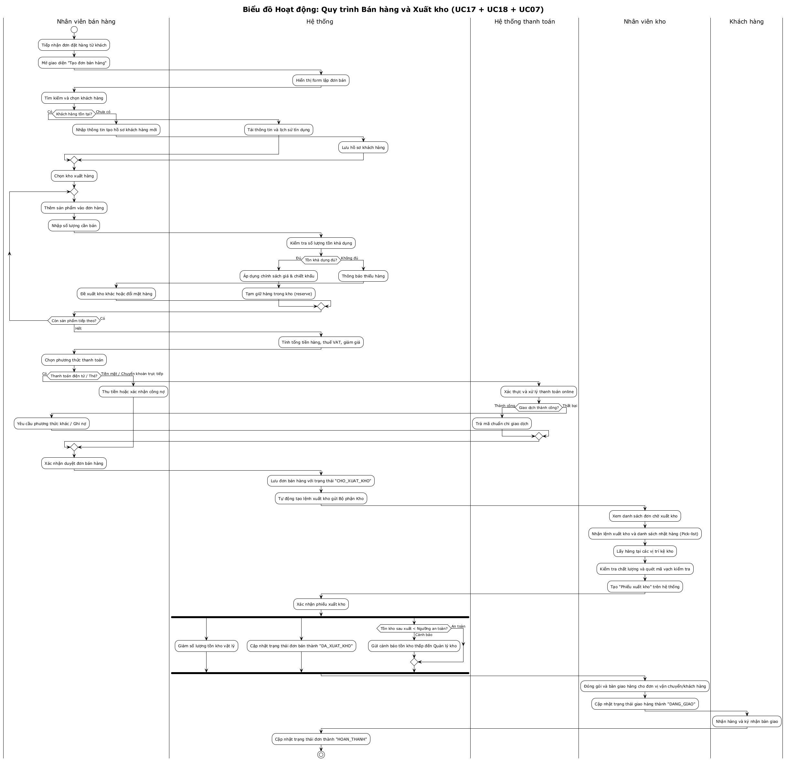

# 04 - Biểu đồ Hoạt động (Activity Diagrams)

## Giới thiệu và Phương pháp tiếp cận

Theo giáo trình **IT3120 - Phân tích và Thiết kế Hệ thống** (Đại học Bách Khoa Hà Nội), biểu đồ hoạt động (Activity Diagram) thuộc giai đoạn **Mô hình hóa chức năng** (Functional Modeling), giúp làm rõ:
- Trình tự các hành động, luồng điều khiển nghiệp vụ giữa người dùng và hệ thống.
- Các điểm rẽ nhánh điều kiện (Decision node), hội tụ (Merge node), phân luồng song song (Fork node) và kết hợp (Join node).
- Trách nhiệm của từng chủ thể tham gia thông qua **đường bơi (Swimlanes / Partitions)**.

Dưới đây là 4 biểu đồ hoạt động mô tả 4 quy trình cốt lõi của **Hệ thống Quản lý Sản phẩm và Kho hàng**.

---

## 1. Quy trình Nhập kho từ Đơn mua hàng (UC06 + UC15)

### Mô tả nghiệp vụ
Quy trình nhập kho bắt đầu khi Nhà cung cấp (NCC) vận chuyển hàng hóa đến kho theo Đơn đặt hàng mua (PO) đã được phê duyệt. Nhân viên kho tiếp nhận, kiểm đếm chất lượng và số lượng thực tế, lập Phiếu nhập kho, đồng thời hệ thống tự động cập nhật số lượng tồn kho và trạng thái đơn mua.

### Bảng phân tích trách nhiệm các đường bơi (Swimlanes)

| Chủ thể (Swimlane) | Nhiệm vụ / Hành động chính |
|-------------------|-----------------------------|
| **Nhà cung cấp** | Giao hàng đến kho theo đơn, thu hồi hàng nếu bị từ chối tiếp nhận |
| **Nhân viên kho** | Tiếp nhận hàng, kiểm đếm so sánh với PO, nhập dữ liệu phiếu nhập, in lưu phiếu |
| **Hệ thống** | Tải thông tin PO, kiểm tra tính hợp lệ dữ liệu, lưu phiếu nhập, tăng tồn kho (`TonKho += soLuongThucNhan`), cập nhật trạng thái đơn mua, ghi nhận log giao dịch |

### Sơ đồ Quy trình Nhập kho

---

## 2. Quy trình Bán hàng và Xuất kho (UC17 + UC18 + UC07)

### Mô tả nghiệp vụ
Quy trình tích hợp giữa bộ phận Bán hàng và bộ phận Kho:
1. **Giai đoạn Bán hàng**: Nhân viên bán hàng tiếp nhận yêu cầu, chọn khách hàng, thêm các sản phẩm, hệ thống kiểm tra tồn khả dụng, tính toán thuế và chiết khấu, xử lý thanh toán (tiền mặt hoặc cổng thanh toán trực tuyến) và xác nhận đơn hàng.
2. **Giai đoạn Xuất kho**: Hệ thống phát sinh yêu cầu nhặt hàng (Pick-list). Nhân viên kho lấy hàng theo vị trí kệ, kiểm tra đối chiếu mã vạch, lập Phiếu xuất kho, hệ thống giảm tồn kho vật lý và kích hoạt cảnh báo tồn kho thấp (UC11) nếu số lượng giảm dưới mức an toàn.

### Sơ đồ Quy trình Bán hàng và Xuất kho

---

## 3. Quy trình Kiểm kê Kho hàng (UC09)

### Mô tả nghiệp vụ
Kiểm kê là quy trình quan trọng nhằm đảm bảo tính toàn vẹn và khớp đúng giữa dữ liệu trên hệ thống và số lượng thực tế trong kho:
1. **Lập đợt kiểm kê**: Quản lý kho chỉ định kho, phạm vi kiểm kê (toàn bộ hoặc danh mục hàng).
2. **Chốt số liệu sổ sách (Stock Snapshot)**: Hệ thống ghi nhận số lượng tồn tại thời điểm bắt đầu và tạm khóa các thao tác xuất/nhập đối với các mặt hàng thuộc đợt kiểm kê để đảm bảo không bị sai lệch số liệu.
3. **Kiểm đếm thực tế**: Nhân viên kho sử dụng danh sách kiểm đếm (Count sheet) đếm thực tế và nhập kết quả vào hệ thống.
4. **Xử lý chênh lệch**: Hệ thống so sánh và hiển thị báo cáo chênh lệch (thừa/thiếu). Nếu sai lệch vượt ngưỡng, Quản lý kho có thể yêu cầu đếm lại lần 2.
5. **Cân đối và Điều chỉnh**: Sau khi phê duyệt giải trình lý do chênh lệch, hệ thống tự sinh các phiếu điều chỉnh tồn kho (nhập thừa / xuất thiếu) và mở khóa giao dịch.

### Sơ đồ Quy trình Kiểm kê Kho

---

## 4. Quy trình Mua hàng từ Nhà Cung Cấp (UC13 + UC14)

### Mô tả nghiệp vụ
Quy trình phục vụ việc tái bổ sung hàng hóa vào kho:
1. Nhân viên mua hàng nhận đề xuất nhập hàng (tự động từ hệ thống khi có cảnh báo tồn kho thấp hoặc thủ công).
2. Lựa chọn nhà cung cấp uy tín, thương lượng giá cả và lập Đơn mua hàng (Purchase Order - PO) với trạng thái `CHO_DUYET`.
3. Quản lý kho thẩm định đơn hàng dựa trên ngân sách, sức chứa kho bãi và nhu cầu thực tế. Nếu chấp thuận, đơn hàng chuyển sang `DA_DUYET` và tự động gửi email thông báo kèm bản PO dạng PDF tới Nhà cung cấp.
4. Trường hợp từ chối, Quản lý kho bắt buộc nhập lý do từ chối để Nhân viên mua hàng xử lý tiếp.

### Sơ đồ Quy trình Mua hàng

---

## Kiểm tra Tính nhất quán (Model Balancing)
- **Với Use Case**: Các hoạt động trong 4 biểu đồ hoạt động tương ứng trực tiếp với các bước trong Main Flow và Alternative Flows của tài liệu đặc tả [03-use-case-specs.md](./03-use-case-specs.md).
- **Với Lớp Phân tích**: Các đối tượng tham gia trao đổi dữ liệu (Đơn mua hàng, Phiếu nhập kho, Tồn kho, Đơn bán hàng, Phiếu xuất kho, Biên bản kiểm kê) hoàn toàn khớp với biểu đồ lớp mô hình lĩnh vực trong [05-domain-class-diagram.md](./05-domain-class-diagram.md).
