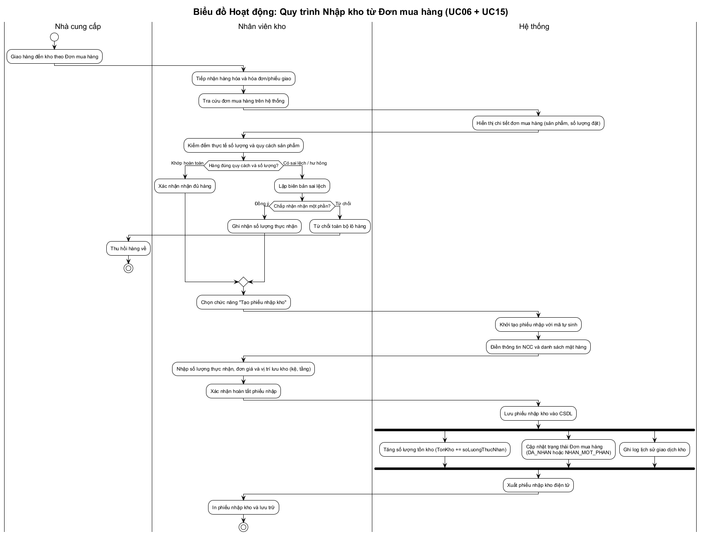
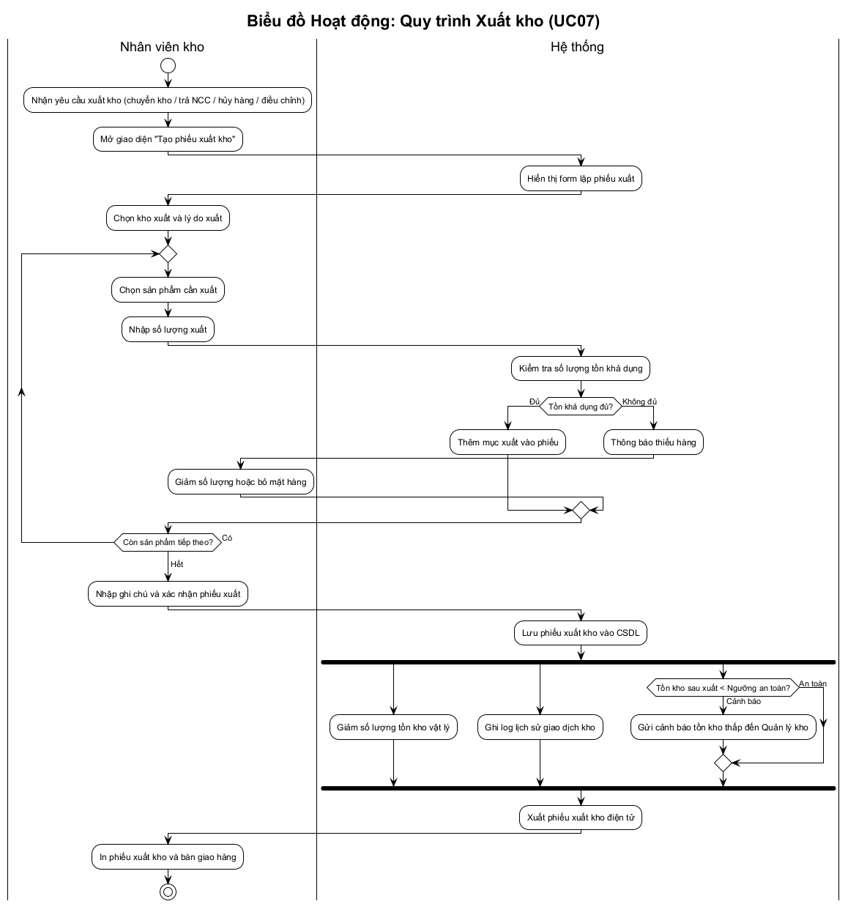
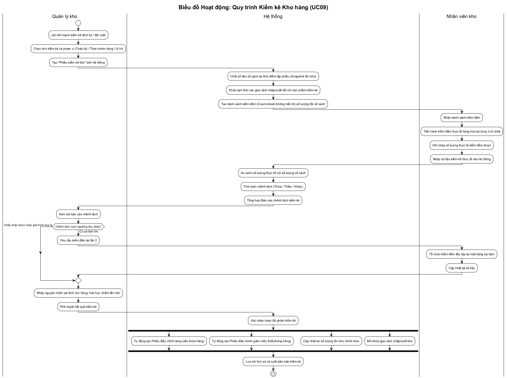
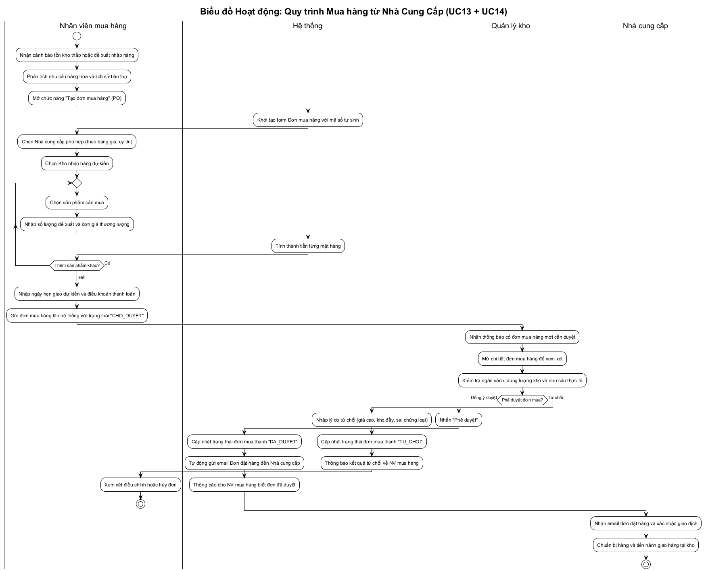

# 04 - Biểu đồ Hoạt động (Activity Diagrams)

## Giới thiệu và Phương pháp tiếp cận

Theo giáo trình **IT3120 - Phân tích và Thiết kế Hệ thống** (Đại học Bách Khoa Hà Nội), biểu đồ hoạt động (Activity Diagram) thuộc giai đoạn **Mô hình hóa chức năng** (Functional Modeling), giúp làm rõ:
- Trình tự các hành động, luồng điều khiển nghiệp vụ giữa người dùng và hệ thống.
- Các điểm rẽ nhánh điều kiện (Decision node), hội tụ (Merge node), phân luồng song song (Fork node) và kết hợp (Join node).
- Trách nhiệm của từng chủ thể tham gia thông qua **đường bơi (Swimlanes / Partitions)**.

Dưới đây là 4 biểu đồ hoạt động mô tả 4 quy trình cốt lõi của **Hệ thống Quản lý Sản phẩm và Kho hàng**.

---

## 1. Quy trình Nhập kho từ Đơn mua hàng (UC06 + UC15)

### Mô tả nghiệp vụ
Quy trình nhập kho bắt đầu khi Nhà cung cấp (NCC) vận chuyển hàng hóa đến kho theo Đơn đặt hàng mua (PO) đã được phê duyệt. Nhân viên kho tiếp nhận, kiểm đếm chất lượng và số lượng thực tế, lập Phiếu nhập kho, đồng thời hệ thống tự động cập nhật số lượng tồn kho và trạng thái đơn mua.

### Sơ đồ Quy trình Nhập kho

---

## 2. Quy trình Xuất kho (UC07)

### Mô tả nghiệp vụ
Quy trình xuất kho phục vụ các mục đích: chuyển kho nội bộ, trả hàng cho NCC, hủy hàng, hoặc điều chỉnh kiểm kê. Nhân viên kho nhận yêu cầu xuất, chọn kho và lý do xuất, thêm các sản phẩm cần xuất, hệ thống kiểm tra tồn kho khả dụng, lập phiếu xuất kho và tự động giảm tồn kho. Nếu tồn kho giảm dưới ngưỡng an toàn, hệ thống kích hoạt cảnh báo (UC11).

### Sơ đồ Quy trình Xuất kho

---

## 3. Quy trình Kiểm kê Kho hàng (UC09)

### Mô tả nghiệp vụ
Kiểm kê là quy trình quan trọng nhằm đảm bảo tính toàn vẹn và khớp đúng giữa dữ liệu trên hệ thống và số lượng thực tế trong kho:
1. **Lập đợt kiểm kê**: Quản lý kho chỉ định kho, phạm vi kiểm kê (toàn bộ hoặc danh mục hàng).
2. **Chốt số liệu sổ sách (Stock Snapshot)**: Hệ thống ghi nhận số lượng tồn tại thời điểm bắt đầu và tạm khóa các thao tác xuất/nhập.
3. **Kiểm đếm thực tế**: Nhân viên kho sử dụng danh sách kiểm đếm (Count sheet) đếm thực tế và nhập kết quả vào hệ thống.
4. **Xử lý chênh lệch**: Hệ thống so sánh và hiển thị báo cáo chênh lệch (thừa/thiếu).
5. **Cân đối và Điều chỉnh**: Sau khi phê duyệt, hệ thống tự sinh các phiếu điều chỉnh tồn kho và mở khóa giao dịch.

### Sơ đồ Quy trình Kiểm kê Kho

---

## 4. Quy trình Mua hàng từ Nhà Cung Cấp (UC13 + UC14)

### Mô tả nghiệp vụ
Quy trình phục vụ việc tái bổ sung hàng hóa vào kho:
1. Nhân viên mua hàng nhận đề xuất nhập hàng (tự động từ hệ thống khi có cảnh báo tồn kho thấp hoặc thủ công).
2. Lựa chọn nhà cung cấp uy tín, thương lượng giá cả và lập Đơn mua hàng (Purchase Order - PO) với trạng thái `CHO_DUYET`.
3. Quản lý kho thẩm định đơn hàng dựa trên ngân sách, sức chứa kho bãi và nhu cầu thực tế. Nếu chấp thuận, đơn hàng chuyển sang `DA_DUYET` và tự động gửi email thông báo kèm bản PO đến Nhà cung cấp.
4. Trường hợp từ chối, Quản lý kho bắt buộc nhập lý do từ chối.

### Sơ đồ Quy trình Mua hàng

---

## Kiểm tra Tính nhất quán (Model Balancing)
- **Với Use Case**: Các hoạt động trong 4 biểu đồ hoạt động tương ứng trực tiếp với các bước trong Main Flow và Alternative Flows của tài liệu đặc tả [03-use-case-specs.md](./03-use-case-specs.md).
- **Với Lớp Phân tích**: Các đối tượng tham gia trao đổi dữ liệu (Đơn mua hàng, Phiếu nhập kho, Tồn kho, Phiếu xuất kho, Biên bản kiểm kê) hoàn toàn khớp với biểu đồ lớp mô hình lĩnh vực trong [05-domain-class-diagram.md](./05-domain-class-diagram.md).