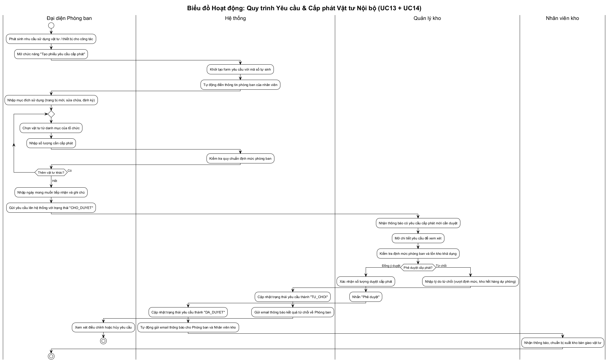

# 04 - Biểu đồ Hoạt động (Activity Diagrams)

## Giới thiệu và Phương pháp tiếp cận

Theo giáo trình **IT3120 - Phân tích và Thiết kế Hệ thống** (Đại học Bách Khoa Hà Nội), biểu đồ hoạt động (Activity Diagram) thuộc giai đoạn **Mô hình hóa chức năng** (Functional Modeling), giúp làm rõ:
- Trình tự các hành động, luồng điều khiển nghiệp vụ giữa người dùng và hệ thống.
- Các điểm rẽ nhánh điều kiện (Decision node), hội tụ (Merge node), phân luồng song song (Fork node) và kết hợp (Join node).
- Trách nhiệm của từng chủ thể tham gia thông qua **đường bơi (Swimlanes / Partitions)**.

Dưới đây là 4 biểu đồ hoạt động mô tả 4 quy trình cốt lõi của **Hệ thống Quản lý Kho hàng và Vật tư Nội bộ Tổ chức**.

---

## 1. Quy trình Nhập kho Vật tư Nội bộ (UC06)

### Mô tả nghiệp vụ
Quy trình nhập kho bắt đầu khi Đơn vị cấp trên phân bổ trang thiết bị hoặc các Phòng ban hoàn nhập/thu hồi vật tư về kho lưu trữ. Nhân viên kho tiếp nhận, kiểm đếm số lượng, kiểm tra quy cách chất lượng thực tế. Nếu đủ tiêu chuẩn, nhân viên kho lập Phiếu nhập kho trên hệ thống; hệ thống tự động tăng số lượng tồn kho vật lý và ghi nhật ký giao dịch.

### Sơ đồ Quy trình Nhập kho

---

## 2. Quy trình Xuất kho Nội bộ (UC07)

### Mô tả nghiệp vụ
Quy trình xuất kho phục vụ các mục đích nội bộ: cấp phát vật tư cho phòng ban theo phiếu yêu cầu đã duyệt, điều chuyển vật tư giữa các kho nội bộ, hoặc xuất thanh lý/tiêu hủy tài sản hỏng hóc. Nhân viên kho tiếp nhận lệnh xuất, chọn kho xuất và lý do, hệ thống kiểm tra tồn kho khả dụng để chống xuất âm, lập phiếu xuất kho và tự động giảm số lượng tồn kho. Nếu số lượng sau xuất giảm dưới ngưỡng an toàn, hệ thống tự động phát cảnh báo (UC11).

### Sơ đồ Quy trình Xuất kho

---

## 3. Quy trình Kiểm kê Kho hàng Nội bộ (UC09)

### Mô tả nghiệp vụ
Kiểm kê là quy trình định kỳ hoặc đột xuất nhằm đảm bảo tính toàn vẹn và khớp đúng giữa dữ liệu sổ sách trên hệ thống và số lượng vật tư thực tế trong kho:
1. **Lập đợt kiểm kê**: Quản lý kho chỉ định kho và phạm vi kiểm kê (toàn bộ hoặc theo nhóm danh mục).
2. **Chốt số liệu sổ sách (Stock Snapshot)**: Hệ thống ghi nhận số lượng tồn tại thời điểm bắt đầu và tạm khóa các thao tác xuất/nhập đối với các mặt hàng kiểm kê.
3. **Kiểm đếm thực tế**: Nhân viên kho sử dụng danh sách kiểm đếm (Count sheet) đếm thực tế tại các ô/kệ và nhập kết quả vào hệ thống.
4. **Xử lý chênh lệch**: Hệ thống so sánh và hiển thị báo cáo chênh lệch (thừa/thiếu).
5. **Cân đối và Điều chỉnh**: Sau khi Quản lý kho phê duyệt và nhập lý do giải trình, hệ thống tự sinh các phiếu điều chỉnh tồn kho và mở khóa giao dịch.

### Sơ đồ Quy trình Kiểm kê Kho

---

## 4. Quy trình Yêu cầu & Cấp phát Vật tư Nội bộ (UC13 + UC14)

### Mô tả nghiệp vụ
Quy trình phục vụ việc điều phối, cấp phát vật tư trang thiết bị từ kho lưu trữ đến các phòng ban, đơn vị trực thuộc tổ chức:
1. Khi có nhu cầu sử dụng trang thiết bị hoặc bổ sung vật tư phục vụ công tác, Đại diện Phòng ban mở chức năng "Lập yêu cầu cấp phát", chọn danh mục vật tư, nhập số lượng và nêu rõ mục đích sử dụng.
2. Phiếu yêu cầu được gửi lên hệ thống với trạng thái `CHO_DUYET`. Hệ thống gửi thông báo tự động đến Quản lý kho.
3. Quản lý kho xem xét yêu cầu dựa trên quy chuẩn định mức của phòng ban và lượng tồn kho khả dụng hiện tại:
   - Nếu chấp thuận: Nhấn "Phê duyệt", yêu cầu chuyển sang trạng thái `DA_DUYET`. Hệ thống tự động gửi email thông báo kết quả cho phòng ban và chuyển lệnh xuất kho cho Thủ kho chuẩn bị vật tư bàn giao.
   - Nếu từ chối: Quản lý kho bắt buộc nhập lý do từ chối (vượt định mức, không đúng mục đích, hết hàng dự phòng). Hệ thống chuyển trạng thái `TU_CHOI` và thông báo về phòng ban.

### Sơ đồ Quy trình Yêu cầu & Cấp phát

---

## Kiểm tra Tính nhất quán (Model Balancing)
- **Với Use Case**: Các hoạt động trong 4 biểu đồ hoạt động tương ứng trực tiếp với các bước trong Main Flow và Alternative Flows của tài liệu đặc tả [03-use-case-specs.md](./03-use-case-specs.md).
- **Với Lớp Phân tích**: Các đối tượng tham gia trao đổi dữ liệu (Phiếu yêu cầu cấp phát, Phiếu nhập kho, Tồn kho, Phiếu xuất kho, Biên bản kiểm kê) hoàn toàn khớp với biểu đồ lớp mô hình lĩnh vực trong [05-domain-class-diagram.md](./05-domain-class-diagram.md).