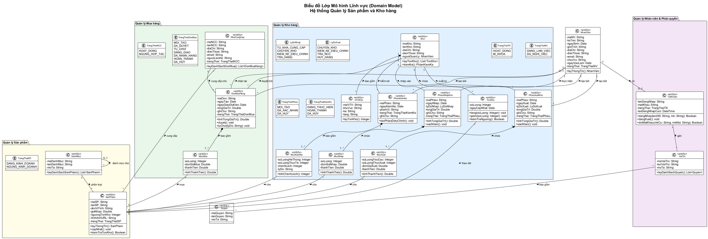

# 05 - Biểu đồ Lớp Mô hình Lĩnh vực (Domain Model Class Diagram)

## Giới thiệu và Cơ sở Lý thuyết

Theo giáo trình **IT3120 - Mô hình hóa Cấu trúc (Structural Modeling)**, biểu đồ lớp lĩnh vực (Domain Model Class Diagram) nhằm mục đích mô hình hóa các khái niệm thực tế trong bài toán nghiệp vụ mà không phụ thuộc vào công nghệ triển khai (chưa bao gồm Controller, DAO/Repository hay giao diện).

Phương pháp trích xuất lớp áp dụng:
1. **Phân tích ngữ nghĩa văn bản (Textual Analysis / Noun Extraction)**: Danh từ chỉ thực thể/lớp, động từ chỉ thao tác/hành vi, tính từ chỉ trạng thái/thuộc tính.
2. **Các mẫu phân tích chuẩn (Analysis Patterns)**:
   - **Party - Place - Transaction pattern**: Bên tham gia (NhaCungCap, NhanVien) - Địa điểm (Kho, ViTriKho) - Giao dịch (DonMuaHang, PhieuNhapKho, PhieuXuatKho, PhienKiemKe).
   - **Order Pattern (Header - Line Item)**: DonMuaHang - MucMua, PhieuNhapKho - MucNhap, PhieuXuatKho - MucXuat.
   - **Catalog - Item Pattern**: DanhMuc - SanPham, SanPham - TonKho.

---

## Danh mục các Gói nghiệp vụ và Lớp đối tượng

### 1. Gói Quản lý Sản phẩm
- `SanPham`: Lưu thông tin thuộc tính cơ bản của sản phẩm (mã, tên, đơn vị tính, giá nhập chuẩn, ngưỡng tồn kho an toàn, trạng thái lưu kho).
- `DanhMuc`: Phân loại cấu trúc sản phẩm dạng phân cấp (hỗ trợ quan hệ đệ quy `0..1 -- *` để tạo danh mục cha - con).
- `TrangThaiSP`: Enum quy định trạng thái `DANG_KINH_DOANH`, `NGUNG_KINH_DOANH`.

### 2. Gói Quản lý Kho hàng
- `Kho`: Đại diện cho thực thể kho vật lý (mã kho, tên kho, địa chỉ, số điện thoại, nhân viên thủ kho/quản lý kho).
- `ViTriKho`: Chi tiết vị trí lưu trữ hàng hóa trong kho (khu vực A/B/C, dãy kệ, tầng kệ).
- `TonKho`: Lớp liên kết giữa `Kho` và `SanPham`, quản lý số lượng tồn thực tế của một mặt hàng cụ thể tại một kho cụ thể.
- `PhieuNhapKho` & `MucNhap`: Chứng từ nhập hàng vào kho và các dòng chi tiết sản phẩm. Có quan hệ Hợp thành mạnh (Composition `1 *-- 1..*`).
- `PhieuXuatKho` & `MucXuat`: Chứng từ xuất hàng ra khỏi kho và chi tiết từng dòng mặt hàng xuất.
- `PhienKiemKe` & `MucKiemKe`: Biên bản kiểm kê định kỳ/đột xuất, ghi nhận số lượng sổ sách, số lượng thực tế và chênh lệch.

### 3. Gói Quản lý Mua hàng
- `DonMuaHang` & `MucMua`: Đơn đặt hàng gửi tới Nhà cung cấp (Purchase Order).
- `NhaCungCap`: Đối tác cung cấp sản phẩm cho doanh nghiệp.

### 4. Gói Quản lý Nhân viên & Phân quyền (RBAC)
- `NhanVien`: Hồ sơ nhân sự (họ tên, ngày sinh, chức vụ, trạng thái làm việc).
- `TaiKhoan`: Thông tin đăng nhập hệ thống (tên đăng nhập, mật khẩu mã hóa hash, trạng thái khóa/hoạt động).
- `VaiTro` & `Quyen`: Mô hình phân quyền dựa trên vai trò (Role-Based Access Control - RBAC).

---

## Bảng Chi tiết Thuộc tính và Phương thức

| Tên lớp | Thuộc tính chính | Phương thức chính | Mẫu áp dụng |
|---------|------------------|-------------------|-------------|
| **SanPham** | `maSP`, `tenSP`, `donViTinh`, `giaNhap`, `nguongTonKho`, `trangThai` | `layThongTin()`, `capNhat()`, `kiemTraTonKho()` | Entity / Item |
| **PhieuXuatKho** | `maPhieu`, `ngayXuat`, `lyDoXuat`, `khoDich`, `trangThai` | `xacNhan()`, `huyPhieu()` | Transaction Header |
| **MucXuat** | `soLuong`, `viTriKho`, `ghiChu` | `tinhThanhTien()` | Line Item |
| **TonKho** | `soLuong`, `ngayCapNhat` | `tang()`, `giam()`, `kiemTraNguong()` | Association Class |
| **PhieuNhapKho** | `maPhieu`, `ngayNhap`, `lyDoNhap`, `tongGiaTri`, `trangThai` | `tinhTongGiaTri()`, `xacNhan()` | Transaction Header |
| **MucNhap** | `soLuong`, `donGiaNhap`, `thanhTien` | `tinhThanhTien()` | Line Item |
| **DonMuaHang** | `maDon`, `ngayTao`, `ngayGiaoDuKien`, `tongGiaTri`, `trangThai` | `tinhTongGiaTri()`, `duyet()`, `tuChoi()` | Order Pattern |
| **PhienKiemKe** | `maPhien`, `ngayKiemKe`, `phamVi`, `trangThai` | `taoPhieuDieuChinh()` | Transaction |
| **MucKiemKe** | `soLuongHeThong`, `soLuongThucTe`, `chenhLech`, `lyDo` | `tinhChenhLech()` | Line Item |

---

## Cơ số và Ý nghĩa các Quan hệ (Multiplicities & Relationships)

1. **Composition (Quan hệ Hợp thành `1 *-- 1..*`)**:
   - `DonMuaHang` hợp thành `MucMua`: Một đơn mua phải có ít nhất 1 dòng mặt hàng. Nếu đơn mua bị hủy/xóa vật lý, các dòng chi tiết không thể tồn tại độc lập.
      - `PhieuNhapKho` hợp thành `MucNhap`, `PhieuXuatKho` hợp thành `MucXuat`, `PhienKiemKe` hợp thành `MucKiemKe`.
2. **Aggregation / Association**:
   - `Kho` và `TonKho`: `Kho 1 -- * TonKho` và `SanPham 1 -- * TonKho`. Đây là ánh xạ nhiều-nhiều giữa Kho và Sản phẩm được làm rõ bằng thuộc tính số lượng tồn.
   - `DanhMuc 0..1 -- * DanhMuc`: Quan hệ phân cấp danh mục tự quy chiếu (Reflexive association).

---

## Biểu đồ Lớp Lĩnh vực Rendered



## File nguồn PlantUML
Sơ đồ nguồn hoàn chỉnh: [domain-class-diagram.puml](../plantuml/domain-class-diagram.puml).
Render thành hình ảnh bằng lệnh:
```bash
java -jar plantuml.jar plantuml/domain-class-diagram.puml -o ../diagrams/
```
