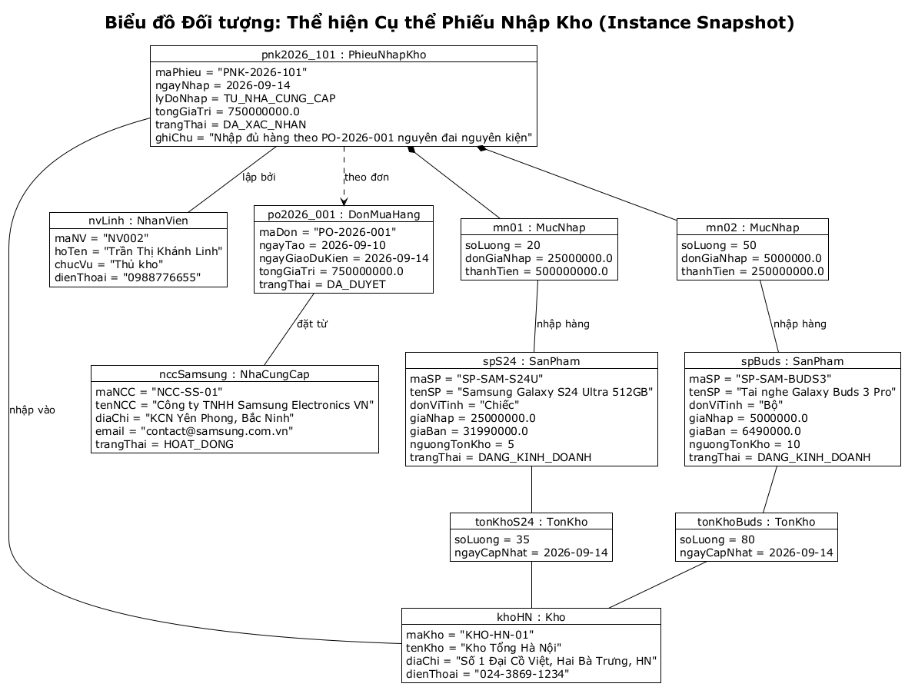
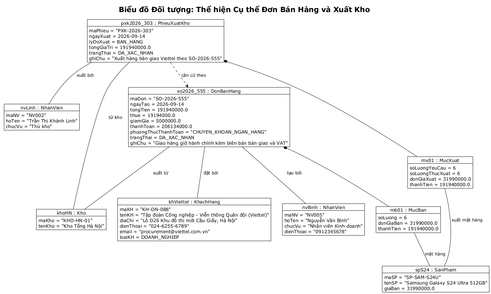

# 06 - Biểu đồ Đối tượng (Object Diagrams)

## Ý nghĩa và Mục đích

Theo giáo trình **IT3120 - Mô hình hóa Cấu trúc (Structural Modeling)**, biểu đồ đối tượng (Object Diagram):
- Là một **ảnh chụp tức thời (Snapshot)** của hệ thống tại một thời điểm cụ thể trong quá trình thực thi.
- Giúp xác minh và kiểm chứng tính đúng đắn của Biểu đồ lớp mô hình lĩnh vực (Domain Class Diagram) với các tập dữ liệu nghiệp vụ thực tế.
- Thể hiện sự liên kết giữa các đối tượng cụ thể (`instanceName : ClassName`) với các giá trị thuộc tính cụ thể (`attribute = value`).

---

## 1. Biểu đồ Đối tượng: Phiếu Nhập Kho thực tế

### Bối cảnh nghiệp vụ
Ngày 14/09/2026, Nhà cung cấp **Samsung Electronics Việt Nam** giao lô hàng theo đơn mua `PO-2026-001`. Thủ kho **Trần Thị Khánh Linh** tại **Kho Tổng Hà Nội** tiến hành lập phiếu nhập kho `PNK-2026-101` với 2 mặt hàng:
1. 20 chiếc *Samsung Galaxy S24 Ultra 512GB* với đơn giá nhập 25,000,000 VNĐ (Thành tiền: 500,000,000 VNĐ).
2. 50 bộ *Tai nghe Galaxy Buds 3 Pro* với đơn giá nhập 5,000,000 VNĐ (Thành tiền: 250,000,000 VNĐ).

Tổng giá trị phiếu nhập: 750,000,000 VNĐ. Số lượng tồn kho tại kho Hà Nội của 2 sản phẩm tương ứng tăng lên 35 và 80.

### Sơ đồ đối tượng Phiếu Nhập Kho

---

## 2. Biểu đồ Đối tượng: Đơn Bán Hàng và Phiếu Xuất Kho

### Bối cảnh nghiệp vụ
Khách hàng doanh nghiệp **Tập đoàn Viettel** đặt mua thiết bị. Nhân viên kinh doanh **Nguyễn Văn Bình** tạo đơn bán `SO-2026-555` bao gồm 6 chiếc *Samsung Galaxy S24 Ultra 512GB* với đơn giá 31,990,000 VNĐ.
Sau khi xác nhận thanh toán chuyển khoản và chiết khấu, Thủ kho **Trần Thị Khánh Linh** phát hành Phiếu xuất kho `PXK-2026-303` với số lượng thực xuất là 6 chiếc để bàn giao cho đối tác.

### Sơ đồ đối tượng Đơn Bán Hàng & Phiếu Xuất Kho

---

## Kiểm tra Tính nhất quán với Biểu đồ Lớp (Model Balancing)
- **Tên thuộc tính và kiểu dữ liệu**: Hoàn toàn trùng khớp với định nghĩa trong lớp [domain-class-diagram.puml](../plantuml/domain-class-diagram.puml).
- **Cơ số (Multiplicity)**:
  - `pnk2026_101` liên kết hợp thành đúng với 2 `MucNhap` (`1 *-- 1..*`).
  - Mỗi `MucNhap` liên kết chính xác với một thể hiện `SanPham`.
  - `TonKho` phản ánh đúng quan hệ tam giác giữa `SanPham` và `Kho`.
