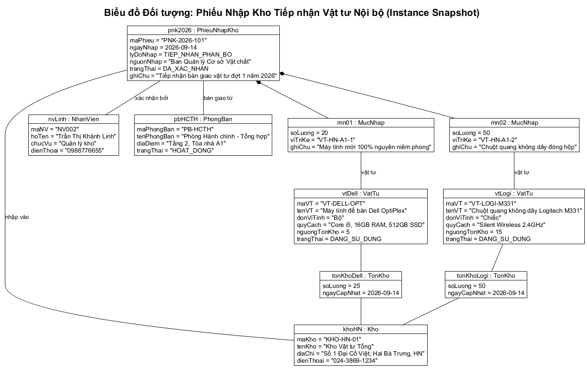
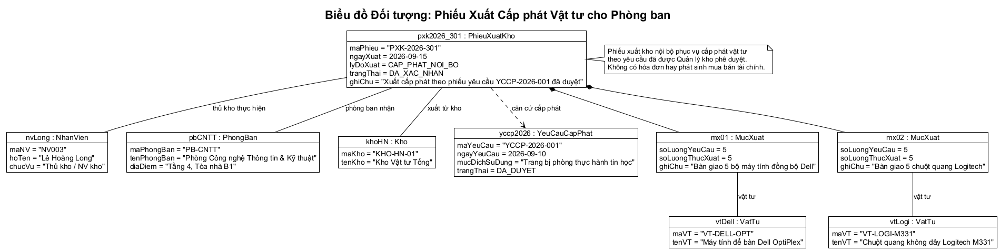

# 06 - Biểu đồ Đối tượng (Object Diagrams)

## Ý nghĩa và Mục đích

Theo giáo trình **IT3120 - Mô hình hóa Cấu trúc (Structural Modeling)**, biểu đồ đối tượng (Object Diagram):
- Là một **ảnh chụp tức thời (Snapshot)** của hệ thống tại một thời điểm cụ thể trong quá trình thực thi.
- Giúp xác minh và kiểm chứng tính đúng đắn của Biểu đồ lớp mô hình lĩnh vực (Domain Class Diagram) với các tập dữ liệu nghiệp vụ thực tế.
- Thể hiện sự liên kết giữa các đối tượng cụ thể (`instanceName : ClassName`) với các giá trị thuộc tính cụ thể (`attribute = value`).

---

## 1. Biểu đồ Đối tượng: Phiếu Nhập Kho Tiếp nhận Vật tư

### Bối cảnh nghiệp vụ
Ngày 14/09/2026, **Phòng Hành chính - Tổng hợp** tiến hành bàn giao lô vật tư trang bị đợt 1 năm 2026 về **Kho Vật tư Tổng**. Quản lý kho **Trần Thị Khánh Linh** tiến hành lập và xác nhận phiếu nhập kho `PNK-2026-101` với 2 mặt hàng:
1. 20 bộ *Máy tính để bàn Dell OptiPlex* (xếp tại vị trí kệ `VT-HN-A1-1`).
2. 50 chiếc *Chuột quang không dây Logitech M331* (xếp tại vị trí kệ `VT-HN-A1-2`).

Số lượng tồn kho tại Kho Tổng của 2 vật tư trên tương ứng được cập nhật tăng lên thành 25 bộ máy tính và 50 chuột.

### Sơ đồ đối tượng Phiếu Nhập Kho

---

## 2. Biểu đồ Đối tượng: Phiếu Xuất Kho Cấp phát Vật tư cho Phòng ban

### Bối cảnh nghiệp vụ
Ngày 15/09/2026, thủ kho **Lê Hoàng Long** thực hiện xuất kho cấp phát vật tư cho **Phòng Công nghệ Thông tin & Kỹ thuật** căn cứ theo phiếu yêu cầu cấp phát `YCCP-2026-001` đã được Quản lý kho phê duyệt. Phiếu xuất kho `PXK-2026-301` được lập với 2 mặt hàng:
1. 5 bộ *Máy tính để bàn Dell OptiPlex*.
2. 5 chiếc *Chuột quang không dây Logitech M331*.

Lý do xuất: `CAP_PHAT_NOI_BO`. Sau khi hoàn tất xuất kho, tồn kho tại Kho Tổng giảm đi 5 bộ máy tính (còn 20 bộ) và giảm 5 chuột (còn 45 chiếc). Đại diện phòng ban ký nhận biên bản bàn giao.

### Sơ đồ đối tượng Phiếu Xuất Cấp phát

---

## Kiểm tra Tính nhất quán với Biểu đồ Lớp (Model Balancing)
- **Tên thuộc tính và kiểu dữ liệu**: Hoàn toàn trùng khớp với định nghĩa trong lớp [domain-class-diagram.puml](../plantuml/domain-class-diagram.puml).
- **Cơ số (Multiplicity)**:
  - `pnk2026` liên kết hợp thành dòng với 2 `MucNhap` (`1 *-- 1..*`).
  - Mỗi `MucNhap` liên kết chính xác với một thể hiện `VatTu`.
  - `TonKho` phản ánh đúng quan hệ tam giác giữa `VatTu` và `Kho`.
  - Phiếu xuất kho liên kết chặt chẽ với đối tượng `PhongBan` nhận và đối tượng `YeuCauCapPhat`.