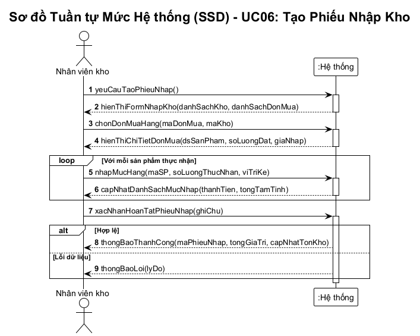
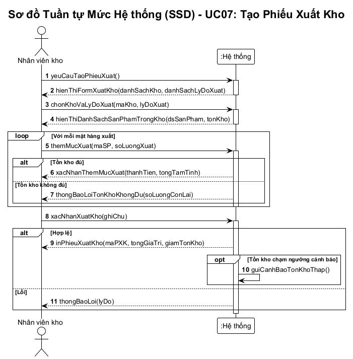
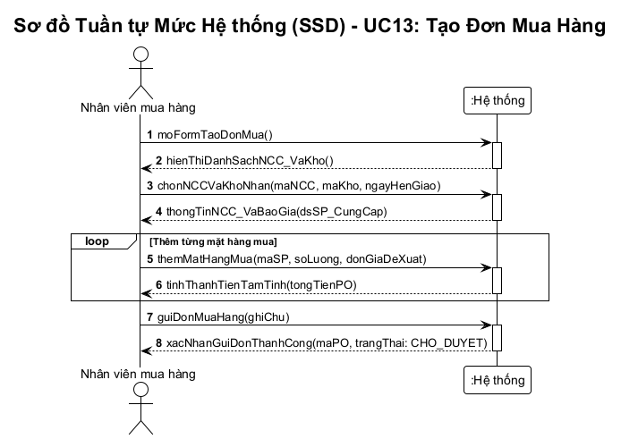
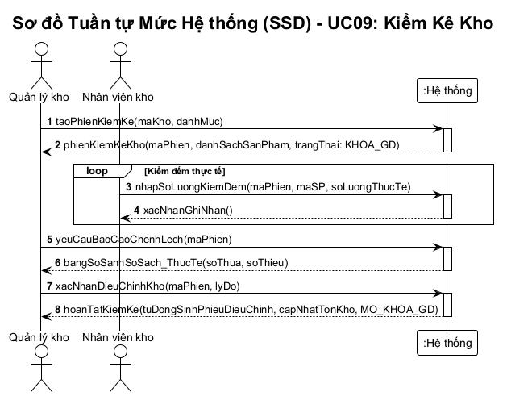

# 07 - Sơ đồ Tuần tự Mức Hệ thống (System Sequence Diagrams - SSD)

## Khái niệm và Vai trò

Theo giáo trình **IT3120 - Mô hình hóa Hành vi (Behavioral Modeling)**:
- **System Sequence Diagram (SSD)** mô tả tương tác giữa các tác nhân bên ngoài (Actors) và hệ thống trong phạm vi một ca sử dụng (Use Case).
- Hệ thống được coi như một **hộp đen (Black Box)** đại diện bởi đối tượng `:Hệ thống` (`:System`).
- SSD định nghĩa rõ các **sự kiện hệ thống (System Events)** và thông điệp phản hồi (Return Messages / Data Displays).

---

## 1. SSD cho UC06: Tạo Phiếu Nhập Kho
- **Tác nhân**: Nhân viên kho.
- **Sự kiện chính**:
  1. `yeuCauTaoPhieuNhap()`: Khởi tạo phiên làm việc nhập kho.
  2. `chonDonMuaHang(maDonMua, maKho)`: Liên kết phiếu nhập với Đơn mua hàng gốc.
  3. `nhapMucHang(maSP, soLuongThucNhan, viTriKe)`: Vòng lặp nhập chi tiết từng mặt hàng.
  4. `xacNhanHoanTatPhieuNhap(ghiChu)`: Chốt phiếu và thực thi ghi sổ tồn kho.

---

## 2. SSD cho UC07: Tạo Phiếu Xuất Kho
- **Tác nhân**: Nhân viên kho.
- **Sự kiện chính**:
  1. `yeuCauTaoPhieuXuat()`: Mở form xuất kho.
  2. `chonKhoVaLyDoXuat(maKho, lyDoXuat)`: Chọn kho xuất và lý do (chuyển kho, trả NCC, hủy, điều chỉnh).
  3. `themMucXuat(maSP, soLuongXuat)`: Xác thực tồn kho và thêm mục xuất.
  4. `xacNhanXuatKho(ghiChu)`: Ghi nhận giảm tồn kho, tự động kích hoạt cảnh báo nếu chạm ngưỡng.

---

## 3. SSD cho UC13: Tạo Đơn Mua Hàng
- **Tác nhân**: Nhân viên mua hàng.
- **Sự kiện chính**:
  1. `moFormTaoDonMua()` & `chonNCCVaKhoNhan()`: Chỉ định nhà cung cấp và điểm tập kết hàng.
  2. `themMatHangMua(maSP, soLuong, donGiaDeXuat)`: Lập danh sách mặt hàng.
  3. `guiDonMuaHang(ghiChu)`: Chuyển đơn sang trạng thái `CHO_DUYET`.

---

## 4. SSD cho UC09: Kiểm Kê Kho
- **Tác nhân**: Quản lý kho, Nhân viên kho.
- **Sự kiện chính**:
  1. `taoPhienKiemKe(maKho, danhMuc)`: Chốt số liệu sổ sách và khóa giao dịch.
  2. `nhapSoLuongKiemDem(maPhien, maSP, soLuongThucTe)`: Nhân viên kho cập nhật số đếm thực.
  3. `yeuCauBaoCaoChenhLech(maPhien)`: Hệ thống tổng hợp báo cáo sai số.
  4. `xacNhanDieuChinhKho(maPhien, lyDo)`: Cân bằng tồn kho và tự sinh phiếu điều chỉnh.

---

## File nguồn PlantUML
File PlantUML hoàn chỉnh: [ssd.puml](../plantuml/ssd.puml).