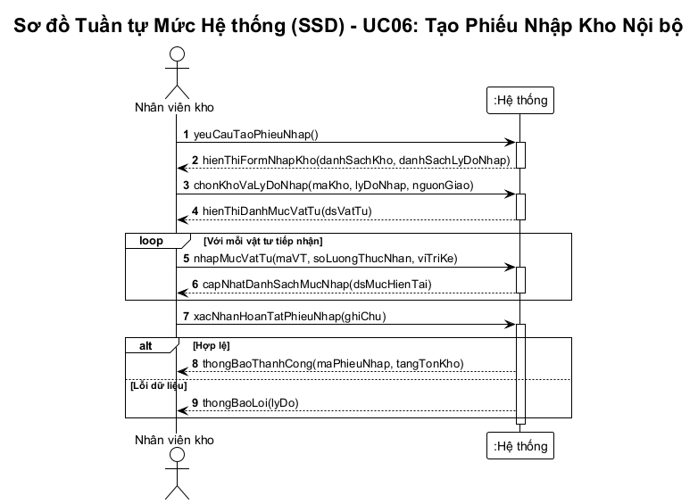
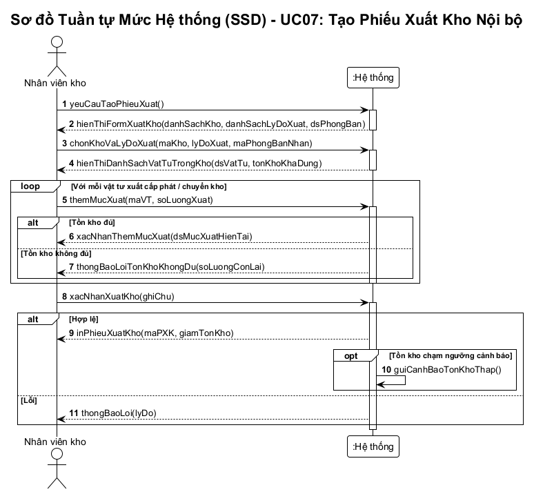
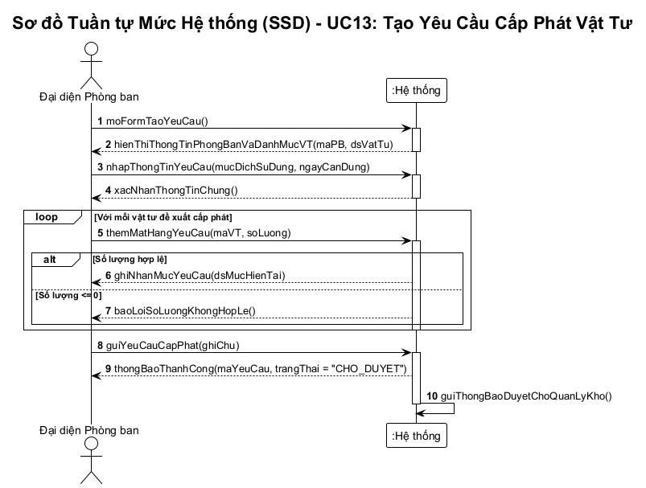
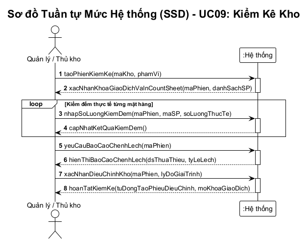

# 07 - Sơ đồ Tuần tự Mức Hệ thống (System Sequence Diagrams - SSD)

## Khái niệm và Vai trò

Theo giáo trình **IT3120 - Mô hình hóa Hành vi (Behavioral Modeling)**:
- **System Sequence Diagram (SSD)** mô tả tương tác giữa các tác nhân bên ngoài (Actors) và hệ thống trong phạm vi một ca sử dụng (Use Case).
- Hệ thống được coi như một **hộp đen (Black Box)** đại diện bởi đối tượng `:Hệ thống` (`:System`).
- SSD định nghĩa rõ các **sự kiện hệ thống (System Events)** và thông điệp phản hồi (Return Messages / Data Displays).

---

## 1. SSD cho UC06: Tạo Phiếu Nhập Kho Nội bộ
- **Tác nhân**: Nhân viên kho.
- **Sự kiện chính**:
  1. `yeuCauTaoPhieuNhap()`: Khởi tạo phiên làm việc nhập kho.
  2. `chonKhoVaLyDoNhap(maKho, lyDoNhap, nguonGiao)`: Xác định kho nhận và căn cứ tiếp nhận (bàn giao phân bổ, hoàn nhập phòng ban, điều chuyển).
  3. `nhapMucVatTu(maVT, soLuongThucNhan, viTriKe)`: Vòng lặp nhập chi tiết từng mặt hàng và vị trí lưu kho.
  4. `xacNhanHoanTatPhieuNhap(ghiChu)`: Chốt phiếu và thực thi ghi sổ tồn kho.

---

## 2. SSD cho UC07: Tạo Phiếu Xuất Kho Nội bộ
- **Tác nhân**: Nhân viên kho.
- **Sự kiện chính**:
  1. `yeuCauTaoPhieuXuat()`: Mở form xuất kho.
  2. `chonKhoVaLyDoXuat(maKho, lyDoXuat, maPhongBanNhan)`: Chọn kho xuất, lý do (cấp phát, chuyển kho, thanh lý) và phòng ban nhận.
  3. `themMucXuat(maVT, soLuongXuat)`: Xác thực tồn kho khả dụng và thêm mục xuất.
  4. `xacNhanXuatKho(ghiChu)`: Ghi nhận giảm tồn kho, tự động kích hoạt cảnh báo nếu chạm ngưỡng.

---

## 3. SSD cho UC13: Tạo Yêu Cầu Cấp Phát Vật Tư
- **Tác nhân**: Đại diện Phòng ban.
- **Sự kiện chính**:
  1. `moFormTaoYeuCau()`: Mở form yêu cầu cấp phát.
  2. `nhapThongTinYeuCau(mucDichSuDung, ngayCanDung)`: Nhập mục đích và thời hạn cần tiếp nhận vật tư.
  3. `themMatHangYeuCau(maVT, soLuong)`: Lập danh sách vật tư đề nghị cấp phát.
  4. `guiYeuCauCapPhat(ghiChu)`: Chuyển phiếu yêu cầu sang trạng thái `CHO_DUYET` và thông báo cho Quản lý kho.

---

## 4. SSD cho UC09: Kiểm Kê Kho
- **Tác nhân**: Quản lý kho, Nhân viên kho.
- **Sự kiện chính**:
  1. `taoPhienKiemKe(maKho, phamVi)`: Chốt số liệu sổ sách và khóa giao dịch.
  2. `nhapSoLuongKiemDem(maPhien, maSP, soLuongThucTe)`: Nhân viên kho cập nhật số đếm thực.
  3. `yeuCauBaoCaoChenhLech(maPhien)`: Hệ thống tổng hợp báo cáo sai số.
  4. `xacNhanDieuChinhKho(maPhien, lyDo)`: Cân bằng tồn kho và tự sinh phiếu điều chỉnh.

---

## File nguồn PlantUML
File PlantUML hoàn chỉnh: [ssd.puml](../plantuml/ssd.puml).