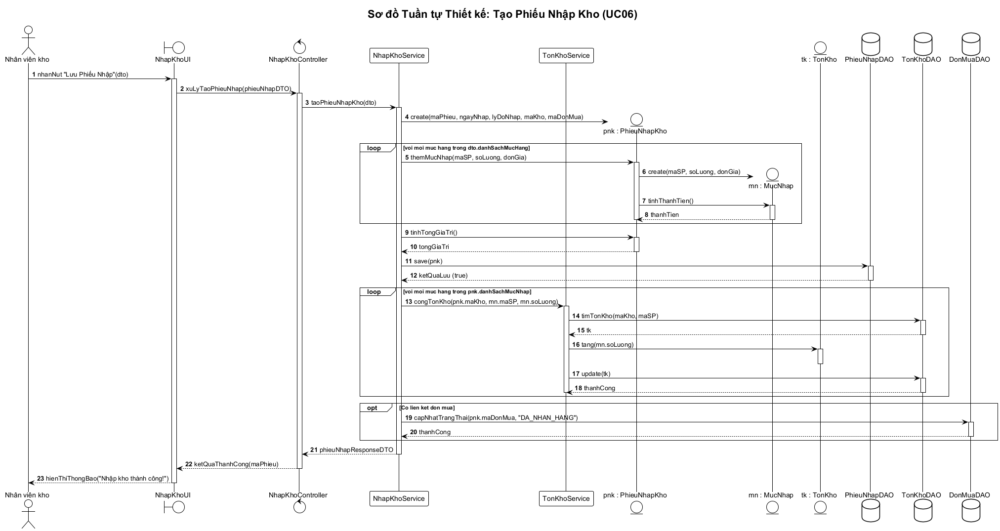
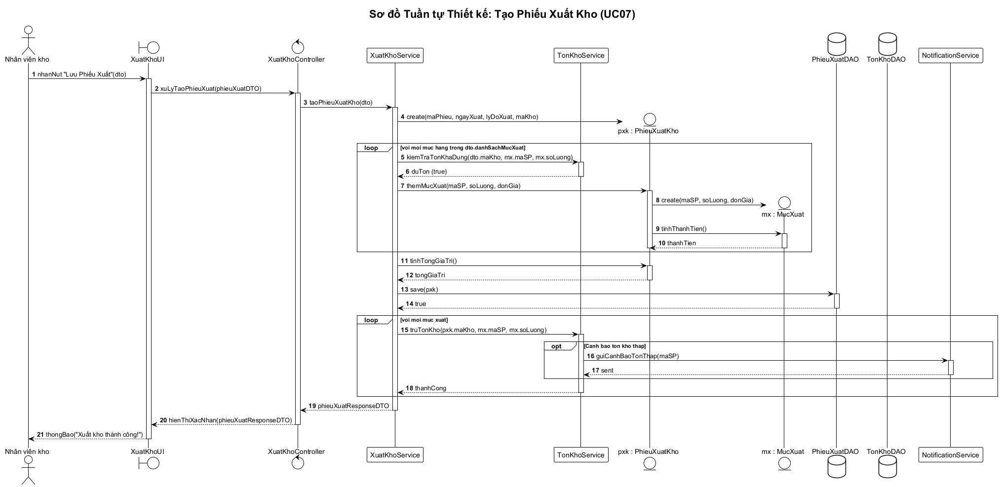
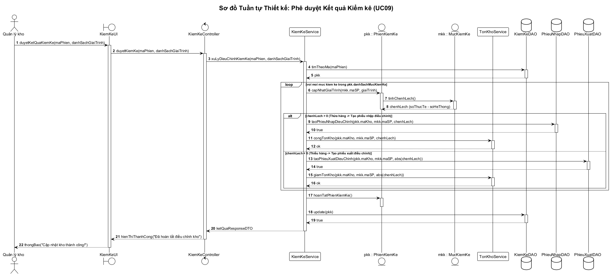

# 08 - Sơ đồ Tuần tự Mức Thiết kế (Design Sequence Diagrams)

## Mục đích và Nguyên tắc Thiết kế (GRASP)

Theo giáo trình **IT3120 - Ch04 Mô hình hóa Hành vi & Ch05 Thiết kế Lớp**:
Khác với SSD chỉ nhìn hệ thống ở mức hộp đen, **Sơ đồ tuần tự mức thiết kế (Design Sequence Diagram)** mở hộp đen của hệ thống và phân bổ trách nhiệm cụ thể cho từng thành phần phần mềm.

Các nguyên lý **GRASP** được áp dụng chặt chẽ:
1. **Controller**: Lớp điều khiển (`NhapKhoController`, `XuatKhoController`, `KiemKeController`) nhận các sự kiện hệ thống từ tầng giao diện, ủy quyền cho tầng Dịch vụ.
2. **Creator**: Đối tượng container tạo các đối tượng con (`PhieuNhapKho` tạo `MucNhap`, `PhieuXuatKho` tạo `MucXuat`).
3. **Information Expert**: Đối tượng nào nắm giữ dữ liệu cần thiết thì chịu trách nhiệm tính toán (`MucNhap` tự tính `thanhTien`, `MucKiemKe` tính `chenhLech`).
4. **Low Coupling & High Cohesion**: Tách biệt rõ ràng giữa logic nghiệp vụ (`Service`), thực thể dữ liệu (`Entity`) và tầng truy xuất (`DAO / Repository`).

---

## 1. Sơ đồ Tuần tự: Tạo Phiếu Nhập Kho (UC06)

---

## 2. Sơ đồ Tuần tự: Tạo Phiếu Xuất Kho (UC07)

---

## 3. Sơ đồ Tuần tự: Phê duyệt Kết quả Kiểm kê (UC09)

---

## File nguồn PlantUML
Sơ đồ PlantUML hoàn chỉnh: [sequence-diagrams.puml](../plantuml/sequence-diagrams.puml).