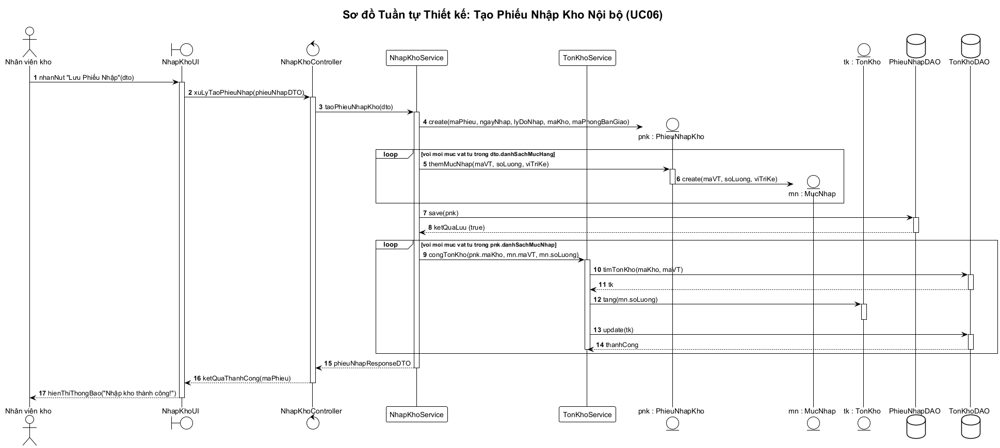
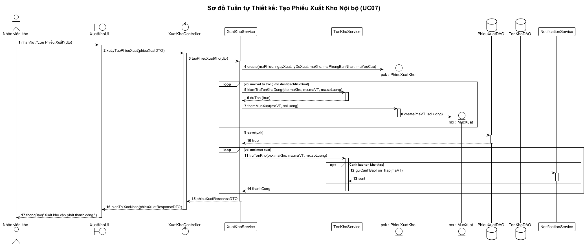
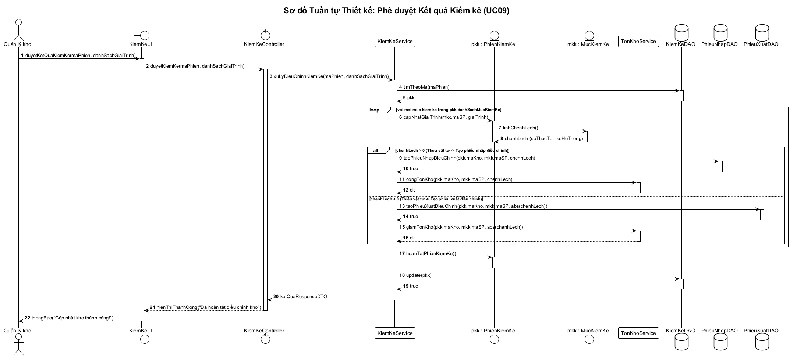

# 08 - Sơ đồ Tuần tự Mức Thiết kế (Design Sequence Diagrams)

## Mục đích và Nguyên tắc Thiết kế (GRASP)

Theo giáo trình **IT3120 - Ch04 Mô hình hóa Hành vi & Ch05 Thiết kế Lớp**:
Khác với SSD chỉ nhìn hệ thống ở mức hộp đen, **Sơ đồ tuần tự mức thiết kế (Design Sequence Diagram)** mở hộp đen của hệ thống và phân bổ trách nhiệm cụ thể cho từng thành phần phần mềm.

Các nguyên lý **GRASP** được áp dụng chặt chẽ:
1. **Controller**: Lớp điều khiển (`NhapKhoController`, `XuatKhoController`, `KiemKeController`, `YeuCauCapPhatController`) nhận các sự kiện hệ thống từ tầng giao diện, ủy quyền cho tầng Dịch vụ.
2. **Creator**: Đối tượng container tạo các đối tượng con (`PhieuNhapKho` tạo `MucNhap`, `PhieuXuatKho` tạo `MucXuat`, `YeuCauCapPhat` tạo `ChiTietYeuCau`).
3. **Information Expert**: Đối tượng nào nắm giữ dữ liệu cần thiết thì chịu trách nhiệm kiểm tra và tính toán (`MucKiemKe` tính `chenhLech`, `TonKho` tính toán cộng/trừ số lượng tồn).
4. **Low Coupling & High Cohesion**: Tách biệt rõ ràng giữa logic nghiệp vụ (`Service`), thực thể dữ liệu (`Entity`) và tầng truy xuất (`DAO / DAM`). Hoàn toàn độc lập với các giao dịch tài chính mua bán thương mại.

---

## 1. Sơ đồ Tuần tự: Tạo Phiếu Nhập Kho Nội bộ (UC06)

Quy trình thể hiện việc nhân viên kho tiếp nhận vật tư bàn giao, điều chuyển hoặc hoàn nhập từ phòng ban, cập nhật số lượng tồn kho theo nguyên lý nguyên tử (ACID transaction):

---

## 2. Sơ đồ Tuần tự: Tạo Phiếu Xuất Kho Nội bộ (UC07)

Quy trình thể hiện việc thủ kho thực hiện xuất cấp phát vật tư cho phòng ban căn cứ theo phiếu yêu cầu đã duyệt hoặc chuyển kho nội bộ, đồng thời kích hoạt cơ chế cảnh báo tồn kho thấp (Observer Pattern):

---

## 3. Sơ đồ Tuần tự: Phê duyệt Kết quả Kiểm kê (UC09)

Quy trình thể hiện Quản lý kho xem xét số liệu thực tế kiểm đếm, nhập lý do giải trình sai lệch và phê duyệt cân đối kho; hệ thống tự động sinh các phiếu điều chỉnh tồn kho:

---

## File nguồn PlantUML
Sơ đồ PlantUML hoàn chỉnh: [sequence-diagrams.puml](../plantuml/sequence-diagrams.puml).