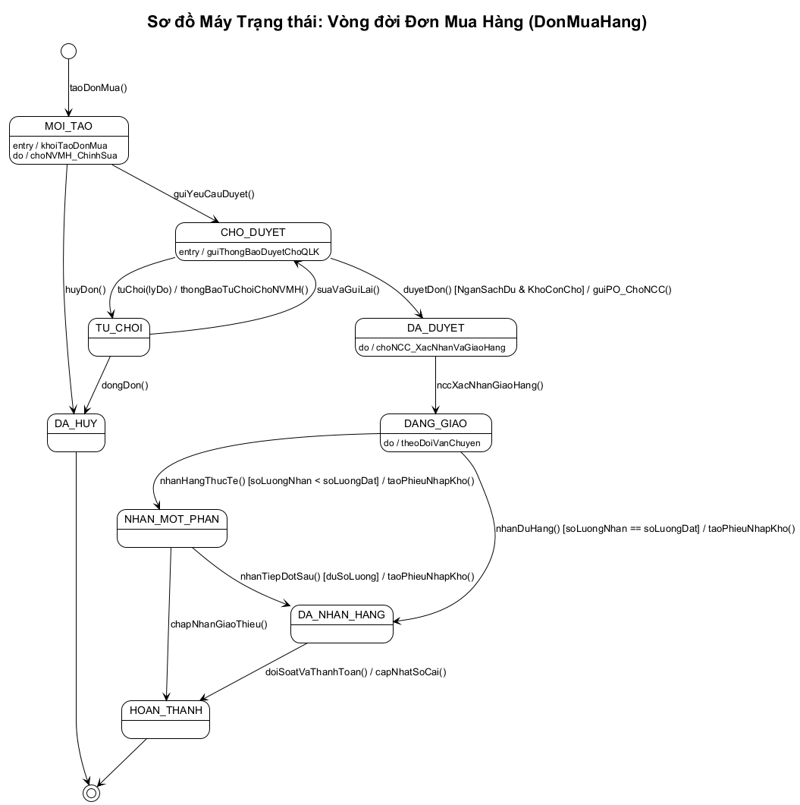
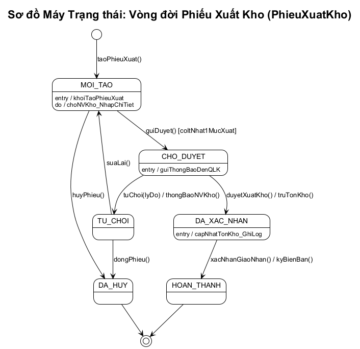
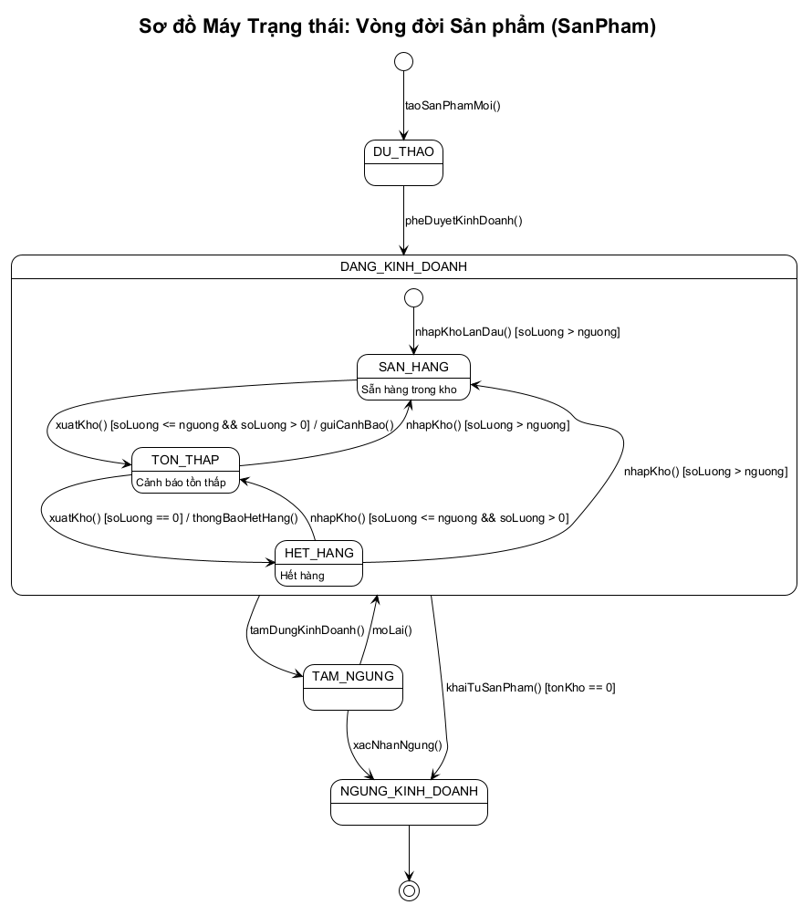

# 09 - Sơ đồ Máy Trạng thái (State Machine Diagrams)

## Mục đích và Khái niệm

Theo giáo trình **IT3120 - Mô hình hóa Hành vi (Behavioral Modeling)**:
- **Biểu đồ máy trạng thái (State Machine Diagram)** mô hình hóa các trạng thái khác nhau mà một đối tượng có thể trải qua trong suốt vòng đời (Lifecycle) của nó.

Hệ thống Quản lý Sản phẩm và Kho hàng có 3 đối tượng nghiệp vụ cốt lõi có trạng thái động phong phú nhất:
1. **Đơn Mua Hàng (`DonMuaHang`)**
2. **Phiếu Xuất Kho (`PhieuXuatKho`)**
3. **Sản phẩm trong Kho (`SanPham`)**

---

## 1. Máy Trạng thái Đơn Mua Hàng (DonMuaHang)

### Bảng phân tích trạng thái và sự kiện chuyển tiếp

| Trạng thái nguồn | Sự kiện kích hoạt | Điều kiện | Hành động | Trạng thái đích |
|------------------|--------------------|-----------|-----------|-----------------|
| `[*]` | `taoDonMua()` | - | `khoiTaoDonMua()` | `MOI_TAO` |
| `MOI_TAO` | `guiYeuCauDuyet()` | Có ít nhất 1 mặt hàng | `guiThongBaoDuyetChoQLK()` | `CHO_DUYET` |
| `MOI_TAO` | `huyDon()` | - | - | `DA_HUY` |
| `CHO_DUYET` | `duyetDon()` | `[NganSachDu && KhoConCho]` | `guiPO_ChoNCC()` | `DA_DUYET` |
| `CHO_DUYET` | `tuChoi(lyDo)` | - | `thongBaoTuChoiChoNVMH()` | `TU_CHOI` |
| `TU_CHOI` | `suaVaGuiLai()` | - | - | `CHO_DUYET` |
| `DA_DUYET` | `nccXacNhanGiaoHang()` | - | `khoiTaoTheoDoi()` | `DANG_GIAO` |
| `DANG_GIAO` | `nhanHangThucTe()` | `[soLuongNhan < soLuongDat]` | `taoPhieuNhapKho()` | `NHAN_MOT_PHAN` |
| `DANG_GIAO` | `nhanDuHang()` | `[soLuongNhan == soLuongDat]` | `taoPhieuNhapKho()` | `DA_NHAN_HANG` |
| `DA_NHAN_HANG` | `doiSoatVaThanhToan()` | - | `capNhatSoCai()` | `HOAN_THANH` |

---

## 2. Máy Trạng thái Phiếu Xuất Kho (PhieuXuatKho)

### Chu trình xử lý phiếu xuất
1. `MOI_TAO`: Nhân viên kho khởi tạo phiếu, nhập chi tiết mục xuất.
2. `CHO_DUYET`: Gửi phiếu để Quản lý kho duyệt.
3. `DA_XAC_NHAN`: Phiếu được duyệt, hệ thống trừ tồn kho và ghi log.
4. `HOAN_THANH`: Xác nhận giao nhận hoàn tất, ký biên bản.
5. Trường hợp từ chối: Quản lý kho từ chối → Nhân viên kho sửa lại hoặc hủy phiếu.

---

## 3. Máy Trạng thái Sản phẩm (SanPham)

Trạng thái nghiệp vụ của sản phẩm gắn liền với tính khả dụng và ngưỡng an toàn trong kho:
- `DU_THAO`: Vừa khởi tạo danh mục, chưa phát hành.
- `DANG_KINH_DOANH`: Trạng thái tổng hợp bao gồm:
  - `SanHang`: Số lượng tồn khả dụng > ngưỡng cảnh báo an toàn.
  - `TonThap`: Khi xuất kho làm số lượng `<= nguongTonKho`, tự động phát sinh thông báo cảnh báo tái đặt hàng (UC11).
  - `HetHang`: Tồn kho = 0.
- `TAM_NGUNG`: Tạm khóa do biến động giá hoặc lý do nhà phân phối.
- `NGUNG_KINH_DOANH`: Khai tử sản phẩm (chỉ cho phép khi tồn kho = 0).

---

## File nguồn PlantUML
Sơ đồ PlantUML hoàn chỉnh: [state-machine.puml](../plantuml/state-machine.puml).