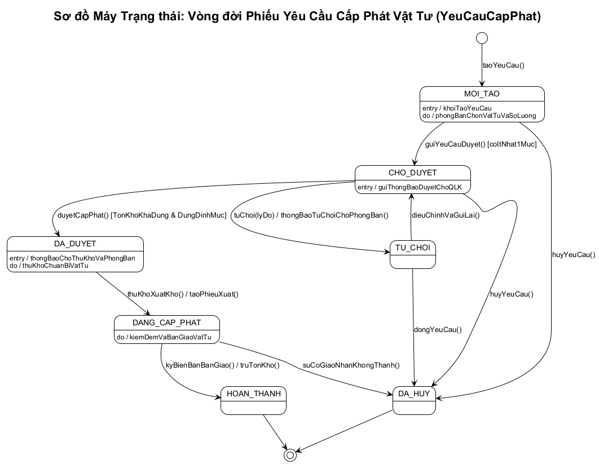
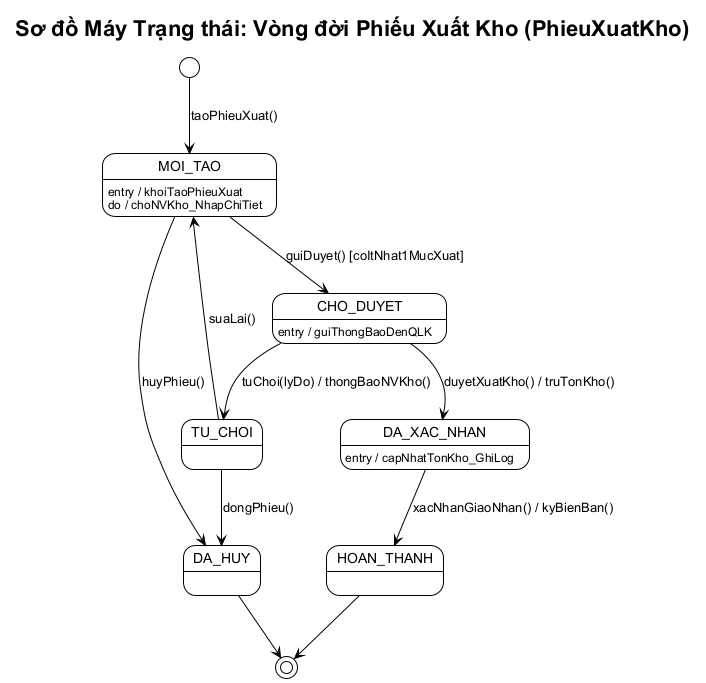
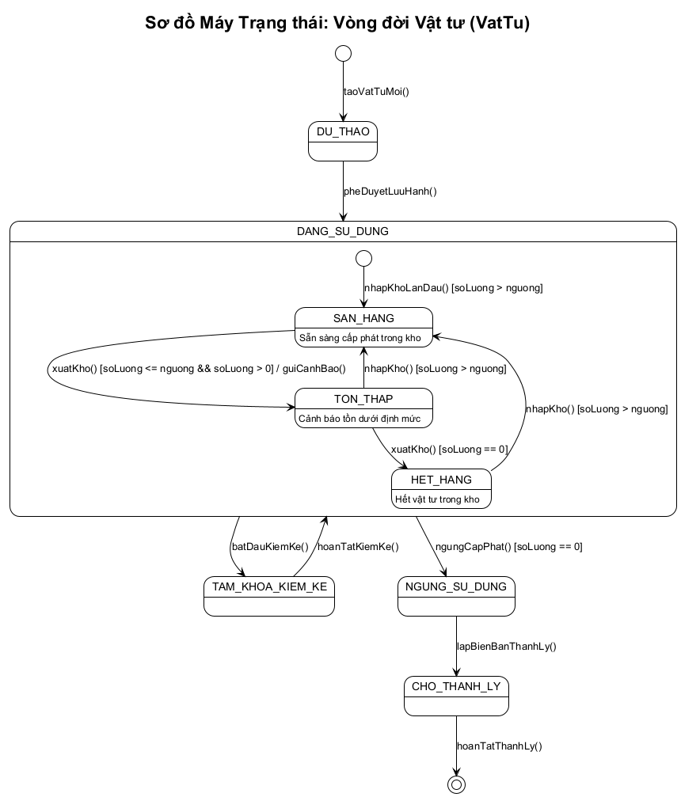

# 09 - Sơ đồ Máy Trạng thái (State Machine Diagrams)

## Mục đích và Khái niệm

Theo giáo trình **IT3120 - Mô hình hóa Hành vi (Behavioral Modeling)**:
- **Biểu đồ máy trạng thái (State Machine Diagram)** mô hình hóa các trạng thái khác nhau mà một đối tượng có thể trải qua trong suốt vòng đời (Lifecycle) của nó, từ khi khởi tạo cho đến khi kết thúc.

Hệ thống Quản lý Kho hàng và Vật tư Nội bộ Tổ chức có 3 đối tượng nghiệp vụ cốt lõi có trạng thái động phong phú nhất:
1. **Phiếu Yêu Cầu Cấp Phát Vật Tư (`YeuCauCapPhat`)**
2. **Phiếu Xuất Kho Nội Bộ (`PhieuXuatKho`)**
3. **Vật tư trong Kho (`VatTu` / `SanPham`)**

---

## 1. Máy Trạng thái Phiếu Yêu Cầu Cấp Phát Vật Tư (YeuCauCapPhat)

### Bảng phân tích trạng thái và sự kiện chuyển tiếp

| Trạng thái nguồn | Sự kiện kích hoạt | Điều kiện | Hành động | Trạng thái đích |
|------------------|--------------------|-----------|-----------|-----------------|
| `[*]` | `taoYeuCau()` | - | `khoiTaoYeuCau()` | `MOI_TAO` |
| `MOI_TAO` | `guiYeuCauDuyet()` | Có ít nhất 1 mặt hàng | `guiThongBaoChoQLK()` | `CHO_DUYET` |
| `MOI_TAO` | `huyYeuCau()` | - | - | `DA_HUY` |
| `CHO_DUYET` | `duyetCapPhat()` | `[TonKhoKhaDung && DungDinhMuc]` | `thongBaoChoThuKhoVaPhongBan()` | `DA_DUYET` |
| `CHO_DUYET` | `tuChoi(lyDo)` | Bắt buộc nhập lý do | `thongBaoTuChoiChoPhongBan()` | `TU_CHOI` |
| `CHO_DUYET` | `huyYeuCau()` | - | - | `DA_HUY` |
| `TU_CHOI` | `dieuChinhVaGuiLai()` | Đã sửa thông tin | - | `CHO_DUYET` |
| `TU_CHOI` | `dongYeuCau()` | - | - | `DA_HUY` |
| `DA_DUYET` | `thuKhoXuatKho()` | - | `taoPhieuXuatKho()` | `DANG_CAP_PHAT` |
| `DANG_CAP_PHAT` | `kyBienBanBanGiao()` | Hai bên xác nhận đủ | `truTonKho()` | `HOAN_THANH` |

---

## 2. Máy Trạng thái Phiếu Xuất Kho (PhieuXuatKho)

### Chu trình xử lý phiếu xuất
1. `MOI_TAO`: Nhân viên kho khởi tạo phiếu, nhập chi tiết mục vật tư cần xuất.
2. `CHO_DUYET`: Gửi phiếu để Quản lý kho duyệt (nếu vượt thẩm quyền thủ kho).
3. `DA_XAC_NHAN`: Phiếu được xác nhận, hệ thống tự động trừ tồn kho khả dụng và ghi log.
4. `HOAN_THANH`: Xác nhận giao nhận hoàn tất, hai bên ký biên bản bàn giao tài sản.
5. Trường hợp từ chối: Quản lý kho từ chối → Nhân viên kho điều chỉnh lại hoặc hủy phiếu.

---

## 3. Máy Trạng thái Vật tư (VatTu)

Trạng thái nghiệp vụ của vật tư gắn liền với vòng đời sử dụng và mức tồn an toàn trong kho:
- `DU_THAO`: Vừa khởi tạo mã danh mục vật tư mới, chưa đưa vào danh mục cấp phát.
- `DANG_SU_DUNG`: Trạng thái hoạt động chính, gồm các trạng thái con:
  - `SanHang`: Số lượng tồn kho khả dụng `> nguongTonKho`.
  - `TonThap`: Khi xuất kho làm số lượng tồn `<= nguongTonKho`, hệ thống tự động phát cảnh báo (UC11).
  - `HetHang`: Số lượng tồn = 0 (tạm thời không thể xuất cấp phát).
- `TAM_KHOA_KIEM_KE`: Tạm khóa các giao dịch xuất/nhập khi đang nằm trong phạm vi đợt kiểm kê.
- `NGUNG_SU_DUNG`: Không cho phép lập yêu cầu cấp phát mới (chỉ thực hiện khi số lượng tồn = 0 hoặc chuyển sang diện thanh lý).
- `CHO_THANH_LY`: Lập biên bản chờ tiêu hủy hoặc thanh lý tài sản cũ hỏng.

---

## File nguồn PlantUML
Sơ đồ PlantUML hoàn chỉnh: [state-machine.puml](../plantuml/state-machine.puml).