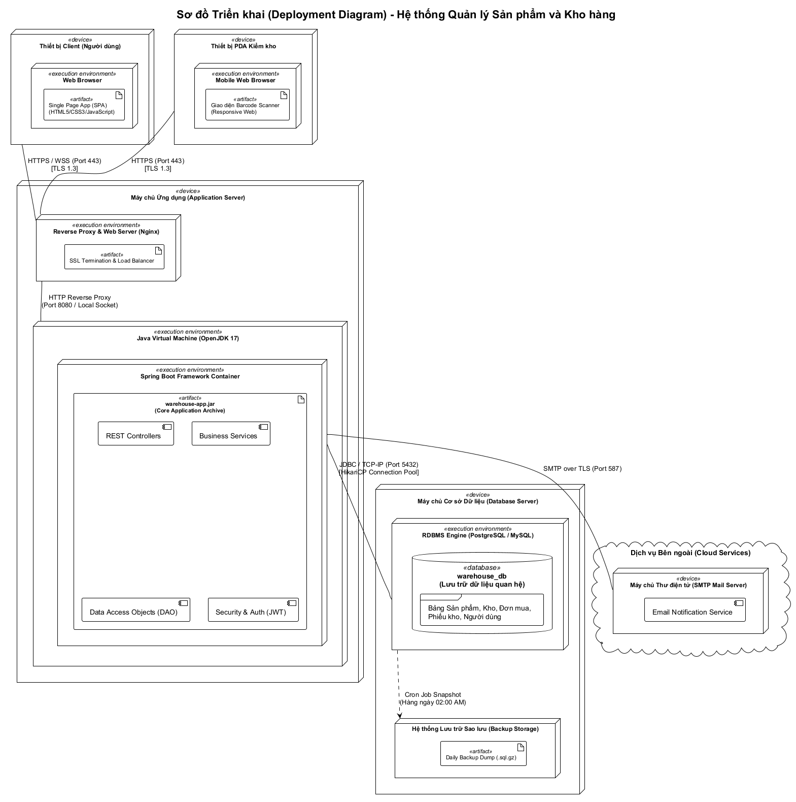

# 11 - Sơ đồ Triển khai (Deployment Diagram)

## Khái niệm và Mục tiêu Kiến trúc

Theo giáo trình **IT3120 - Kiến trúc Hệ thống & Hạ tầng Vật lý**:
- **Biểu đồ triển khai (Deployment Diagram)** thể hiện cấu hình phần cứng (Node), môi trường thực thi (Execution Environment) và việc bố trí các thành phần phần mềm (Artifacts) trên hệ thống vật lý.
- Thiết kế hướng tới đáp ứng các yêu cầu phi chức năng (Non-Functional Requirements) từ [01-system-request.md](./01-system-request.md):
  - **Khả năng phục vụ đồng thời**: Tối thiểu 50 người dùng làm việc đồng thời với thời gian phản hồi `< 3s`.
  - **Bảo mật**: Mã hóa toàn bộ kênh truyền qua giao thức HTTPS (TLS 1.3), phân tách tường lửa giữa Web Server, App Server và Database Server.
  - **Độ sẵn sàng và tin cậy**: Cơ chế sao lưu tự động hàng ngày (Daily automated backup snapshot).

---

## Các Tầng trong Mô hình Triển khai 3 Tầng (3-Tier Architecture)

### 1. Tầng Khách (Client Tier)
- **Thiết bị làm việc văn phòng (Desktop / Laptop)**: Truy cập hệ thống thông qua trình duyệt Web tiêu chuẩn (Chrome, Edge, Firefox). Chạy ứng dụng Single Page App (SPA) được tối ưu hóa hiển thị Dashboard, Quản lý sản phẩm, Quản lý kho hàng, Báo cáo thống kê.
- **Thiết bị cầm tay chuyên dụng tại kho (PDA Barcode Scanner)**: Sử dụng trình duyệt nhúng trên hệ điều hành Android chuyên dụng để quét mã vạch sản phẩm khi nhập hàng, xuất kho chuyển kho và kiểm kê hàng hóa tại vị trí kệ kho.

### 2. Tầng Máy chủ Ứng dụng (Application Server Tier)
- **Nginx Reverse Proxy**:
  - Đóng vai trò cổng vào duy nhất từ Internet/Mạng nội bộ.
  - Tiếp nhận kết nối HTTPS cổng 443, giải mã chứng chỉ bảo mật SSL/TLS.
  - Nén dữ liệu Gzip và phân phát tài nguyên tĩnh (HTML/CSS/JS).
  - Định tuyến các yêu cầu API động về cụm máy chủ ứng dụng Spring Boot.
- **Java Runtime Environment (OpenJDK 17 LTS)**:
  - Chạy file thực thi `warehouse-app.jar` chứa toàn bộ logic nghiệp vụ quản lý kho.
  - Quản lý phiên làm việc thông qua JWT (JSON Web Token) phi trạng thái (Stateless), giúp hệ thống dễ dàng mở rộng theo chiều ngang (Horizontal Scaling).
  - Tích hợp kết nối HikariCP Connection Pool để duy trì các kết nối cơ sở dữ liệu tốc độ cao.

### 3. Tầng Máy chủ Cơ sở Dữ liệu (Database Server Tier)
- **Hệ quản trị CSDL quan hệ (PostgreSQL / MySQL)**:
  - Cổng dịch vụ chuẩn (TCP Port 5432 / 3306), chỉ cho phép kết nối nội bộ từ máy chủ ứng dụng.
  - Quản lý schema `warehouse_db` với cơ chế khóa hàng (Row-level locking) và ACID transactions nhằm bảo đảm an toàn dữ liệu tồn kho khi có nhiều giao dịch xuất/nhập đồng thời.
- **Storage Subsystem**:
  - Lưu trữ đĩa mạng hoặc ổ SSD chuyên dụng.
  - Tiến trình Cron Job tự động kết xuất dữ liệu nén hàng ngày lúc 02:00 sáng.

### 4. Tầng Dịch vụ Bên ngoài (External Integrations)
- **SMTP Mail Server**: Gửi email thông báo tự động (thông báo đơn mua cho Nhà cung cấp, cảnh báo tồn kho thấp cho Quản lý kho).

---

## Sơ đồ Triển khai Rendered



## File nguồn PlantUML
Sơ đồ PlantUML hoàn chỉnh: [deployment-diagram.puml](../plantuml/deployment-diagram.puml).
Render đồ họa:
```bash
java -jar plantuml.jar plantuml/deployment-diagram.puml -o ../diagrams/
```
