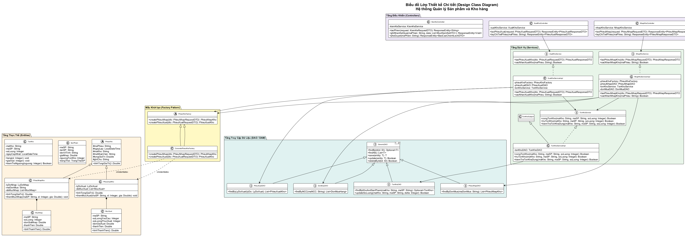

# 12 - Biểu đồ Lớp Thiết kế Chi tiết (Design Class Diagram)

## Tổng quan và Yêu cầu Thiết kế

Theo giáo trình **IT3120 - Ch05 Thiết kế Lớp & Ch06 Mẫu Thiết kế**:
Biểu đồ lớp thiết kế (Design Class Diagram - DCD) là bước hoàn thiện từ biểu đồ lớp phân tích miền sang mô hình phần mềm có thể sinh mã nguồn trực tiếp (Java / C#).

DCD đáp ứng đầy đủ:
1. **Kiểu dữ liệu kỹ thuật và phạm vi truy cập**: `+` (public), `-` (private), `#` (protected), danh sách kiểu trả về, tham số phương thức (`Optional<T>`, `List<T>`, `Double`, `ResponseEntity`).
2. **Nguyên lý thiết kế hướng đối tượng SOLID**:
   - **S (Single Responsibility)**: Tách riêng Controller (tiếp nhận HTTP Request), Service (xử lý nghiệp vụ), DAO (truy vấn CSDL), Entity (lưu giữ trạng thái nghiệp vụ).
   - **O (Open/Closed)**: Mở rộng các chiến lược định giá tồn kho / phân bổ xuất kho (`InventoryValuationStrategy`) mà không phải sửa mã nguồn lớp `XuatKhoService` hay `TonKhoService`.
   - **L (Liskov Substitution)**: Lớp trừu tượng `PhieuKho` được kế thừa bởi `PhieuNhapKho` và `PhieuXuatKho`, mọi phương thức thao tác trên `PhieuKho` đều hoạt động đúng khi truyền thể hiện con.
   - **I (Interface Segregation)**: Chia nhỏ các giao diện DAO (`PhieuNhapDAO`, `PhieuXuatDAO`, `TonKhoDAO`, `SanPhamDAO`, `DonMuaDAO`) thay vì một DAO khổng lồ.
   - **D (Dependency Inversion)**: `NhapKhoServiceImpl` phụ thuộc vào Interface `PhieuNhapDAO` và Interface `TonKhoService`, `XuatKhoServiceImpl` phụ thuộc vào Interface `PhieuXuatDAO`, giúp dễ dàng Unit Test với Mockito.
3. **Các mẫu thiết kế (GoF Design Patterns)**:
   - **Factory Pattern**: `PhieuKhoFactory` đóng gói logic khởi tạo các loại phiếu kho khác nhau (`PhieuNhapKho`, `PhieuXuatKho`).
   - **Observer Pattern**: `TonKhoSubject` tự động phát thông báo cho các `TonKhoObserver` (`LowStockAlertObserver`, `AuditLogObserver`) mỗi khi lượng tồn kho biến động dưới ngưỡng.
   - **Strategy Pattern**: `InventoryValuationStrategy` cho phép thay đổi linh hoạt giải pháp tính giá vốn xuất kho và chọn lô hàng (`FIFOStrategy` - Nhập trước xuất trước, `WeightedAverageStrategy` - Bình quân gia quyền).

---

## Hợp đồng Thông điệp Cốt lõi (Message Contracts)

### 1. Hợp đồng `NhapKhoService.taoPhieuNhapKho(dto: PhieuNhapRequestDTO)`
- **Mục đích**: Lập phiếu nhập kho và cập nhật tăng số lượng hàng trong kho.
- **Tiền điều kiện (Pre-conditions)**:
  - Nhân viên lập phiếu có quyền `NHAP_KHO`.
  - Kho nhận hàng (`dto.maKho`) và các mã sản phẩm (`dto.danhSachMucHang[].maSP`) phải tồn tại trong CSDL.
  - Số lượng thực nhận của từng mặt hàng phải `> 0`.
- **Hậu điều kiện (Post-conditions)**:
  - Bản ghi `PhieuNhapKho` mới được lưu vào CSDL với trạng thái `DA_XAC_NHAN`.
  - Thuộc tính `soLuong` của `TonKho` tương ứng tăng lên đúng bằng số lượng thực nhận.
  - Nếu có liên kết với `DonMuaHang`, trạng thái đơn mua chuyển thành `DA_NHAN_HANG`.
  - Trả về đối tượng `PhieuNhapResponseDTO` chứa mã phiếu tự sinh và tổng giá trị.

### 2. Hợp đồng `XuatKhoService.taoPhieuXuatKho(dto: PhieuXuatRequestDTO)`
- **Mục đích**: Lập phiếu xuất kho cho các lý do: Chuyển kho, Xuất trả NCC, Xuất hủy, Điều chỉnh kiểm kê.
- **Tiền điều kiện**:
  - Nhân viên lập phiếu có quyền `XUAT_KHO`.
  - Kho xuất và các sản phẩm xuất phải tồn tại.
  - Số lượng xuất của từng mục `<= TonKho.soLuong` hiện có tại kho xuất.
- **Hậu điều kiện**:
  - Bản ghi `PhieuXuatKho` được lưu với trạng thái `DA_XAC_NHAN`.
  - Gọi `TonKhoService.truTonKho(...)` để giảm số lượng tồn kho.
  - Kích hoạt thông báo cảnh báo nếu số lượng tồn chạm hoặc xuống dưới ngưỡng an toàn.

### 3. Hợp đồng `TonKhoService.truTonKho(maKho, maSP, soLuong)`
- **Mục đích**: Giảm số lượng tồn vật lý sau khi xuất hàng.
- **Tiền điều kiện**:
  - `soLuong > 0`.
  - Số lượng tồn khả dụng hiện tại `>= soLuong`.
- **Hậu điều kiện**:
  - `TonKho.soLuong = TonKho.soLuong - soLuong`.
  - Nếu `TonKho.soLuong <= SanPham.nguongTonKho`, kích hoạt `notifyObservers(...)` gửi cảnh báo tồn kho thấp.

---

## Biểu đồ Lớp Thiết kế Chi tiết Rendered



## File nguồn PlantUML
Sơ đồ PlantUML hoàn chỉnh: [design-class-diagram.puml](../plantuml/design-class-diagram.puml).
Render đồ họa:
```bash
java -jar plantuml.jar plantuml/design-class-diagram.puml -o ../diagrams/
```
