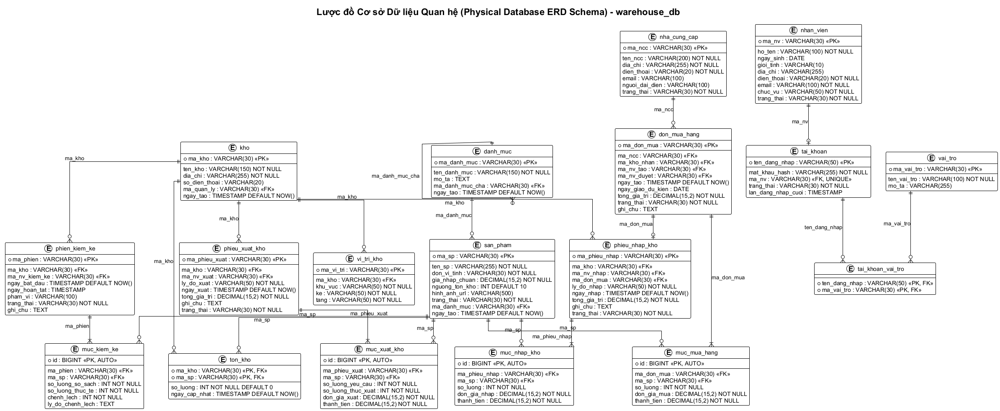

# 13 - Thiết kế Cơ sở Dữ liệu (Database Design)

## Quy tắc Ánh xạ từ Mô hình Hướng Đối tượng sang CSDL Quan hệ (ORM Rules)

Theo giáo trình **IT3120 - Thiết kế Lưu trữ Cố định (ThietKeLuuTruCoDinh)**:
Mô hình đối tượng được ánh xạ sang mô hình quan hệ theo các quy tắc chuẩn:

| Quy tắc | Nội dung áp dụng | Minh họa trong Hệ thống |
|---------|------------------|--------------------------|
| **Rule 1 (R1)** | Mỗi lớp thực thể (Entity Class) ánh xạ thành một Bảng (Table). | `SanPham` → `san_pham`, `Kho` → `kho`, `NhaCungCap` → `nha_cung_cap`. |
| **Rule 2 (R2)** | Thuộc tính đơn trị ánh xạ thành Cột (Column). Thuộc tính định danh ánh xạ thành Khóa chính (Primary Key - PK). | `maSP` → `ma_sp VARCHAR(30) PRIMARY KEY`. |
| **Rule 3 (R3)** | Quan hệ 1 - Nhiều (1 - *) ánh xạ bằng cách đưa Khóa chính của phía "1" làm Khóa ngoại (Foreign Key - FK) ở phía "Nhiều". | `DanhMuc (1) -- (*) SanPham`: thêm cột `ma_danh_muc` trong bảng `san_pham`. |
| **Rule 4 (R4)** | Quan hệ Nhiều - Nhiều (* - *) ánh xạ thành Bảng liên kết (Junction Table) chứa 2 FK trỏ về 2 bảng gốc. | `TaiKhoan (*) -- (*) VaiTro` → Bảng `tai_khoan_vai_tro(ten_dang_nhap, ma_vai_tro)`. |
| **Rule 5-8 (R5-R8)** | Xử lý kế thừa `PhieuKho` có 2 lớp con `PhieuNhapKho` và `PhieuXuatKho`. | Áp dụng phương pháp tách bảng cụ thể (Table per Concrete Class) `phieu_nhap_kho` và `phieu_xuat_kho` để tối ưu hiệu năng truy vấn và ràng buộc toàn vẹn riêng biệt cho từng nghiệp vụ kho. |

---

## Chuẩn hóa Dữ liệu (Normalization)
Mọi bảng trong lược đồ đều đạt **Chuẩn 3NF (Third Normal Form)**:
1. **1NF**: Mọi thuộc tính đều là nguyên tố (Atomic), không chứa mảng lặp (các dòng mặt hàng được tách ra bảng chi tiết riêng `muc_nhap_kho`, `muc_xuat_kho`, `muc_mua_hang`, `muc_kiem_ke`).
2. **2NF**: Đạt 1NF và mọi thuộc tính không khóa đều phụ thuộc hàm toàn phần vào Khóa chính (đặc biệt trong các bảng có khóa phức hợp như `ton_kho(ma_kho, ma_sp)`).
3. **3NF**: Đạt 2NF và không có thuộc tính không khóa nào phụ thuộc bắc cầu vào Khóa chính.

---

## Kịch bản DDL SQL Tạo Cơ sở Dữ liệu (PostgreSQL / MySQL)

Toàn bộ 18 bảng chuẩn hóa của Hệ thống Quản lý Sản phẩm và Kho hàng:

```sql
-- =============================================================================
-- SCHEMA CSDL (DDL) - warehouse_db
-- Hệ thống Quản lý Sản phẩm và Kho hàng (IT3120 - BTL OOSAD)
-- Phạm vi: Quản lý sản phẩm, Nhập/Xuất kho, Kiểm kê, Mua hàng từ NCC
-- =============================================================================

-- Xoá cơ sở dữ liệu cũ (nếu có) và khởi tạo
DROP DATABASE IF EXISTS warehouse_db;
CREATE DATABASE warehouse_db CHARACTER SET utf8mb4 COLLATE utf8mb4_unicode_ci;
USE warehouse_db;

-- 1. Bảng Danh mục sản phẩm (Phân cấp đệ quy)
CREATE TABLE danh_muc (
    ma_danh_muc VARCHAR(30) PRIMARY KEY,
    ten_danh_muc VARCHAR(150) NOT NULL,
    mo_ta TEXT,
    ma_danh_muc_cha VARCHAR(30),
    ngay_tao TIMESTAMP DEFAULT CURRENT_TIMESTAMP,
    CONSTRAINT fk_danhmuc_cha FOREIGN KEY (ma_danh_muc_cha) REFERENCES danh_muc(ma_danh_muc)
);

-- 2. Bảng Sản phẩm
CREATE TABLE san_pham (
    ma_sp VARCHAR(30) PRIMARY KEY,
    ten_sp VARCHAR(255) NOT NULL,
    don_vi_tinh VARCHAR(30) NOT NULL,
    gia_nhap_chuan DECIMAL(15,2) NOT NULL,
    nguong_ton_kho INT NOT NULL DEFAULT 10,
    hinh_anh_url VARCHAR(500),
    trang_thai VARCHAR(30) NOT NULL DEFAULT 'DANG_KINH_DOANH',
    ma_danh_muc VARCHAR(30),
    ngay_tao TIMESTAMP DEFAULT CURRENT_TIMESTAMP,
    CONSTRAINT fk_sp_danhmuc FOREIGN KEY (ma_danh_muc) REFERENCES danh_muc(ma_danh_muc)
);

-- 3. Bảng Nhân viên
CREATE TABLE nhan_vien (
    ma_nv VARCHAR(30) PRIMARY KEY,
    ho_ten VARCHAR(100) NOT NULL,
    ngay_sinh DATE,
    gioi_tinh VARCHAR(10),
    dia_chi VARCHAR(255),
    dien_thoai VARCHAR(20) NOT NULL,
    email VARCHAR(100) NOT NULL,
    chuc_vu VARCHAR(50) NOT NULL,
    trang_thai VARCHAR(30) NOT NULL DEFAULT 'DANG_LAM_VIEC',
    ngay_vao_lam TIMESTAMP DEFAULT CURRENT_TIMESTAMP
);

-- 4. Bảng Tài khoản, Vai trò, Quyền (RBAC)
CREATE TABLE tai_khoan (
    ten_dang_nhap VARCHAR(50) PRIMARY KEY,
    mat_khau_hash VARCHAR(255) NOT NULL,
    ma_nv VARCHAR(30) NOT NULL UNIQUE,
    trang_thai VARCHAR(30) NOT NULL DEFAULT 'HOAT_DONG',
    lan_dang_nhap_cuoi TIMESTAMP,
    CONSTRAINT fk_tk_nv FOREIGN KEY (ma_nv) REFERENCES nhan_vien(ma_nv)
);

CREATE TABLE vai_tro (
    ma_vai_tro VARCHAR(30) PRIMARY KEY,
    ten_vai_tro VARCHAR(100) NOT NULL,
    mo_ta VARCHAR(255)
);

CREATE TABLE tai_khoan_vai_tro (
    ten_dang_nhap VARCHAR(50) NOT NULL,
    ma_vai_tro VARCHAR(30) NOT NULL,
    PRIMARY KEY (ten_dang_nhap, ma_vai_tro),
    CONSTRAINT fk_tkvt_tk FOREIGN KEY (ten_dang_nhap) REFERENCES tai_khoan(ten_dang_nhap),
    CONSTRAINT fk_tkvt_vt FOREIGN KEY (ma_vai_tro) REFERENCES vai_tro(ma_vai_tro)
);

-- 5. Bảng Kho & Vị trí kho
CREATE TABLE kho (
    ma_kho VARCHAR(30) PRIMARY KEY,
    ten_kho VARCHAR(150) NOT NULL,
    dia_chi VARCHAR(255) NOT NULL,
    so_dien_thoai VARCHAR(20),
    ma_quan_ly VARCHAR(30),
    ngay_tao TIMESTAMP DEFAULT CURRENT_TIMESTAMP,
    CONSTRAINT fk_kho_quanly FOREIGN KEY (ma_quan_ly) REFERENCES nhan_vien(ma_nv)
);

CREATE TABLE vi_tri_kho (
    ma_vi_tri VARCHAR(30) PRIMARY KEY,
    ma_kho VARCHAR(30) NOT NULL,
    khu_vuc VARCHAR(50) NOT NULL,
    ke VARCHAR(50) NOT NULL,
    tang VARCHAR(50) NOT NULL,
    CONSTRAINT fk_vitri_kho FOREIGN KEY (ma_kho) REFERENCES kho(ma_kho) ON DELETE CASCADE
);

-- 6. Bảng Tồn kho (Ánh xạ Nhiều-Nhiều giữa Kho và Sản phẩm)
CREATE TABLE ton_kho (
    ma_kho VARCHAR(30) NOT NULL,
    ma_sp VARCHAR(30) NOT NULL,
    so_luong INT NOT NULL DEFAULT 0,
    ngay_cap_nhat TIMESTAMP DEFAULT CURRENT_TIMESTAMP ON UPDATE CURRENT_TIMESTAMP,
    PRIMARY KEY (ma_kho, ma_sp),
    CONSTRAINT fk_tonkho_kho FOREIGN KEY (ma_kho) REFERENCES kho(ma_kho),
    CONSTRAINT fk_tonkho_sanpham FOREIGN KEY (ma_sp) REFERENCES san_pham(ma_sp)
);

-- 7. Bảng Nhà cung cấp & Đơn mua hàng (PO)
CREATE TABLE nha_cung_cap (
    ma_ncc VARCHAR(30) PRIMARY KEY,
    ten_ncc VARCHAR(200) NOT NULL,
    dia_chi VARCHAR(255) NOT NULL,
    dien_thoai VARCHAR(20) NOT NULL,
    email VARCHAR(100),
    nguoi_dai_dien VARCHAR(100),
    trang_thai VARCHAR(30) NOT NULL DEFAULT 'HOAT_DONG'
);

CREATE TABLE don_mua_hang (
    ma_don_mua VARCHAR(30) PRIMARY KEY,
    ma_ncc VARCHAR(30) NOT NULL,
    ma_kho_nhan VARCHAR(30) NOT NULL,
    ma_nv_tao VARCHAR(30) NOT NULL,
    ma_nv_duyet VARCHAR(30),
    ngay_tao TIMESTAMP DEFAULT CURRENT_TIMESTAMP,
    ngay_giao_du_kien DATE,
    tong_gia_tri DECIMAL(15,2) NOT NULL DEFAULT 0,
    trang_thai VARCHAR(30) NOT NULL DEFAULT 'MOI_TAO',
    ghi_chu TEXT,
    CONSTRAINT fk_po_ncc FOREIGN KEY (ma_ncc) REFERENCES nha_cung_cap(ma_ncc),
    CONSTRAINT fk_po_kho FOREIGN KEY (ma_kho_nhan) REFERENCES kho(ma_kho),
    CONSTRAINT fk_po_nvtao FOREIGN KEY (ma_nv_tao) REFERENCES nhan_vien(ma_nv),
    CONSTRAINT fk_po_nvduyet FOREIGN KEY (ma_nv_duyet) REFERENCES nhan_vien(ma_nv)
);

CREATE TABLE muc_mua_hang (
    id BIGINT AUTO_INCREMENT PRIMARY KEY,
    ma_don_mua VARCHAR(30) NOT NULL,
    ma_sp VARCHAR(30) NOT NULL,
    so_luong INT NOT NULL,
    don_gia_mua DECIMAL(15,2) NOT NULL,
    thanh_tien DECIMAL(15,2) NOT NULL,
    CONSTRAINT fk_muc_po_don FOREIGN KEY (ma_don_mua) REFERENCES don_mua_hang(ma_don_mua) ON DELETE CASCADE,
    CONSTRAINT fk_muc_po_sp FOREIGN KEY (ma_sp) REFERENCES san_pham(ma_sp)
);

-- 8. Bảng Phiếu nhập kho & Chi tiết
CREATE TABLE phieu_nhap_kho (
    ma_phieu_nhap VARCHAR(30) PRIMARY KEY,
    ma_kho VARCHAR(30) NOT NULL,
    ma_nv_nhap VARCHAR(30) NOT NULL,
    ma_don_mua VARCHAR(30),
    ly_do_nhap VARCHAR(50) NOT NULL,
    ngay_nhap TIMESTAMP DEFAULT CURRENT_TIMESTAMP,
    tong_gia_tri DECIMAL(15,2) NOT NULL DEFAULT 0,
    ghi_chu TEXT,
    trang_thai VARCHAR(30) NOT NULL DEFAULT 'DA_XAC_NHAN',
    CONSTRAINT fk_pnk_kho FOREIGN KEY (ma_kho) REFERENCES kho(ma_kho),
    CONSTRAINT fk_pnk_nv FOREIGN KEY (ma_nv_nhap) REFERENCES nhan_vien(ma_nv),
    CONSTRAINT fk_pnk_po FOREIGN KEY (ma_don_mua) REFERENCES don_mua_hang(ma_don_mua)
);

CREATE TABLE muc_nhap_kho (
    id BIGINT AUTO_INCREMENT PRIMARY KEY,
    ma_phieu_nhap VARCHAR(30) NOT NULL,
    ma_sp VARCHAR(30) NOT NULL,
    so_luong INT NOT NULL,
    don_gia_nhap DECIMAL(15,2) NOT NULL,
    thanh_tien DECIMAL(15,2) NOT NULL,
    CONSTRAINT fk_muc_pnk_phieu FOREIGN KEY (ma_phieu_nhap) REFERENCES phieu_nhap_kho(ma_phieu_nhap) ON DELETE CASCADE,
    CONSTRAINT fk_muc_pnk_sp FOREIGN KEY (ma_sp) REFERENCES san_pham(ma_sp)
);

-- 9. Bảng Phiếu xuất kho & Chi tiết (Xuất chuyển kho, trả NCC, hủy, cân đối kiểm kê)
CREATE TABLE phieu_xuat_kho (
    ma_phieu_xuat VARCHAR(30) PRIMARY KEY,
    ma_kho VARCHAR(30) NOT NULL,
    ma_nv_xuat VARCHAR(30) NOT NULL,
    ly_do_xuat VARCHAR(50) NOT NULL,
    ngay_xuat TIMESTAMP DEFAULT CURRENT_TIMESTAMP,
    tong_gia_tri DECIMAL(15,2) NOT NULL DEFAULT 0,
    ghi_chu TEXT,
    trang_thai VARCHAR(30) NOT NULL DEFAULT 'DA_XAC_NHAN',
    CONSTRAINT fk_pxk_kho FOREIGN KEY (ma_kho) REFERENCES kho(ma_kho),
    CONSTRAINT fk_pxk_nv FOREIGN KEY (ma_nv_xuat) REFERENCES nhan_vien(ma_nv)
);

CREATE TABLE muc_xuat_kho (
    id BIGINT AUTO_INCREMENT PRIMARY KEY,
    ma_phieu_xuat VARCHAR(30) NOT NULL,
    ma_sp VARCHAR(30) NOT NULL,
    so_luong_yeu_cau INT NOT NULL,
    so_luong_thuc_xuat INT NOT NULL,
    don_gia_xuat DECIMAL(15,2) NOT NULL,
    thanh_tien DECIMAL(15,2) NOT NULL,
    CONSTRAINT fk_muc_pxk_phieu FOREIGN KEY (ma_phieu_xuat) REFERENCES phieu_xuat_kho(ma_phieu_xuat) ON DELETE CASCADE,
    CONSTRAINT fk_muc_pxk_sp FOREIGN KEY (ma_sp) REFERENCES san_pham(ma_sp)
);

-- 10. Bảng Kiểm kê kho
CREATE TABLE phien_kiem_ke (
    ma_phien VARCHAR(30) PRIMARY KEY,
    ma_kho VARCHAR(30) NOT NULL,
    ma_nv_kiem_ke VARCHAR(30) NOT NULL,
    ngay_bat_dau TIMESTAMP DEFAULT CURRENT_TIMESTAMP,
    ngay_hoan_tat TIMESTAMP,
    pham_vi VARCHAR(100),
    trang_thai VARCHAR(30) NOT NULL DEFAULT 'DANG_THUC_HIEN',
    ghi_chu TEXT,
    CONSTRAINT fk_pkk_kho FOREIGN KEY (ma_kho) REFERENCES kho(ma_kho),
    CONSTRAINT fk_pkk_nv FOREIGN KEY (ma_nv_kiem_ke) REFERENCES nhan_vien(ma_nv)
);

CREATE TABLE muc_kiem_ke (
    id BIGINT AUTO_INCREMENT PRIMARY KEY,
    ma_phien VARCHAR(30) NOT NULL,
    ma_sp VARCHAR(30) NOT NULL,
    so_luong_so_sach INT NOT NULL,
    so_luong_thuc_te INT NOT NULL,
    chenh_lech INT NOT NULL,
    ly_do_chenh_lech TEXT,
    CONSTRAINT fk_muc_pkk_phien FOREIGN KEY (ma_phien) REFERENCES phien_kiem_ke(ma_phien) ON DELETE CASCADE,
    CONSTRAINT fk_muc_pkk_sp FOREIGN KEY (ma_sp) REFERENCES san_pham(ma_sp)
);

-- =============================================================================
-- CHỈ MỤC TỐI ƯU HOÁ TRUY VẤN (INDEXES)
-- =============================================================================
CREATE INDEX idx_sanpham_danhmuc ON san_pham(ma_danh_muc);
CREATE INDEX idx_sanpham_trangthai ON san_pham(trang_thai);
CREATE INDEX idx_tonkho_soluong ON ton_kho(so_luong);
CREATE INDEX idx_donmua_trangthai ON don_mua_hang(trang_thai);
CREATE INDEX idx_pnk_ngaynhap ON phieu_nhap_kho(ngay_nhap);
CREATE INDEX idx_pxk_ngayxuat ON phieu_xuat_kho(ngay_xuat);
```

---

## Sơ đồ Thực thể Liên kết (ERD / Database Design) Rendered



## File nguồn PlantUML
Sơ đồ PlantUML hoàn chỉnh: [database-design.puml](../plantuml/database-design.puml).
Render đồ họa:
```bash
java -jar plantuml.jar plantuml/database-design.puml -o ../diagrams/
```
