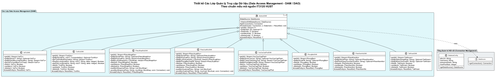

# 14 - Thiết kế Các Lớp Truy cập Dữ liệu (Data Access Management - DAM / DAO)

## Cơ sở Thiết kế và Mẫu kiến trúc

Theo giáo trình **IT3120 - Thiết kế Lưu trữ Cố định (ThietKeLuuTruCoDinh)** và mã nguồn mẫu của bộ môn (`demo/dam` và `demo/dao`):
- **Lớp DAM (Data Access Management)**:
  - Đóng gói toàn bộ câu lệnh SQL và logic tương tác JDBC (Java Database Connectivity) với hệ CSDL bên dưới.
  - Ngăn ngừa việc mã nguồn nghiệp vụ (Service / Domain) bị phụ thuộc vào câu lệnh SQL hoặc cú pháp riêng của từng hệ quản trị CSDL.
  - Sử dụng cơ chế truyền `DataSource` vào hàm khởi tạo (Constructor Injection) nhằm tối ưu hóa việc tái sử dụng kết nối (Connection Pooling).
  - Sử dụng Java 8+ `Stream<T>` và `Spliterator` để đọc dữ liệu dạng luồng mượt mà, tự động đóng kết nối thông qua phương thức `onClose()` và `mutedClose()`.

---

## Cấu trúc Lớp DAM Cơ sở (`AbstractDAM<T, ID>`)

```java
public abstract class AbstractDAM<T, ID> {
    protected final DataSource dataSource;

    public AbstractDAM(DataSource dataSource) {
        this.dataSource = dataSource;
    }

    protected Connection getConnection() throws SQLException {
        return dataSource.getConnection();
    }

    protected void mutedClose(Connection c, Statement s, ResultSet r) {
        try { if (r != null) r.close(); } catch (SQLException ignored) {}
        try { if (s != null) s.close(); } catch (SQLException ignored) {}
        try { if (c != null) c.close(); } catch (SQLException ignored) {}
    }

    public abstract Stream<T> getAll() throws Exception;
    public abstract Optional<T> getById(ID id) throws Exception;
    public abstract boolean add(T entity) throws Exception;
    public abstract boolean update(T entity) throws Exception;
    public abstract boolean delete(T entity) throws Exception;
    protected abstract T createEntity(ResultSet rs) throws SQLException;
}
```

---

## Minh họa Cài đặt Thực tế: `VatTuDAM`

Lớp `VatTuDAM` quản lý lưu trữ cho thực thể `VatTu` (bảng `san_pham`):

```java
public class VatTuDAM extends AbstractDAM<VatTu, String> {

    public VatTuDAM(DataSource dataSource) {
        super(dataSource);
    }

    @Override
    public Stream<VatTu> getAll() throws Exception {
        Connection conn = getConnection();
        PreparedStatement stmt = conn.prepareStatement("SELECT * FROM san_pham");
        ResultSet rs = stmt.executeQuery();
        return StreamSupport.stream(new Spliterators.AbstractSpliterator<VatTu>(Long.MAX_VALUE, Spliterator.ORDERED) {
            @Override
            public boolean tryAdvance(Consumer<? super VatTu> action) {
                try {
                    if (!rs.next()) return false;
                    action.accept(createEntity(rs));
                    return true;
                } catch (SQLException e) {
                    throw new RuntimeException(e);
                }
            }
        }, false).onClose(() -> mutedClose(conn, stmt, rs));
    }

    @Override
    public Optional<VatTu> getById(String maVT) throws Exception {
        String sql = "SELECT * FROM san_pham WHERE ma_sp = ?";
        try (Connection conn = getConnection(); PreparedStatement stmt = conn.prepareStatement(sql)) {
            stmt.setString(1, maVT);
            try (ResultSet rs = stmt.executeQuery()) {
                if (rs.next()) {
                    return Optional.of(createEntity(rs));
                }
            }
        }
        return Optional.empty();
    }

    @Override
    public boolean add(VatTu vt) throws Exception {
        String sql = "INSERT INTO san_pham (ma_sp, ten_sp, don_vi_tinh, quy_cach, nguong_ton_kho, hinh_anh_url, trang_thai, ma_danh_muc) " +
                     "VALUES (?, ?, ?, ?, ?, ?, ?, ?)";
        try (Connection conn = getConnection(); PreparedStatement stmt = conn.prepareStatement(sql)) {
            stmt.setString(1, vt.getMaVT());
            stmt.setString(2, vt.getTenVT());
            stmt.setString(3, vt.getDonViTinh());
            stmt.setString(4, vt.getQuyCach());
            stmt.setInt(5, vt.getNguongTonKho());
            stmt.setString(6, vt.getHinhAnhURL());
            stmt.setString(7, vt.getTrangThai().name());
            stmt.setString(8, vt.getMaDanhMuc());
            return stmt.executeUpdate() > 0;
        }
    }

    @Override
    public boolean update(VatTu vt) throws Exception {
        String sql = "UPDATE san_pham SET ten_sp = ?, don_vi_tinh = ?, quy_cach = ?, nguong_ton_kho = ?, " +
                     "hinh_anh_url = ?, trang_thai = ?, ma_danh_muc = ? WHERE ma_sp = ?";
        try (Connection conn = getConnection(); PreparedStatement stmt = conn.prepareStatement(sql)) {
            stmt.setString(1, vt.getTenVT());
            stmt.setString(2, vt.getDonViTinh());
            stmt.setString(3, vt.getQuyCach());
            stmt.setInt(4, vt.getNguongTonKho());
            stmt.setString(5, vt.getHinhAnhURL());
            stmt.setString(6, vt.getTrangThai().name());
            stmt.setString(7, vt.getMaDanhMuc());
            stmt.setString(8, vt.getMaVT());
            return stmt.executeUpdate() > 0;
        }
    }

    @Override
    public boolean delete(VatTu vt) throws Exception {
        // Soft delete: chuyển sang trạng thái NGUNG_SU_DUNG để bảo toàn toàn vẹn lịch sử giao dịch kho
        String sql = "UPDATE san_pham SET trang_thai = 'NGUNG_SU_DUNG' WHERE ma_sp = ?";
        try (Connection conn = getConnection(); PreparedStatement stmt = conn.prepareStatement(sql)) {
            stmt.setString(1, vt.getMaVT());
            return stmt.executeUpdate() > 0;
        }
    }

    @Override
    protected VatTu createEntity(ResultSet rs) throws SQLException {
        VatTu vt = new VatTu();
        vt.setMaVT(rs.getString("ma_sp"));
        vt.setTenVT(rs.getString("ten_sp"));
        vt.setDonViTinh(rs.getString("don_vi_tinh"));
        vt.setQuyCach(rs.getString("quy_cach"));
        vt.setNguongTonKho(rs.getInt("nguong_ton_kho"));
        vt.setHinhAnhURL(rs.getString("hinh_anh_url"));
        vt.setTrangThai(TrangThaiVT.valueOf(rs.getString("trang_thai")));
        vt.setMaDanhMuc(rs.getString("ma_danh_muc"));
        return vt;
    }
}
```

---

## Cài đặt Lớp `YeuCauCapPhatDAM`

Lớp quản lý các giao dịch đề nghị cấp phát vật tư từ phòng ban:

```java
public class YeuCauCapPhatDAM extends AbstractDAM<YeuCauCapPhat, String> {

    public YeuCauCapPhatDAM(DataSource dataSource) {
        super(dataSource);
    }

    public Stream<YeuCauCapPhat> getByPhongBan(String maPB) throws Exception {
        Connection conn = getConnection();
        PreparedStatement stmt = conn.prepareStatement("SELECT * FROM yeu_cau_cap_phat WHERE ma_phong_ban = ?");
        stmt.setString(1, maPB);
        ResultSet rs = stmt.executeQuery();
        return StreamSupport.stream(new Spliterators.AbstractSpliterator<YeuCauCapPhat>(Long.MAX_VALUE, Spliterator.ORDERED) {
            @Override
            public boolean tryAdvance(Consumer<? super YeuCauCapPhat> action) {
                try {
                    if (!rs.next()) return false;
                    action.accept(createEntity(rs));
                    return true;
                } catch (SQLException e) {
                    throw new RuntimeException(e);
                }
            }
        }, false).onClose(() -> mutedClose(conn, stmt, rs));
    }

    @Override
    public Stream<YeuCauCapPhat> getAll() throws Exception {
        Connection conn = getConnection();
        PreparedStatement stmt = conn.prepareStatement("SELECT * FROM yeu_cau_cap_phat ORDER BY ngay_yeu_cau DESC");
        ResultSet rs = stmt.executeQuery();
        return StreamSupport.stream(new Spliterators.AbstractSpliterator<YeuCauCapPhat>(Long.MAX_VALUE, Spliterator.ORDERED) {
            @Override
            public boolean tryAdvance(Consumer<? super YeuCauCapPhat> action) {
                try {
                    if (!rs.next()) return false;
                    action.accept(createEntity(rs));
                    return true;
                } catch (SQLException e) {
                    throw new RuntimeException(e);
                }
            }
        }, false).onClose(() -> mutedClose(conn, stmt, rs));
    }

    @Override
    public Optional<YeuCauCapPhat> getById(String id) throws Exception {
        String sql = "SELECT * FROM yeu_cau_cap_phat WHERE ma_yeu_cau = ?";
        try (Connection conn = getConnection(); PreparedStatement stmt = conn.prepareStatement(sql)) {
            stmt.setString(1, id);
            try (ResultSet rs = stmt.executeQuery()) {
                if (rs.next()) {
                    return Optional.of(createEntity(rs));
                }
            }
        }
        return Optional.empty();
    }

    @Override
    public boolean add(YeuCauCapPhat yc) throws Exception {
        String sql = "INSERT INTO yeu_cau_cap_phat (ma_yeu_cau, ma_phong_ban, ma_nv_yeu_cau, muc_dich_su_dung, trang_thai, ghi_chu) " +
                     "VALUES (?, ?, ?, ?, ?, ?)";
        try (Connection conn = getConnection(); PreparedStatement stmt = conn.prepareStatement(sql)) {
            stmt.setString(1, yc.getMaYeuCau());
            stmt.setString(2, yc.getMaPhongBan());
            stmt.setString(3, yc.getMaNvYeuCau());
            stmt.setString(4, yc.getMucDichSuDung());
            stmt.setString(5, yc.getTrangThai().name());
            stmt.setString(6, yc.getGhiChu());
            return stmt.executeUpdate() > 0;
        }
    }

    @Override
    public boolean update(YeuCauCapPhat yc) throws Exception {
        String sql = "UPDATE yeu_cau_cap_phat SET ma_nv_duyet = ?, ngay_duyet = ?, trang_thai = ?, ly_do_tu_choi = ? WHERE ma_yeu_cau = ?";
        try (Connection conn = getConnection(); PreparedStatement stmt = conn.prepareStatement(sql)) {
            stmt.setString(1, yc.getMaNvDuyet());
            stmt.setTimestamp(2, yc.getNgayDuyet() != null ? new Timestamp(yc.getNgayDuyet().getTime()) : null);
            stmt.setString(3, yc.getTrangThai().name());
            stmt.setString(4, yc.getLyDoTuChoi());
            stmt.setString(5, yc.getMaYeuCau());
            return stmt.executeUpdate() > 0;
        }
    }

    @Override
    public boolean delete(YeuCauCapPhat yc) throws Exception {
        String sql = "UPDATE yeu_cau_cap_phat SET trang_thai = 'DA_HUY' WHERE ma_yeu_cau = ?";
        try (Connection conn = getConnection(); PreparedStatement stmt = conn.prepareStatement(sql)) {
            stmt.setString(1, yc.getMaYeuCau());
            return stmt.executeUpdate() > 0;
        }
    }

    @Override
    protected YeuCauCapPhat createEntity(ResultSet rs) throws SQLException {
        YeuCauCapPhat yc = new YeuCauCapPhat();
        yc.setMaYeuCau(rs.getString("ma_yeu_cau"));
        yc.setMaPhongBan(rs.getString("ma_phong_ban"));
        yc.setMaNvYeuCau(rs.getString("ma_nv_yeu_cau"));
        yc.setMaNvDuyet(rs.getString("ma_nv_duyet"));
        yc.setNgayYeuCau(rs.getTimestamp("ngay_yeu_cau"));
        yc.setNgayDuyet(rs.getTimestamp("ngay_duyet"));
        yc.setMucDichSuDung(rs.getString("muc_dich_su_dung"));
        yc.setTrangThai(TrangThaiYeuCau.valueOf(rs.getString("trang_thai")));
        yc.setLyDoTuChoi(rs.getString("ly_do_tu_choi"));
        yc.setGhiChu(rs.getString("ghi_chu"));
        return yc;
    }
}
```

---

## Biểu đồ Lớp DAM Chi tiết Rendered



## File nguồn PlantUML
Sơ đồ PlantUML hoàn chỉnh: [dam-classes.puml](../plantuml/dam-classes.puml).
Render đồ họa:
```bash
java -jar plantuml.jar plantuml/dam-classes.puml -o ../diagrams/
```
