# Mô hình Chức năng Chi tiết — Hệ thống Quản lý Sản phẩm và Kho hàng

> **Học phần**: IT3120 – Phân tích và Thiết kế Hệ thống Thông tin  
> **Đại học Bách Khoa Hà Nội (HUST)** — Nhóm G8  
> **Phương pháp**: Phân tích chức năng theo tiến trình EUP, sử dụng UML 2.5

---

## 1. Tổng quan Mô hình Chức năng

Mô hình chức năng (Functional Model) là thành phần cốt lõi trong giai đoạn **Phân tích hệ thống**, đặc tả **hệ thống làm gì** (what) chứ không phải **làm như thế nào** (how). Mô hình bao gồm:

| Thành phần | Mục đích | Tài liệu tham chiếu |
|:--|:--|:--|
| Biểu đồ phân rã chức năng (BFD) | Phân rã hệ thống thành các nhóm chức năng con | Mục 2 |
| Biểu đồ Ca sử dụng (Use Case Diagram) | Xác định tác nhân và các ca sử dụng | [02-use-case-diagram.md](./02-use-case-diagram.md) |
| Đặc tả Ca sử dụng (Use Case Specs) | Mô tả chi tiết luồng sự kiện | [03-use-case-specs.md](./03-use-case-specs.md) |
| Biểu đồ Hoạt động (Activity Diagrams) | Mô hình hóa luồng công việc nghiệp vụ | [04-activity-diagrams.md](./04-activity-diagrams.md) |
| Ma trận CRUD | Ánh xạ chức năng ↔ thực thể dữ liệu | Mục 5 |
| Luồng dữ liệu nghiệp vụ | Mô tả luồng dữ liệu giữa các chức năng | Mục 6 |

---

## 2. Biểu đồ Phân rã Chức năng (Business Function Decomposition – BFD)

Phân rã hệ thống từ mức tổng quát xuống mức chức năng nguyên thủy (leaf function). Mỗi chức năng nguyên thủy tương ứng với một hoặc nhiều Ca sử dụng (UC).

File mã nguồn PlantUML: [functional-model-bfd.puml](../plantuml/functional-model-bfd.puml)

Xem mã Mermaid (tham khảo)

```mermaid
graph TD
    ROOT["<b>Hệ thống Quản lý<br>Sản phẩm & Kho hàng</b>"]

    ROOT --> F1["<b>F1. Quản lý<br>Xác thực & Phân quyền</b>"]
    ROOT --> F2["<b>F2. Quản lý<br>Sản phẩm</b>"]
    ROOT --> F3["<b>F3. Quản lý<br>Kho hàng</b>"]
    ROOT --> F4["<b>F4. Quản lý<br>Mua hàng</b>"]
    ROOT --> F5["<b>F5. Quản lý<br>Nhân viên</b>"]
    ROOT --> F6["<b>F6. Báo cáo<br>Thống kê</b>"]

    F1 --> F11["F1.1 Đăng nhập /<br>Đăng xuất<br><i>UC01</i>"]
    F1 --> F12["F1.2 Phân quyền<br>người dùng<br><i>UC02</i>"]

    F2 --> F21["F2.1 Quản lý<br>sản phẩm<br><i>UC03</i>"]
    F2 --> F22["F2.2 Quản lý<br>danh mục SP<br><i>UC04</i>"]
    F2 --> F23["F2.3 Tìm kiếm<br>sản phẩm<br><i>UC05</i>"]

    F3 --> F31["F3.1 Nhập kho<br><i>UC06</i>"]
    F3 --> F32["F3.2 Xuất kho<br><i>UC07</i>"]
    F3 --> F33["F3.3 Chuyển kho<br><i>UC08</i>"]
    F3 --> F34["F3.4 Kiểm kê kho<br><i>UC09</i>"]
    F3 --> F35["F3.5 Xem tồn kho<br><i>UC10</i>"]
    F3 --> F36["F3.6 Cảnh báo<br>tồn kho thấp<br><i>UC11</i>"]

    F4 --> F41["F4.1 Quản lý NCC<br><i>UC12</i>"]
    F4 --> F42["F4.2 Tạo đơn<br>mua hàng<br><i>UC13</i>"]
    F4 --> F43["F4.3 Duyệt đơn<br>mua hàng<br><i>UC14</i>"]
    F4 --> F44["F4.4 Nhận hàng<br>từ NCC<br><i>UC15</i>"]

    F5 --> F51["F5.1 Quản lý<br>nhân viên<br><i>UC16</i>"]

    F6 --> F61["F6.1 Báo cáo<br>tồn kho<br><i>UC17</i>"]
    F6 --> F62["F6.2 Báo cáo<br>mua hàng<br><i>UC18</i>"]

    style ROOT fill:#1a365d,color:#fff,stroke:#2d3748
    style F1 fill:#2b6cb0,color:#fff
    style F2 fill:#2b6cb0,color:#fff
    style F3 fill:#2b6cb0,color:#fff
    style F4 fill:#2b6cb0,color:#fff
    style F5 fill:#2b6cb0,color:#fff
    style F6 fill:#2b6cb0,color:#fff
```

---

## 3. Đặc tả Chi tiết Từng Nhóm Chức năng

### 3.1 F1 — Quản lý Xác thực & Phân quyền

#### F1.1 Đăng nhập / Đăng xuất (UC01)

| Thuộc tính | Nội dung |
|:--|:--|
| **Mô tả** | Người dùng xác thực danh tính để truy cập hệ thống; đăng xuất để kết thúc phiên làm việc |
| **Tác nhân** | Tất cả (Admin, Quản lý kho, NV mua hàng, NV kho) |
| **Độ phức tạp** | Simple (1–3 transactions) |
| **Dữ liệu đầu vào** | Tên đăng nhập, mật khẩu |
| **Dữ liệu đầu ra** | Phiên đăng nhập (session token), thông tin vai trò |
| **Quy tắc nghiệp vụ** | BR01: Mật khẩu phải được mã hóa hash (bcrypt); BR02: Khóa tài khoản sau 5 lần đăng nhập sai liên tiếp; BR03: Session timeout sau 30 phút không hoạt động |

**Các chức năng nguyên thủy:**

| ID | Chức năng | Mô tả chi tiết |
|:--|:--|:--|
| F1.1.1 | Xác thực thông tin đăng nhập | Nhận tên đăng nhập + mật khẩu, so khớp hash trong CSDL, trả về kết quả |
| F1.1.2 | Tạo phiên đăng nhập | Sinh session token, lưu thông tin phiên (IP, thời gian, vai trò) |
| F1.1.3 | Ghi log đăng nhập | Ghi nhật ký đăng nhập thành công/thất bại vào bảng AuditLog |
| F1.1.4 | Hủy phiên đăng xuất | Xóa session, chuyển hướng về trang đăng nhập |

#### F1.2 Phân quyền người dùng (UC02)

| Thuộc tính | Nội dung |
|:--|:--|
| **Mô tả** | Admin gán vai trò (Role) cho tài khoản người dùng, quản lý quyền truy cập chức năng |
| **Tác nhân** | Quản trị viên (Admin) |
| **Độ phức tạp** | Average (4–7 transactions) |
| **Mô hình phân quyền** | RBAC (Role-Based Access Control) |

**Các chức năng nguyên thủy:**

| ID | Chức năng | Mô tả chi tiết |
|:--|:--|:--|
| F1.2.1 | Xem danh sách vai trò | Hiển thị tất cả vai trò: ADMIN, QUAN_LY_KHO, NV_MUA_HANG, NV_KHO |
| F1.2.2 | Tạo / sửa vai trò | Thêm vai trò mới hoặc chỉnh sửa tên, mô tả vai trò hiện có |
| F1.2.3 | Gán quyền cho vai trò | Chọn các quyền (Quyen) cụ thể và gán cho một vai trò |
| F1.2.4 | Gán vai trò cho tài khoản | Liên kết tài khoản người dùng với một hoặc nhiều vai trò |
| F1.2.5 | Thu hồi vai trò | Xóa liên kết vai trò khỏi tài khoản |

**Ma trận quyền theo vai trò:**

| Chức năng | ADMIN | QUAN_LY_KHO | NV_MUA_HANG | NV_KHO |
|:--|:--:|:--:|:--:|:--:|
| Quản lý nhân viên | ✅ | ❌ | ❌ | ❌ |
| Phân quyền | ✅ | ❌ | ❌ | ❌ |
| Quản lý sản phẩm | ✅ | ✅ | ❌ | ❌ |
| Quản lý danh mục | ✅ | ✅ | ❌ | ❌ |
| Tìm kiếm sản phẩm | ✅ | ✅ | ✅ | ✅ |
| Tạo phiếu nhập kho | ❌ | ❌ | ❌ | ✅ |
| Tạo phiếu xuất kho | ❌ | ❌ | ❌ | ✅ |
| Chuyển kho | ❌ | ✅ | ❌ | ❌ |
| Kiểm kê kho | ❌ | ✅ | ❌ | ✅ |
| Xem tồn kho | ✅ | ✅ | ❌ | ✅ |
| Quản lý NCC | ❌ | ❌ | ✅ | ❌ |
| Tạo đơn mua hàng | ❌ | ❌ | ✅ | ❌ |
| Duyệt đơn mua hàng | ❌ | ✅ | ❌ | ❌ |
| Nhận hàng từ NCC | ❌ | ❌ | ❌ | ✅ |
| Báo cáo tồn kho | ✅ | ✅ | ❌ | ❌ |
| Báo cáo mua hàng | ✅ | ❌ | ❌ | ❌ |

---

### 3.2 F2 — Quản lý Sản phẩm

#### F2.1 Quản lý sản phẩm (UC03)

| Thuộc tính | Nội dung |
|:--|:--|
| **Mô tả** | Quản lý toàn bộ vòng đời sản phẩm: thêm mới, cập nhật thông tin, ngừng kinh doanh |
| **Tác nhân** | Quản lý kho |
| **Độ phức tạp** | Average |

**Các chức năng nguyên thủy:**

| ID | Chức năng | Mô tả chi tiết | Quy tắc nghiệp vụ |
|:--|:--|:--|:--|
| F2.1.1 | Thêm sản phẩm mới | Nhập maSP (tự sinh theo format SP-YYYYMMDD-XXX), tenSP, donViTinh, giaNhap, nguongTonKho, chọn danh mục | BR04: Mã SP duy nhất; BR05: giaNhap > 0; BR06: nguongTonKho ≥ 0 |
| F2.1.2 | Cập nhật sản phẩm | Sửa thông tin sản phẩm (tên, giá, ngưỡng tồn kho) | BR07: Không được sửa maSP; BR08: Ghi log mọi thay đổi |
| F2.1.3 | Ngừng kinh doanh SP | Chuyển trạng thái sang NGUNG_KINH_DOANH (soft delete) | BR09: Không được xóa vật lý SP đã có giao dịch |
| F2.1.4 | Xem chi tiết sản phẩm | Hiển thị toàn bộ thông tin SP kèm tồn kho tại từng kho | — |
| F2.1.5 | Liệt kê sản phẩm | Hiển thị danh sách SP với phân trang, lọc theo danh mục, trạng thái | — |

#### F2.2 Quản lý danh mục sản phẩm (UC04)

| ID | Chức năng | Mô tả chi tiết | Quy tắc nghiệp vụ |
|:--|:--|:--|:--|
| F2.2.1 | Thêm danh mục | Tạo danh mục mới, có thể chọn danh mục cha (cấu trúc phân cấp đệ quy) | BR10: Tên danh mục duy nhất cùng cấp |
| F2.2.2 | Sửa danh mục | Cập nhật tên, mô tả, danh mục cha | BR11: Không được tạo vòng lặp trong cấu trúc cây |
| F2.2.3 | Xóa danh mục | Xóa danh mục không còn sản phẩm nào | BR12: Không xóa danh mục có sản phẩm hoặc danh mục con |
| F2.2.4 | Xem cây danh mục | Hiển thị cấu trúc danh mục dạng cây phân cấp | — |

#### F2.3 Tìm kiếm sản phẩm (UC05)

| ID | Chức năng | Mô tả chi tiết |
|:--|:--|:--|
| F2.3.1 | Tìm kiếm theo từ khóa | Tìm theo mã SP, tên SP (hỗ trợ tìm gần đúng / full-text search) |
| F2.3.2 | Lọc theo danh mục | Lọc danh sách SP theo danh mục / danh mục con |
| F2.3.3 | Lọc theo trạng thái | Lọc SP đang kinh doanh / ngừng kinh doanh |
| F2.3.4 | Lọc theo tồn kho | Lọc SP có tồn kho = 0, < ngưỡng, hoặc trong khoảng |
| F2.3.5 | Sắp xếp kết quả | Sắp xếp theo tên, mã, giá nhập, tồn kho (tăng/giảm) |

---

### 3.3 F3 — Quản lý Kho hàng

#### F3.1 Tạo phiếu nhập kho (UC06)

| Thuộc tính | Nội dung |
|:--|:--|
| **Mô tả** | NV kho tạo phiếu nhập kho khi nhận hàng hóa, ghi nhận chi tiết SP nhập, số lượng, cập nhật tồn kho |
| **Tác nhân** | Nhân viên kho |
| **Độ phức tạp** | Complex (>7 transactions) |
| **Tiền điều kiện** | NV kho đã đăng nhập; hàng hóa đã được giao đến kho |
| **Hậu điều kiện** | Phiếu nhập kho được lưu; tồn kho tăng; trạng thái đơn mua được cập nhật (nếu có) |

**Các chức năng nguyên thủy:**

| ID | Chức năng | Mô tả chi tiết | Quy tắc nghiệp vụ |
|:--|:--|:--|:--|
| F3.1.1 | Khởi tạo phiếu nhập kho | Tự sinh mã phiếu (PN-YYYYMMDD-XXX), gán ngày hiện tại, NV tạo | BR13: Mã phiếu duy nhất |
| F3.1.2 | Chọn kho nhận hàng | NV chọn kho từ danh sách kho đang hoạt động | — |
| F3.1.3 | Chọn lý do nhập kho | Lý do: Nhập từ NCC, Chuyển kho đến, Kiểm kê điều chỉnh tăng | — |
| F3.1.4 | Liên kết đơn mua hàng | Nếu nhập từ NCC → chọn đơn mua đã duyệt, hệ thống tự điền danh sách SP | BR14: Chỉ chọn đơn mua trạng thái DA_DUYET hoặc DANG_GIAO |
| F3.1.5 | Thêm mục nhập kho | Chọn SP, nhập số lượng thực nhận, đơn giá nhập | BR15: soLuong > 0; BR16: SP phải tồn tại và DANG_KINH_DOANH |
| F3.1.6 | Kiểm tra số lượng nhập vượt đơn mua | So sánh số lượng thực nhận với đơn mua, cảnh báo nếu vượt | BR17: Cảnh báo nhưng cho phép nhập vượt (có xác nhận) |
| F3.1.7 | Tính tổng giá trị phiếu | Tổng = Σ(soLuong × donGiaNhap) cho mỗi MucNhap | — |
| F3.1.8 | Xác nhận lưu phiếu nhập | Lưu PhieuNhapKho + các MucNhap vào CSDL | — |
| F3.1.9 | Cập nhật tồn kho | TonKho.soLuong += soLuong cho mỗi (Kho, SanPham) | BR18: Cập nhật nguyên tử (transaction) |
| F3.1.10 | Cập nhật trạng thái đơn mua | Nếu nhận đủ → DA_NHAN_DU; nếu nhận một phần → DANG_GIAO | BR19: So sánh tổng đã nhận với tổng đặt |
| F3.1.11 | Hủy phiếu nhập | Hủy trước khi xác nhận, không lưu dữ liệu | — |

**Luồng sự kiện chính (16 bước)** — xem chi tiết tại [03-use-case-specs.md](./03-use-case-specs.md)

**Biểu đồ hoạt động:**

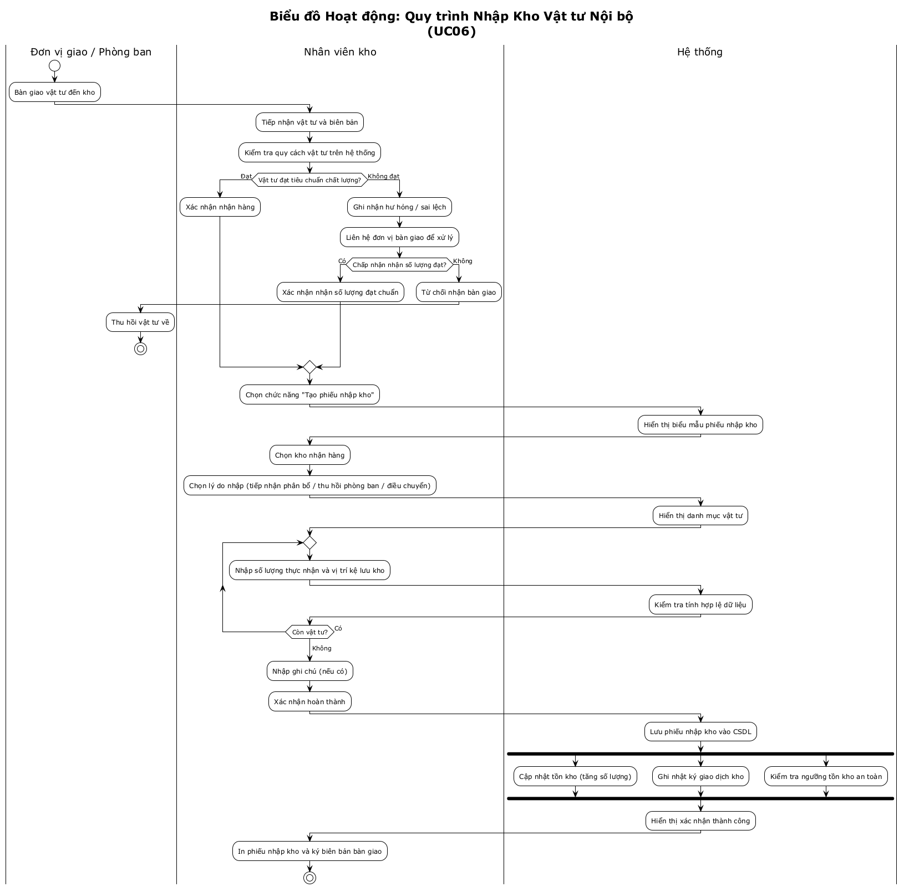

---

#### F3.2 Tạo phiếu xuất kho (UC07)

| Thuộc tính | Nội dung |
|:--|:--|
| **Mô tả** | NV kho tạo phiếu xuất kho khi cần xuất hàng (chuyển kho, trả NCC, hủy hàng, điều chỉnh kiểm kê) |
| **Tác nhân** | Nhân viên kho |
| **Độ phức tạp** | Complex |
| **Tiền điều kiện** | NV kho đã đăng nhập; hàng hóa có sẵn trong kho |
| **Hậu điều kiện** | Phiếu xuất lưu; tồn kho giảm; cảnh báo tồn kho thấp kích hoạt nếu cần |

**Các chức năng nguyên thủy:**

| ID | Chức năng | Mô tả chi tiết | Quy tắc nghiệp vụ |
|:--|:--|:--|:--|
| F3.2.1 | Khởi tạo phiếu xuất kho | Tự sinh mã (PX-YYYYMMDD-XXX), gán ngày, NV tạo | BR20: Mã phiếu duy nhất |
| F3.2.2 | Chọn kho xuất | Chọn kho có hàng cần xuất | — |
| F3.2.3 | Chọn lý do xuất kho | Lý do: Chuyển kho nội bộ, Trả NCC, Hủy hàng, Điều chỉnh kiểm kê giảm | — |
| F3.2.4 | Chọn đích tiếp nhận | Kho đích (nếu chuyển kho), NCC (nếu trả hàng), bộ phận hủy | — |
| F3.2.5 | Thêm mục xuất kho | Chọn SP, nhập số lượng xuất | BR21: soLuongXuat ≤ TonKho hiện có |
| F3.2.6 | Kiểm tra tồn kho khả dụng | Hệ thống kiểm tra TonKho.soLuong ≥ soLuongXuat | BR22: Từ chối nếu tồn kho không đủ |
| F3.2.7 | Kiểm tra SP bị khóa kiểm kê | SP đang trong phiên kiểm kê → không cho xuất | BR23: SP bị khóa khi PhienKiemKe trạng thái DANG_KIEM_KE |
| F3.2.8 | Tính đơn giá xuất | Áp dụng phương pháp tính giá xuất (giá bình quân gia quyền / FIFO) | — |
| F3.2.9 | Xác nhận lưu phiếu xuất | Lưu PhieuXuatKho + các MucXuat | — |
| F3.2.10 | Cập nhật tồn kho | TonKho.soLuong -= soLuongXuat | BR24: Cập nhật nguyên tử |
| F3.2.11 | Kiểm tra và kích hoạt cảnh báo | Nếu TonKho.soLuong < SanPham.nguongTonKho → kích hoạt UC11 | — |
| F3.2.12 | Tạo phiếu nhập kho đích | Nếu chuyển kho → tự động tạo phiếu nhập tại kho đích | BR25: Liên kết PhieuXuat ↔ PhieuNhap qua maPhieuLienQuan |

**Biểu đồ hoạt động:**

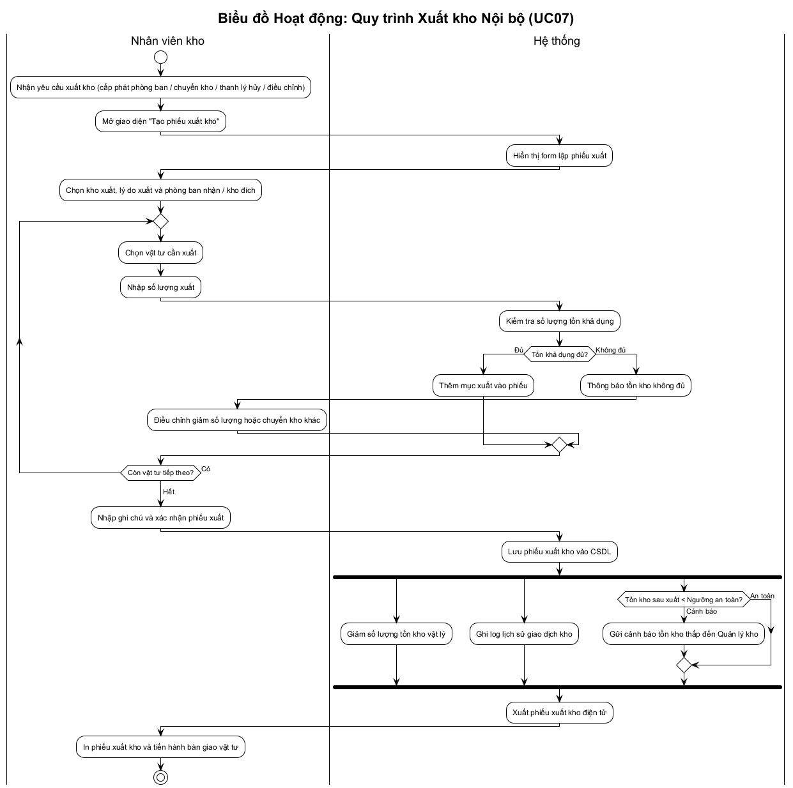

---

#### F3.3 Chuyển kho (UC08)

| Thuộc tính | Nội dung |
|:--|:--|
| **Mô tả** | Điều chuyển hàng hóa giữa các kho nội bộ doanh nghiệp |
| **Tác nhân** | Quản lý kho |
| **Quan hệ** | **Extend** từ UC07 (Tạo phiếu xuất kho) – kích hoạt khi lý do xuất = "Chuyển kho nội bộ" |

**Các chức năng nguyên thủy:**

| ID | Chức năng | Mô tả chi tiết |
|:--|:--|:--|
| F3.3.1 | Chọn kho nguồn và kho đích | Đảm bảo kho nguồn ≠ kho đích, cả hai đều đang hoạt động |
| F3.3.2 | Tạo phiếu xuất kho nguồn | Tự động gọi F3.2 với lý do "Chuyển kho nội bộ" |
| F3.3.3 | Tạo phiếu nhập kho đích | Tự động sinh phiếu nhập kho liên kết với phiếu xuất |
| F3.3.4 | Cập nhật tồn kho 2 chiều | Giảm tồn kho nguồn, tăng tồn kho đích cho từng SP |

---

#### F3.4 Kiểm kê kho (UC09)

| Thuộc tính | Nội dung |
|:--|:--|
| **Mô tả** | Kiểm kê hàng hóa thực tế trong kho, so sánh với hệ thống, điều chỉnh chênh lệch |
| **Tác nhân** | Quản lý kho (tạo phiên, duyệt), Nhân viên kho (kiểm đếm) |
| **Độ phức tạp** | Complex |
| **Tiền điều kiện** | Quản lý kho đã lên kế hoạch kiểm kê; NV kho đã đăng nhập |
| **Hậu điều kiện** | Phiếu kiểm kê lưu; tồn kho điều chỉnh (nếu chênh lệch); báo cáo chênh lệch tạo |

**Các chức năng nguyên thủy:**

| ID | Chức năng | Mô tả chi tiết | Quy tắc nghiệp vụ |
|:--|:--|:--|:--|
| F3.4.1 | Tạo phiên kiểm kê | QLK tạo phiên, tự sinh mã (KK-YYYYMMDD-XXX), chọn kho, phạm vi | BR26: Một kho chỉ có 1 phiên kiểm kê mở tại 1 thời điểm |
| F3.4.2 | Chốt số liệu sổ sách | Hệ thống snapshot TonKho.soLuong tại thời điểm bắt đầu | BR27: Khóa xuất/nhập kho cho các SP trong phạm vi kiểm kê |
| F3.4.3 | Tạo danh sách kiểm đếm | Sinh danh sách SP cần kiểm đếm kèm soLuongHeThong | — |
| F3.4.4 | Nhập số lượng thực tế | NV kho đếm thực tế và nhập soLuongThucTe cho từng SP | — |
| F3.4.5 | Tính chênh lệch | chenhLech = soLuongThucTe - soLuongHeThong cho mỗi MucKiemKe | — |
| F3.4.6 | Hiển thị báo cáo chênh lệch | Danh sách SP thừa (chenhLech > 0) và thiếu (chenhLech < 0) | — |
| F3.4.7 | Nhập lý do chênh lệch | QLK nhập lý do cho từng SP có chênh lệch | BR28: Bắt buộc nhập lý do khi |chenhLech| > 0 |
| F3.4.8 | Phê duyệt điều chỉnh | QLK xác nhận điều chỉnh tồn kho | — |
| F3.4.9 | Tạo phiếu điều chỉnh | Tự sinh phiếu nhập (nếu thừa) hoặc phiếu xuất (nếu thiếu) với lý do "Kiểm kê điều chỉnh" | — |
| F3.4.10 | Cập nhật tồn kho | TonKho.soLuong = soLuongThucTe | BR29: Cập nhật nguyên tử |
| F3.4.11 | Mở khóa giao dịch | Gỡ khóa xuất/nhập cho các SP trong phạm vi | — |
| F3.4.12 | Lưu báo cáo kiểm kê | Lưu PhienKiemKe với trạng thái HOAN_THANH | — |

**Biểu đồ hoạt động:**

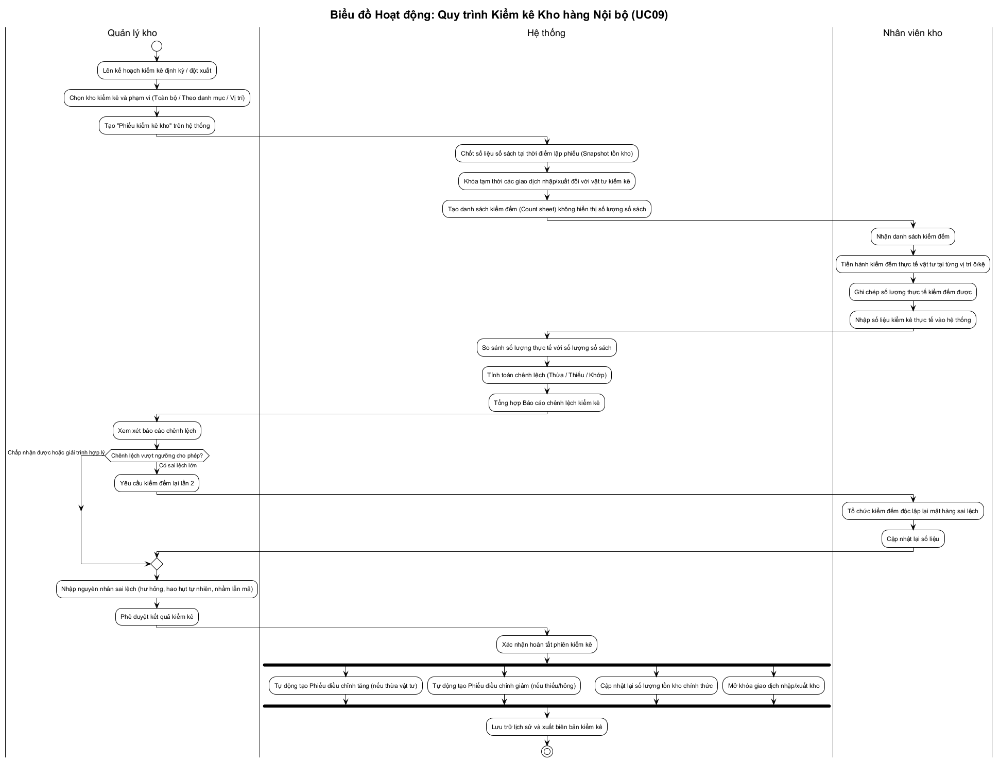

---

#### F3.5 Xem tồn kho (UC10)

| ID | Chức năng | Mô tả chi tiết |
|:--|:--|:--|
| F3.5.1 | Xem tồn kho tổng hợp | Hiển thị tồn kho tất cả SP trên tất cả kho, phân trang |
| F3.5.2 | Xem tồn kho theo kho | Lọc tồn kho theo một kho cụ thể |
| F3.5.3 | Xem tồn kho theo SP | Hiển thị tồn kho của 1 SP tại tất cả các kho |
| F3.5.4 | Xem SP dưới ngưỡng | Lọc SP có TonKho.soLuong < SanPham.nguongTonKho |
| F3.5.5 | Xem SP hết hàng | Lọc SP có TonKho.soLuong = 0 |
| F3.5.6 | Xuất danh sách tồn kho | Xuất file Excel/CSV |

#### F3.6 Cảnh báo tồn kho thấp (UC11)

| Thuộc tính | Nội dung |
|:--|:--|
| **Mô tả** | Hệ thống tự động giám sát và cảnh báo khi tồn kho giảm dưới ngưỡng |
| **Loại sự kiện** | Sự kiện trạng thái (State Event) |
| **Quan hệ** | **Extend** từ UC10 – kích hoạt khi TonKho < ngưỡng |

| ID | Chức năng | Mô tả chi tiết |
|:--|:--|:--|
| F3.6.1 | Giám sát ngưỡng tồn kho | Sau mỗi giao dịch xuất kho → kiểm tra TonKho vs nguongTonKho |
| F3.6.2 | Tạo cảnh báo | Sinh bản ghi cảnh báo (SP, kho, soLuongHienTai, nguongTonKho, ngay) |
| F3.6.3 | Gửi email thông báo | Gửi email đến Quản lý kho qua hệ thống email (tác nhân EmailSys) |
| F3.6.4 | Hiển thị trên Dashboard | Hiển thị danh sách SP cảnh báo trên trang Dashboard |

---

### 3.4 F4 — Quản lý Mua hàng

#### F4.1 Quản lý nhà cung cấp (UC12)

| ID | Chức năng | Mô tả chi tiết | Quy tắc nghiệp vụ |
|:--|:--|:--|:--|
| F4.1.1 | Thêm NCC mới | Nhập mã, tên, địa chỉ, SĐT, email, người liên hệ | BR30: Mã NCC duy nhất |
| F4.1.2 | Cập nhật thông tin NCC | Sửa thông tin NCC | — |
| F4.1.3 | Ngừng hợp tác NCC | Chuyển trạng thái NCC sang NGUNG_HOP_TAC | BR31: Không xóa vật lý NCC đã có đơn mua |
| F4.1.4 | Xem chi tiết NCC | Hiển thị thông tin NCC kèm lịch sử đơn mua | — |
| F4.1.5 | Liệt kê NCC | Danh sách NCC với tìm kiếm, lọc theo trạng thái | — |
| F4.1.6 | Liên kết NCC - SP | Quản lý danh sách SP mà NCC cung cấp (bảng trung gian) | — |

#### F4.2 Tạo đơn mua hàng (UC13)

| Thuộc tính | Nội dung |
|:--|:--|
| **Mô tả** | NV mua hàng tạo đơn đặt mua hàng từ NCC để bổ sung hàng cho kho |
| **Tác nhân** | Nhân viên mua hàng |
| **Độ phức tạp** | Complex |
| **Tiền điều kiện** | NV mua hàng đã đăng nhập; có ít nhất 1 NCC trong hệ thống |
| **Hậu điều kiện** | Đơn mua lưu trạng thái MOI_TAO; chờ duyệt |

**Các chức năng nguyên thủy:**

| ID | Chức năng | Mô tả chi tiết | Quy tắc nghiệp vụ |
|:--|:--|:--|:--|
| F4.2.1 | Khởi tạo đơn mua | Tự sinh mã (DM-YYYYMMDD-XXX), gán ngày tạo, NV tạo | BR32: Mã đơn duy nhất |
| F4.2.2 | Chọn nhà cung cấp | Chọn NCC từ danh sách NCC đang hợp tác | BR33: Chỉ chọn NCC trạng thái DANG_HOP_TAC |
| F4.2.3 | Hiển thị SP của NCC | Lọc và hiển thị danh sách SP mà NCC được chọn cung cấp | — |
| F4.2.4 | Chọn kho nhận hàng | Chọn kho sẽ nhận hàng khi NCC giao | — |
| F4.2.5 | Thêm mục mua | Chọn SP, nhập soLuong, donGiaMua | BR34: soLuong > 0; BR35: donGiaMua > 0 |
| F4.2.6 | Tính thành tiền | thanhTien = soLuong × donGiaMua; tongGiaTri = Σ thanhTien | — |
| F4.2.7 | Nhập thông tin bổ sung | Ngày giao hàng dự kiến, ghi chú | BR36: ngayGiaoDuKien > ngayTao |
| F4.2.8 | Xác nhận tạo đơn | Lưu DonMuaHang + các MucMua, trạng thái = MOI_TAO | — |
| F4.2.9 | Gửi thông báo duyệt | Gửi email thông báo đến Quản lý kho để duyệt đơn | — |

**Biểu đồ hoạt động:**

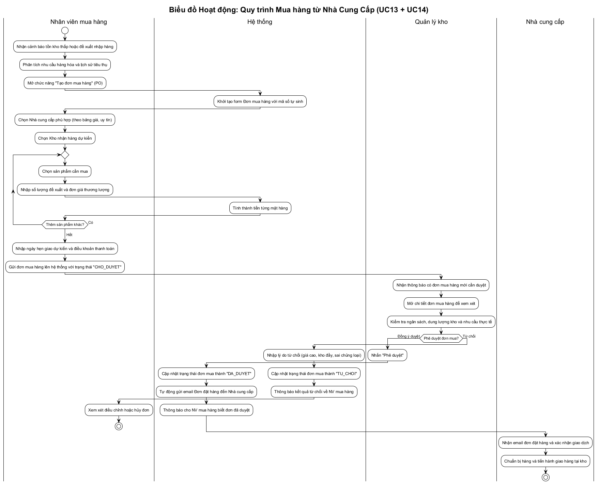

#### F4.3 Duyệt đơn mua hàng (UC14)

**Các chức năng nguyên thủy:**

| ID | Chức năng | Mô tả chi tiết | Quy tắc nghiệp vụ |
|:--|:--|:--|:--|
| F4.3.1 | Xem danh sách đơn chờ duyệt | Liệt kê đơn mua trạng thái MOI_TAO, sắp xếp theo ngày tạo | — |
| F4.3.2 | Xem chi tiết đơn mua | Hiển thị NCC, danh sách SP, số lượng, đơn giá, tổng tiền | — |
| F4.3.3 | Phê duyệt đơn mua | Chuyển trạng thái → DA_DUYET | — |
| F4.3.4 | Từ chối đơn mua | Chuyển trạng thái → TU_CHOI, bắt buộc nhập lý do | BR37: Lý do từ chối không được để trống |
| F4.3.5 | Gửi thông báo kết quả | Email đến NV mua hàng; nếu DA_DUYET → email kèm PO đến NCC | — |

#### F4.4 Nhận hàng từ nhà cung cấp (UC15)

**Các chức năng nguyên thủy:**

| ID | Chức năng | Mô tả chi tiết | Quy tắc nghiệp vụ |
|:--|:--|:--|:--|
| F4.4.1 | Xem đơn mua chờ nhận hàng | Liệt kê đơn mua trạng thái DA_DUYET hoặc DANG_GIAO | — |
| F4.4.2 | Chọn đơn mua để nhận hàng | NV kho chọn đơn mua, hệ thống hiển thị SP và số lượng đặt | — |
| F4.4.3 | Kiểm đếm hàng thực nhận | NV kho nhập số lượng thực nhận cho từng SP | BR38: soLuongThucNhan ≥ 0 |
| F4.4.4 | Ghi nhận chất lượng | NV kho ghi nhận tình trạng hàng hóa (đạt/không đạt) | — |
| F4.4.5 | Tạo phiếu nhập kho tự động | Kích hoạt UC06 (include) với dữ liệu từ đơn mua | — |
| F4.4.6 | Cập nhật trạng thái đơn mua | Nhận đủ → DA_NHAN_DU; nhận một phần → DANG_GIAO | — |

---

### 3.5 F5 — Quản lý Nhân viên

#### F5.1 Quản lý nhân viên (UC16)

| ID | Chức năng | Mô tả chi tiết | Quy tắc nghiệp vụ |
|:--|:--|:--|:--|
| F5.1.1 | Thêm nhân viên mới | Nhập họ tên, ngày sinh, giới tính, CCCD, SĐT, email, chức vụ, bộ phận | BR39: CCCD/email duy nhất |
| F5.1.2 | Tạo tài khoản đăng nhập | Sinh tài khoản liên kết NV, gán mật khẩu mặc định, bắt buộc đổi lần đầu | BR40: Mật khẩu mặc định được hash |
| F5.1.3 | Cập nhật thông tin NV | Sửa thông tin cá nhân, chức vụ, bộ phận | — |
| F5.1.4 | Vô hiệu hóa nhân viên | Chuyển trạng thái NV và tài khoản sang NGHI_VIEC / KHOA | BR41: Không xóa vật lý; giữ lại lịch sử giao dịch |
| F5.1.5 | Đặt lại mật khẩu | Admin reset mật khẩu cho NV | — |
| F5.1.6 | Liệt kê nhân viên | Danh sách NV với tìm kiếm, lọc theo bộ phận/trạng thái | — |

---

### 3.6 F6 — Báo cáo Thống kê

#### F6.1 Báo cáo tồn kho (UC17)

| ID | Chức năng | Mô tả chi tiết |
|:--|:--|:--|
| F6.1.1 | Báo cáo tồn kho tổng hợp | Tổng hợp tồn kho tất cả SP trên tất cả kho tại thời điểm hiện tại |
| F6.1.2 | Báo cáo tồn kho theo kho | Tồn kho chi tiết của một kho cụ thể |
| F6.1.3 | Báo cáo tồn kho theo danh mục | Gom nhóm tồn kho theo cây danh mục SP |
| F6.1.4 | Báo cáo xuất nhập tồn | Tổng hợp nhập - xuất - tồn theo khoảng thời gian (ngày/tuần/tháng) |
| F6.1.5 | Báo cáo SP dưới ngưỡng | Danh sách SP cảnh báo tồn kho thấp |
| F6.1.6 | Xuất báo cáo | Xuất file Excel/PDF |

#### F6.2 Báo cáo mua hàng (UC18)

| ID | Chức năng | Mô tả chi tiết |
|:--|:--|:--|
| F6.2.1 | Báo cáo đơn mua theo kỳ | Tổng hợp đơn mua theo tháng/quý/năm |
| F6.2.2 | Báo cáo theo NCC | Thống kê giá trị mua hàng theo từng NCC |
| F6.2.3 | Báo cáo theo SP | Top SP mua nhiều nhất / ít nhất |
| F6.2.4 | Báo cáo tỉ lệ hoàn thành | % đơn mua hoàn thành đúng hạn vs trễ hạn |
| F6.2.5 | Xuất báo cáo | Xuất file Excel/PDF |

---

## 4. Biểu đồ Ca sử dụng Tổng quan

### Quan hệ giữa các Ca sử dụng

File mã nguồn PlantUML: [functional-model-uc-relations.puml](../plantuml/functional-model-uc-relations.puml)

### Ma trận Phân quyền theo Vai trò (RBAC)

File mã nguồn PlantUML: [functional-model-rbac-matrix.puml](../plantuml/functional-model-rbac-matrix.puml)

Xem mã Mermaid quan hệ UC (tham khảo)

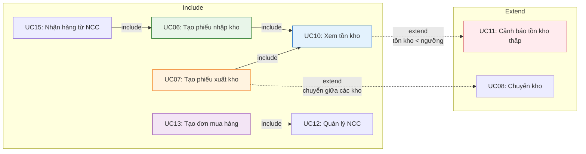

---

## 5. Ma trận CRUD (Chức năng ↔ Thực thể Dữ liệu)

Ma trận CRUD thể hiện mối quan hệ giữa các chức năng và các thực thể dữ liệu trong hệ thống.

> **C** = Create, **R** = Read, **U** = Update, **D** = Delete (soft)

| Chức năng \ Thực thể | SanPham | DanhMuc | Kho | TonKho | PhieuNhapKho | MucNhap | PhieuXuatKho | MucXuat | DonMuaHang | MucMua | NhaCungCap | PhienKiemKe | MucKiemKe | NhanVien | TaiKhoan | VaiTro | Quyen |
|:--|:--:|:--:|:--:|:--:|:--:|:--:|:--:|:--:|:--:|:--:|:--:|:--:|:--:|:--:|:--:|:--:|:--:|
| **F1.1 Đăng nhập** | | | | | | | | | | | | | | | R | R | R |
| **F1.2 Phân quyền** | | | | | | | | | | | | | | | R,U | C,R,U,D | C,R,U,D |
| **F2.1 QL sản phẩm** | C,R,U,D | R | | R | | | | | | | | | | | | | |
| **F2.2 QL danh mục** | | C,R,U,D | | | | | | | | | | | | | | | |
| **F2.3 Tìm kiếm SP** | R | R | | R | | | | | | | | | | | | | |
| **F3.1 Nhập kho** | R | | R | C,U | C | C | | | R,U | R | R | | | | | | |
| **F3.2 Xuất kho** | R | | R | R,U | | | C | C | | | | | | | | | |
| **F3.3 Chuyển kho** | R | | R | U | C | C | C | C | | | | | | | | | |
| **F3.4 Kiểm kê** | R | | R | R,U | C | C | C | C | | | | C,U | C,U | | | | |
| **F3.5 Xem tồn kho** | R | R | R | R | | | | | | | | | | | | | |
| **F3.6 Cảnh báo** | R | | R | R | | | | | | | | | | | | | |
| **F4.1 QL NCC** | R | | | | | | | | | | C,R,U,D | | | | | | |
| **F4.2 Tạo đơn mua** | R | | R | | | | | | C | C | R | | | | | | |
| **F4.3 Duyệt đơn mua** | | | | | | | | | R,U | R | R | | | | | | |
| **F4.4 Nhận hàng** | R | | R | U | C | C | | | R,U | R | R | | | | | | |
| **F5.1 QL nhân viên** | | | | | | | | | | | | | | C,R,U,D | C,R,U | R | |
| **F6.1 BC tồn kho** | R | R | R | R | R | R | R | R | | | | R | R | | | | |
| **F6.2 BC mua hàng** | R | | | | | | | | R | R | R | | | | | | |

---

## 6. Luồng Dữ liệu Nghiệp vụ (Data Flow Overview)

### 6.1 Luồng Mua hàng – Nhập kho

File mã nguồn PlantUML: [functional-model-flow-mua-nhap.puml](../plantuml/functional-model-flow-mua-nhap.puml)

Xem mã Mermaid (tham khảo)

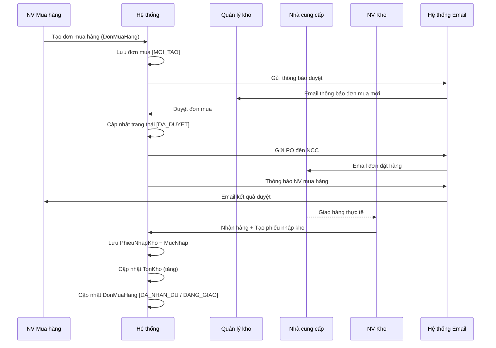

### 6.2 Luồng Xuất kho – Cảnh báo

File mã nguồn PlantUML: [functional-model-flow-xuat-canh-bao.puml](../plantuml/functional-model-flow-xuat-canh-bao.puml)

Xem mã Mermaid (tham khảo)

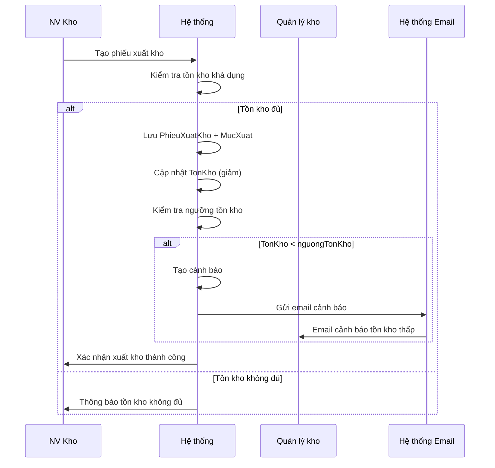

### 6.3 Luồng Kiểm kê

File mã nguồn PlantUML: [functional-model-flow-kiem-ke.puml](../plantuml/functional-model-flow-kiem-ke.puml)

Xem mã Mermaid (tham khảo)

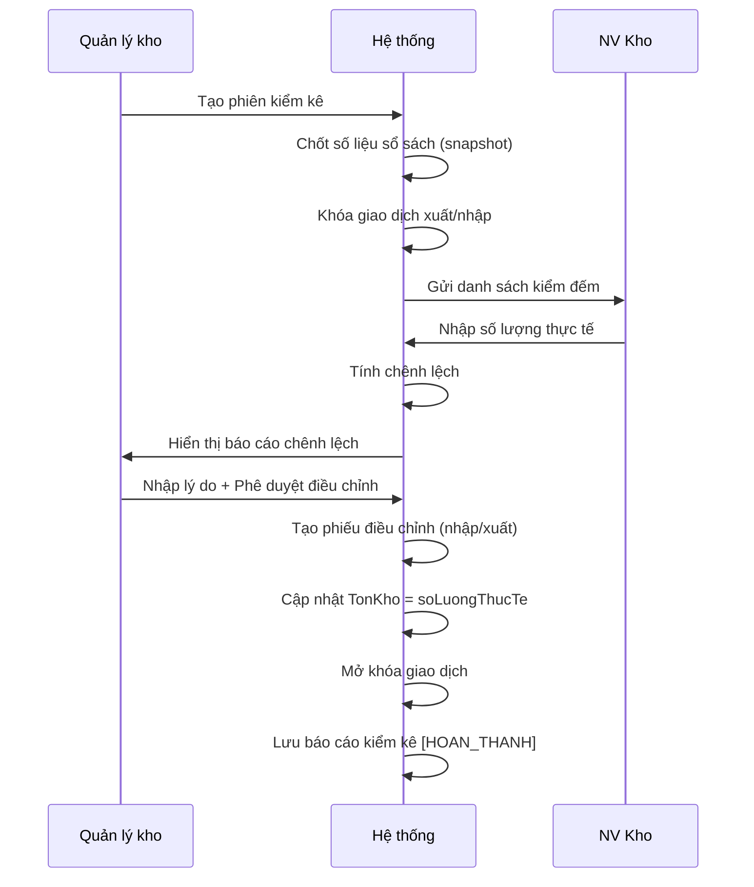

---

## 7. Máy trạng thái các Thực thể Nghiệp vụ Chính

File mã nguồn PlantUML: [functional-model-state-machines.puml](../plantuml/functional-model-state-machines.puml)

### 7.1 Đơn mua hàng (DonMuaHang)

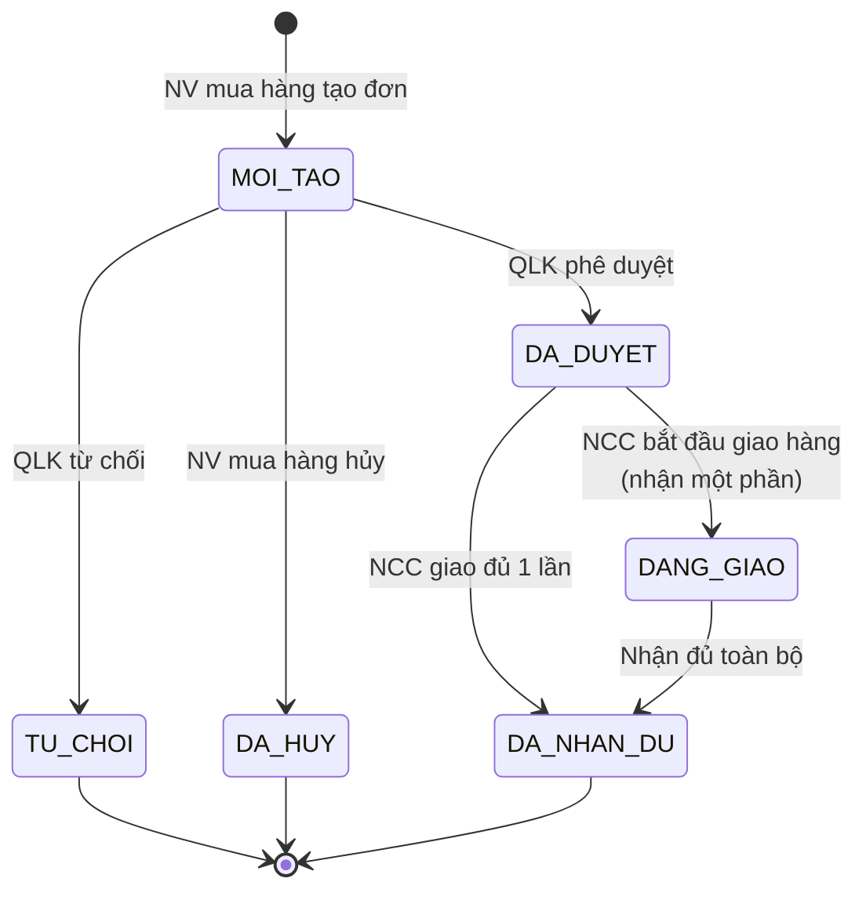

### 7.2 Phiếu xuất kho (PhieuXuatKho)

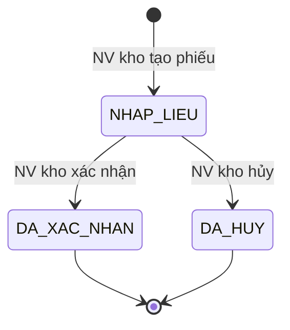

### 7.3 Sản phẩm (SanPham)

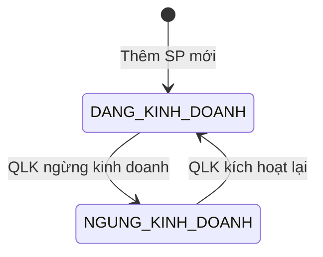

---

## 8. Tổng hợp Quy tắc Nghiệp vụ (Business Rules)

| ID | Quy tắc | Áp dụng cho |
|:--|:--|:--|
| BR01 | Mật khẩu mã hóa hash (bcrypt) | TaiKhoan |
| BR02 | Khóa tài khoản sau 5 lần đăng nhập sai | TaiKhoan |
| BR03 | Session timeout 30 phút | Phiên đăng nhập |
| BR04 | Mã sản phẩm duy nhất | SanPham |
| BR05 | Giá nhập > 0 | SanPham |
| BR06 | Ngưỡng tồn kho ≥ 0 | SanPham |
| BR07 | Không được sửa mã SP | SanPham |
| BR08 | Ghi log mọi thay đổi SP | SanPham |
| BR09 | Không xóa vật lý SP đã có giao dịch | SanPham |
| BR10 | Tên danh mục duy nhất cùng cấp | DanhMuc |
| BR11 | Không tạo vòng lặp cây danh mục | DanhMuc |
| BR12 | Không xóa danh mục có SP hoặc con | DanhMuc |
| BR13 | Mã phiếu nhập kho duy nhất | PhieuNhapKho |
| BR14 | Chỉ nhập từ đơn mua DA_DUYET hoặc DANG_GIAO | PhieuNhapKho |
| BR15 | Số lượng nhập > 0 | MucNhap |
| BR16 | SP phải tồn tại và DANG_KINH_DOANH | MucNhap |
| BR17 | Cảnh báo nhưng cho phép nhập vượt đơn mua | MucNhap |
| BR18 | Cập nhật tồn kho nguyên tử (transaction) | TonKho |
| BR19 | So sánh tổng đã nhận vs tổng đặt | DonMuaHang |
| BR20 | Mã phiếu xuất kho duy nhất | PhieuXuatKho |
| BR21 | Số lượng xuất ≤ tồn kho hiện có | MucXuat |
| BR22 | Từ chối xuất nếu tồn kho không đủ | MucXuat |
| BR23 | SP bị khóa khi đang kiểm kê | PhienKiemKe |
| BR24 | Cập nhật tồn kho giảm nguyên tử | TonKho |
| BR25 | Liên kết phiếu xuất ↔ phiếu nhập khi chuyển kho | PhieuXuatKho, PhieuNhapKho |
| BR26 | Một kho chỉ có 1 phiên kiểm kê mở | PhienKiemKe |
| BR27 | Khóa xuất/nhập khi kiểm kê | PhienKiemKe |
| BR28 | Bắt buộc nhập lý do khi có chênh lệch | MucKiemKe |
| BR29 | Cập nhật tồn kho kiểm kê nguyên tử | TonKho |
| BR30 | Mã NCC duy nhất | NhaCungCap |
| BR31 | Không xóa vật lý NCC đã có đơn mua | NhaCungCap |
| BR32 | Mã đơn mua duy nhất | DonMuaHang |
| BR33 | Chỉ chọn NCC đang hợp tác | DonMuaHang |
| BR34 | Số lượng mua > 0 | MucMua |
| BR35 | Đơn giá mua > 0 | MucMua |
| BR36 | Ngày giao dự kiến > ngày tạo | DonMuaHang |
| BR37 | Lý do từ chối không được trống | DonMuaHang |
| BR38 | Số lượng thực nhận ≥ 0 | MucNhap |
| BR39 | CCCD/email nhân viên duy nhất | NhanVien |
| BR40 | Mật khẩu mặc định được hash | TaiKhoan |
| BR41 | Không xóa vật lý NV, giữ lịch sử | NhanVien |

---

## 9. Kiểm tra Cân bằng Mô hình (Functional Model Balancing)

> [!IMPORTANT]
> Mô hình chức năng phải đảm bảo tính nhất quán với các mô hình khác trong hệ thống.

| Tiêu chí kiểm tra | Kết quả | Chi tiết |
|:--|:--:|:--|
| **BFD ↔ Use Case Diagram** | ✅ | 18 chức năng nguyên thủy (leaf) ánh xạ 1:1 với 18 UC |
| **UC Specs ↔ Activity Diagrams** | ✅ | Các bước Main Flow/Alternative Flow trong 5 UC specs (UC06, UC07, UC09, UC13, UC14) khớp với 4 Activity Diagrams |
| **Chức năng ↔ Thực thể (CRUD)** | ✅ | Mọi thực thể đều được ít nhất 1 chức năng Create và 1 chức năng Read; không có thực thể "mồ côi" |
| **Tác nhân ↔ Chức năng** | ✅ | Mọi tác nhân đều tham gia ít nhất 1 UC; mọi UC đều có ít nhất 1 tác nhân |
| **FR ↔ UC** | ✅ | 15 yêu cầu chức năng (FR01–FR15) được phủ bởi 18 UC |
| **Chức năng ↔ Quy tắc NV** | ✅ | 41 quy tắc nghiệp vụ (BR01–BR41) được gán cho các chức năng nguyên thủy tương ứng |
| **Sự kiện ↔ UC** | ✅ | 5 sự kiện (3 ngoại, 1 thời gian, 1 trạng thái) ánh xạ đúng UC |

### Ánh xạ Yêu cầu chức năng → Ca sử dụng

| Yêu cầu | UC tương ứng |
|:--|:--|
| FR01: QL thông tin SP | UC03, UC05 |
| FR02: QL danh mục SP | UC04 |
| FR03: QL thông tin NCC | UC12 |
| FR04: Tạo đơn mua hàng | UC13 |
| FR05: Duyệt đơn mua | UC14 |
| FR06: Tạo phiếu nhập kho | UC06, UC15 |
| FR07: Tạo phiếu xuất kho | UC07 |
| FR08: Theo dõi tồn kho | UC10 |
| FR09: Kiểm kê kho | UC09 |
| FR10: Chuyển kho | UC08 |
| FR11: Cảnh báo tồn kho | UC11 |
| FR12: Báo cáo tồn kho | UC17 |
| FR13: Báo cáo mua hàng | UC18 |
| FR14: QL nhân viên | UC16 |
| FR15: Đăng nhập/phân quyền | UC01, UC02 |

---

## 10. Thống kê Tổng quan

| Chỉ số | Giá trị |
|:--|:--|
| Tổng số nhóm chức năng (Level 1) | **6** |
| Tổng số chức năng con (Level 2 = UC) | **18** |
| Tổng số chức năng nguyên thủy (Level 3) | **~85** |
| Tổng số quy tắc nghiệp vụ | **41** |
| Tổng số thực thể dữ liệu | **17** |
| Tổng số tác nhân | **5** (4 người + 1 hệ thống) |
| Tổng số quan hệ Include | **4** |
| Tổng số quan hệ Extend | **2** |
| Tổng số sự kiện nghiệp vụ | **5** |
| Tổng UAW (Unadjusted Actor Weight) | **13** |
| Tổng UUCW (Unadjusted Use Case Weight) | **185** |

