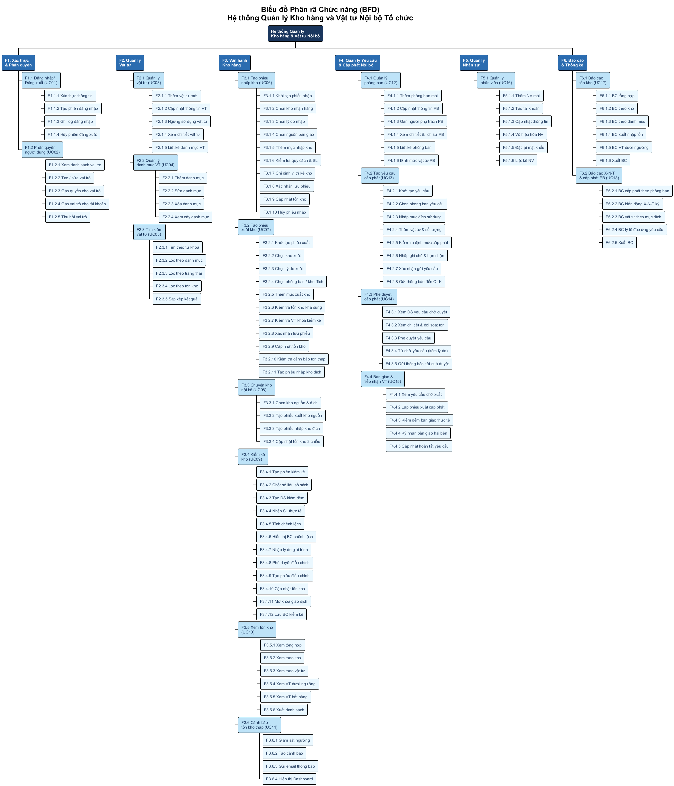
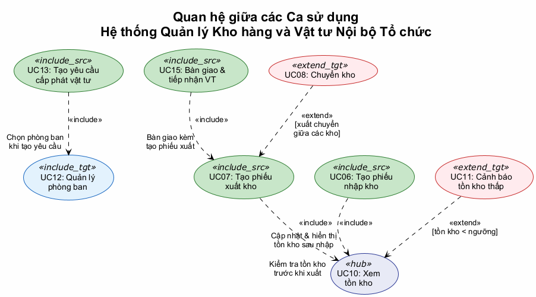
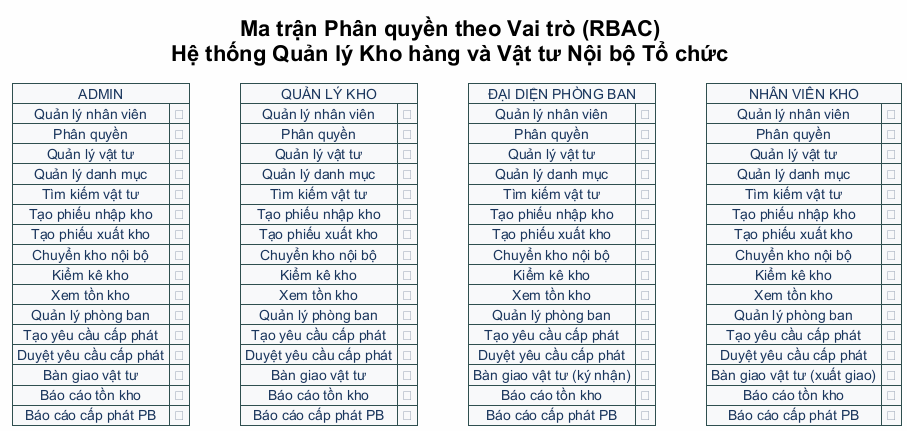
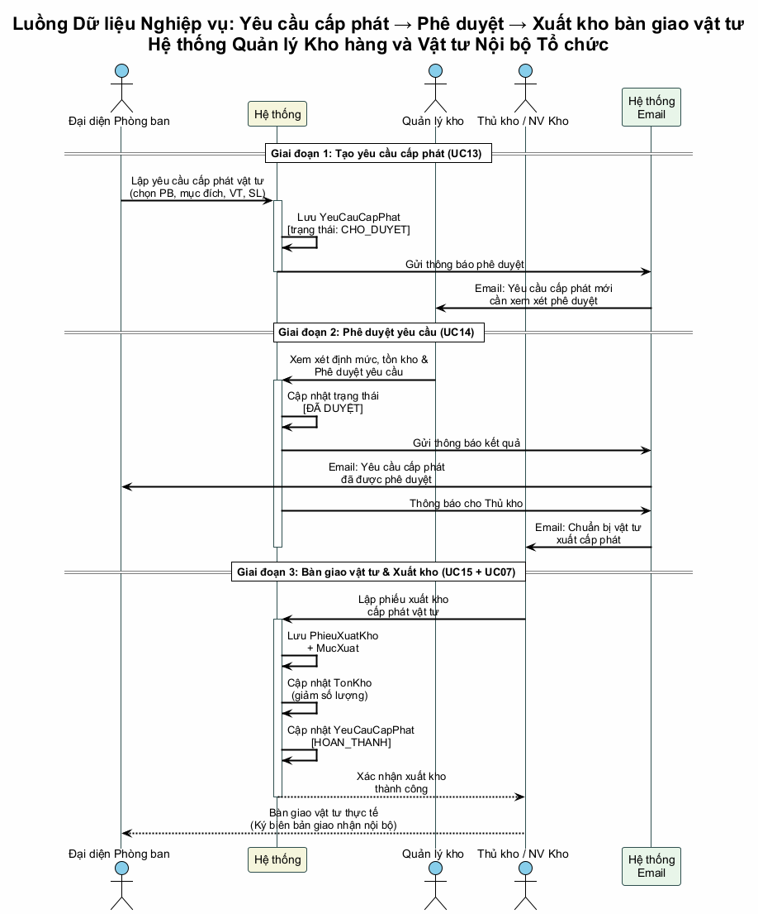
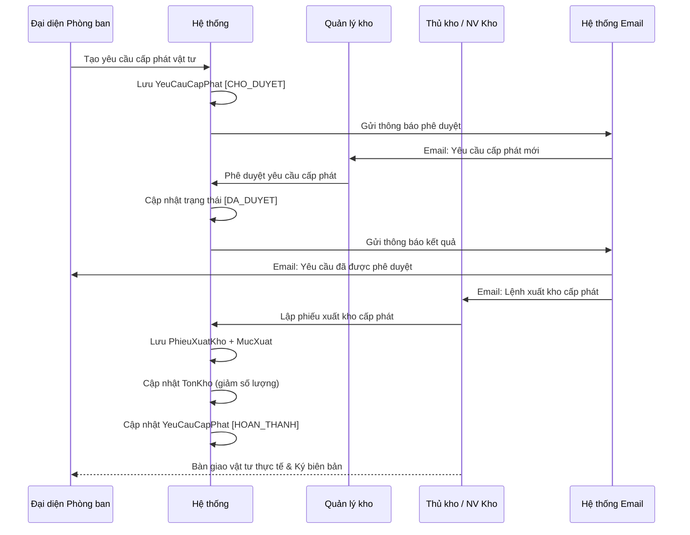
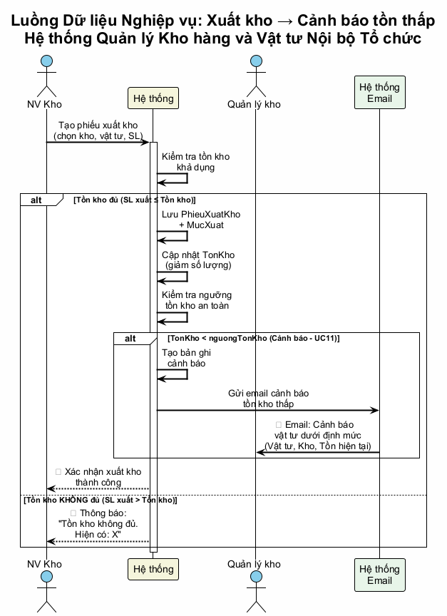
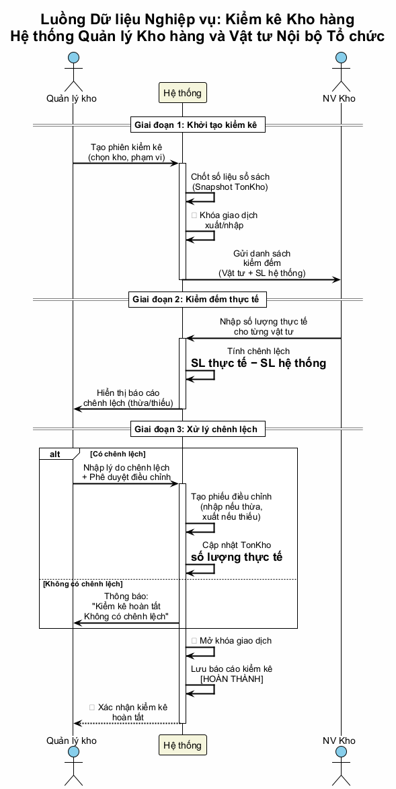
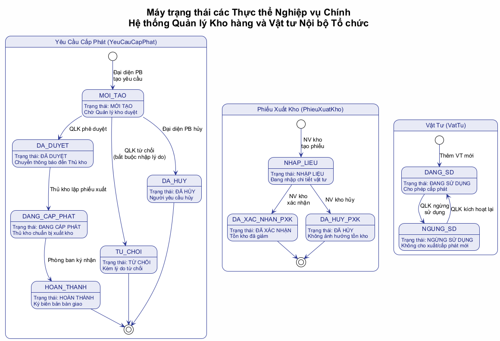

# Mô hình Chức năng Chi tiết — Hệ thống Quản lý Kho hàng và Vật tư Nội bộ Tổ chức

> **Học phần**: IT3120 – Phân tích và Thiết kế Hệ thống Thông tin  
> **Đại học Bách Khoa Hà Nội (HUST)** — Nhóm G8  
> **Phương pháp**: Phân tích chức năng theo tiến trình EUP, sử dụng UML 2.5  
> **Đặc tả phạm vi**: Quản lý tài sản, vật tư, trang thiết bị và kho lưu trữ nội bộ của một tổ chức — **Hoàn toàn không có nghiệp vụ mua bán thương mại**.

---

## 1. Tổng quan Mô hình Chức năng

Mô hình chức năng (Functional Model) là thành phần cốt lõi trong giai đoạn **Phân tích hệ thống**, đặc tả **hệ thống làm gì** (what) chứ không phải **làm như thế nào** (how). Mô hình bao gồm:

| Thành phần | Mục đích | Tài liệu tham chiếu |
|:--|:--|:--|
| Biểu đồ phân rã chức năng (BFD) | Phân rã hệ thống thành các nhóm chức năng con | Mục 2 |
| Biểu đồ Ca sử dụng (Use Case Diagram) | Xác định tác nhân và các ca sử dụng | [02-use-case-diagram.md](./02-use-case-diagram.md) |
| Đặc tả Ca sử dụng (Use Case Specs) | Mô tả chi tiết luồng sự kiện | [03-use-case-specs.md](./03-use-case-specs.md) |
| Biểu đồ Hoạt động (Activity Diagrams) | Mô hình hóa luồng công việc nghiệp vụ | [04-activity-diagrams.md](./04-activity-diagrams.md) |
| Ma trận CRUD | Ánh xạ chức năng ↔ thực thể dữ liệu | Mục 5 |
| Luồng dữ liệu nghiệp vụ | Mô tả luồng dữ liệu giữa các chức năng | Mục 6 |

---

## 2. Biểu đồ Phân rã Chức năng (Business Function Decomposition – BFD)

Phân rã hệ thống từ mức tổng quát xuống mức chức năng nguyên thủy (leaf function). Mỗi chức năng nguyên thủy tương ứng với một hoặc nhiều Ca sử dụng (UC).

File mã nguồn PlantUML: [functional-model-bfd.puml](../plantuml/functional-model-bfd.puml)

```mermaid
graph TD
    ROOT["<b>Hệ thống Quản lý<br>Kho & Vật tư Nội bộ</b>"]

    ROOT --> F1["<b>F1. Quản lý<br>Xác thực & Phân quyền</b>"]
    ROOT --> F2["<b>F2. Quản lý<br>Vật tư</b>"]
    ROOT --> F3["<b>F3. Vận hành<br>Kho hàng</b>"]
    ROOT --> F4["<b>F4. Yêu cầu &<br>Cấp phát Nội bộ</b>"]
    ROOT --> F5["<b>F5. Quản lý<br>Nhân sự</b>"]
    ROOT --> F6["<b>F6. Báo cáo<br>Thống kê</b>"]

    F1 --> F11["F1.1 Đăng nhập /<br>Đăng xuất<br><i>UC01</i>"]
    F1 --> F12["F1.2 Phân quyền<br>người dùng<br><i>UC02</i>"]

    F2 --> F21["F2.1 Quản lý<br>vật tư<br><i>UC03</i>"]
    F2 --> F22["F2.2 Quản lý<br>danh mục VT<br><i>UC04</i>"]
    F2 --> F23["F2.3 Tìm kiếm<br>vật tư<br><i>UC05</i>"]

    F3 --> F31["F3.1 Nhập kho<br>nội bộ<br><i>UC06</i>"]
    F3 --> F32["F3.2 Xuất kho<br>nội bộ<br><i>UC07</i>"]
    F3 --> F33["F3.3 Chuyển kho<br>nội bộ<br><i>UC08</i>"]
    F3 --> F34["F3.4 Kiểm kê kho<br><i>UC09</i>"]
    F3 --> F35["F3.5 Xem tồn kho<br><i>UC10</i>"]
    F3 --> F36["F3.6 Cảnh báo<br>tồn kho thấp<br><i>UC11</i>"]

    F4 --> F41["F4.1 Quản lý<br>phòng ban<br><i>UC12</i>"]
    F4 --> F42["F4.2 Tạo yêu cầu<br>cấp phát<br><i>UC13</i>"]
    F4 --> F43["F4.3 Duyệt yêu cầu<br>cấp phát<br><i>UC14</i>"]
    F4 --> F44["F4.4 Bàn giao &<br>tiếp nhận VT<br><i>UC15</i>"]

    F5 --> F51["F5.1 Quản lý<br>nhân viên<br><i>UC16</i>"]

    F6 --> F61["F6.1 Báo cáo<br>tồn kho<br><i>UC17</i>"]
    F6 --> F62["F6.2 Báo cáo X-N-T<br>& cấp phát PB<br><i>UC18</i>"]

    style ROOT fill:#1a365d,color:#fff,stroke:#2d3748
    style F1 fill:#2b6cb0,color:#fff
    style F2 fill:#2b6cb0,color:#fff
    style F3 fill:#2b6cb0,color:#fff
    style F4 fill:#2b6cb0,color:#fff
    style F5 fill:#2b6cb0,color:#fff
    style F6 fill:#2b6cb0,color:#fff
```

Xem mã Mermaid (tham khảo)

---

## 3. Đặc tả Chi tiết Từng Nhóm Chức năng

### 3.1 F1 — Quản lý Xác thực & Phân quyền

#### F1.1 Đăng nhập / Đăng xuất (UC01)

| Thuộc tính | Nội dung |
|:--|:--|
| **Mô tả** | Người dùng xác thực danh tính để truy cập hệ thống; đăng xuất để kết thúc phiên làm việc |
| **Tác nhân** | Tất cả (Admin, Quản lý kho, Đại diện phòng ban, Thủ kho / NV kho) |
| **Độ phức tạp** | Simple (1–3 transactions) |
| **Dữ liệu đầu vào** | Tên đăng nhập, mật khẩu |
| **Dữ liệu đầu ra** | Phiên đăng nhập (session token), thông tin vai trò người dùng |
| **Quy tắc nghiệp vụ** | BR01: Mật khẩu phải được mã hóa hash (bcrypt); BR02: Khóa tài khoản sau 5 lần đăng nhập sai liên tiếp; BR03: Session timeout sau 30 phút không hoạt động |

**Các chức năng nguyên thủy:**

| ID | Chức năng | Mô tả chi tiết |
|:--|:--|:--|
| F1.1.1 | Xác thực thông tin đăng nhập | Nhận tên đăng nhập + mật khẩu, so khớp hash trong CSDL, trả về kết quả |
| F1.1.2 | Tạo phiên đăng nhập | Sinh session token, lưu thông tin phiên (IP, thời gian, vai trò) |
| F1.1.3 | Ghi log đăng nhập | Ghi nhật ký đăng nhập thành công/thất bại vào bảng AuditLog |
| F1.1.4 | Hủy phiên đăng xuất | Xóa session token, chuyển hướng về trang đăng nhập |

#### F1.2 Phân quyền người dùng (UC02)

| Thuộc tính | Nội dung |
|:--|:--|
| **Mô tả** | Admin gán vai trò (Role) cho tài khoản nhân viên, cấu hình quyền hạn chức năng theo cơ chế RBAC |
| **Tác nhân** | Quản trị viên (Admin) |
| **Độ phức tạp** | Average (4–7 transactions) |
| **Mô hình phân quyền** | RBAC (Role-Based Access Control) gồm 4 vai trò: `ROLE_ADMIN`, `ROLE_WAREHOUSE_MGR`, `ROLE_DEPT_STAFF`, `ROLE_WAREHOUSE_STAFF` |

---

### 3.2 F2 — Quản lý Vật tư, Thiết bị

#### F2.1 Quản lý vật tư (UC03)

| ID | Chức năng | Mô tả chi tiết | Quy tắc nghiệp vụ |
|:--|:--|:--|:--|
| F2.1.1 | Thêm vật tư mới | Nhập mã VT, tên, ĐVT, quy cách kỹ thuật, ngưỡng tồn an toàn | BR04: Mã VT duy nhất; BR06: Ngưỡng tồn ≥ 0 |
| F2.1.2 | Cập nhật vật tư | Sửa quy cách, đơn vị tính, ngưỡng cảnh báo | BR07: Không sửa mã VT; BR08: Ghi log lịch sử |
| F2.1.3 | Ngừng sử dụng vật tư | Chuyển trạng thái sang `NGUNG_SU_DUNG` | BR09: Không xóa vật lý khi đã có giao dịch kho |
| F2.1.4 | Xem chi tiết vật tư | Hiển thị thông số, vị trí lưu kho và tồn kho theo từng kho | — |
| F2.1.5 | Liệt kê vật tư | Hiển thị danh sách có phân trang, lọc theo trạng thái | — |

#### F2.2 Quản lý danh mục vật tư (UC04)

| ID | Chức năng | Mô tả chi tiết | Quy tắc nghiệp vụ |
|:--|:--|:--|:--|
| F2.2.1 | Thêm danh mục | Tạo danh mục phân cấp (cha - con) | BR10: Tên danh mục duy nhất trong cùng cấp cha |
| F2.2.2 | Sửa danh mục | Cập nhật tên, mô tả danh mục | BR11: Không tạo vòng lặp cây danh mục |
| F2.2.3 | Xóa danh mục | Xóa danh mục rỗng (không chứa vật tư hoặc danh mục con) | BR12: Không xóa danh mục đang có vật tư |
| F2.2.4 | Xem cây danh mục | Hiển thị sơ đồ cấu trúc phân cấp danh mục | — |

#### F2.3 Tìm kiếm & tra cứu vật tư (UC05)
Hỗ trợ tìm kiếm theo từ khóa tên vật tư, lọc theo danh mục, trạng thái lưu hành và mức tồn an toàn.

---

### 3.3 F3 — Vận hành Kho hàng

#### F3.1 Tạo phiếu nhập kho nội bộ (UC06)

| ID | Chức năng | Mô tả chi tiết | Quy tắc nghiệp vụ |
|:--|:--|:--|:--|
| F3.1.1 | Khởi tạo phiếu nhập | Tự sinh mã (`PNK-YYYYMMDD-XXX`), gán thời điểm, thủ kho lập | BR13: Mã phiếu nhập duy nhất |
| F3.1.2 | Chọn kho nhận hàng | Chọn kho tiếp nhận vật tư | — |
| F3.1.3 | Chọn lý do nhập | Phân bổ cấp trên, hoàn nhập phòng ban, điều chuyển, kiểm kê thừa | — |
| F3.1.4 | Chọn nguồn bàn giao | Chọn phòng ban bàn giao hoặc nguồn phân bổ | — |
| F3.1.5 | Thêm mục nhập kho | Chọn vật tư, nhập số lượng thực nhận, chỉ định ô/kệ | BR15: Số lượng nhập > 0; BR16: Vật tư DANG_SU_DUNG |
| F3.1.6 | Xác nhận lưu phiếu | Lưu phiếu nhập trạng thái `DA_XAC_NHAN` | — |
| F3.1.7 | Cập nhật tồn kho | Tăng số lượng tồn kho nguyên tử (`TonKho += soLuong`) | BR18: Cập nhật tồn kho nguyên tử (transaction) |
| F3.1.8 | Hủy phiếu nhập | Hủy bỏ trước khi xác nhận | — |

#### F3.2 Tạo phiếu xuất kho nội bộ (UC07)

| ID | Chức năng | Mô tả chi tiết | Quy tắc nghiệp vụ |
|:--|:--|:--|:--|
| F3.2.1 | Khởi tạo phiếu xuất | Tự sinh mã (`PXK-YYYYMMDD-XXX`), gán ngày giờ, thủ kho | BR20: Mã phiếu xuất duy nhất |
| F3.2.2 | Chọn kho xuất | Chọn kho thực hiện xuất vật tư | — |
| F3.2.3 | Chọn lý do xuất | Cấp phát phòng ban, chuyển kho, thanh lý hủy, kiểm kê thiếu | — |
| F3.2.4 | Chọn phòng ban nhận | Chọn phòng ban hoặc căn cứ phiếu yêu cầu cấp phát đã duyệt | — |
| F3.2.5 | Thêm mục xuất kho | Chọn vật tư, nhập số lượng cần xuất | BR21: Số lượng xuất ≤ tồn khả dụng (chống xuất âm) |
| F3.2.6 | Kiểm tra vật tư khóa | Kiểm tra vật tư có thuộc đợt kiểm kê đang diễn ra không | BR23: Không xuất vật tư đang bị khóa kiểm kê |
| F3.2.7 | Cập nhật tồn kho | Trừ tồn kho nguyên tử (`TonKho -= soLuong`) | BR24: Trừ tồn kho transaction an toàn |
| F3.2.8 | Kiểm tra cảnh báo | Tự động so sánh với ngưỡng an toàn để kích hoạt UC11 | — |

#### F3.3 Chuyển kho nội bộ (UC08)
Tự động đồng bộ tạo phiếu xuất tại kho nguồn và phiếu nhập tại kho đích.

#### F3.4 Kiểm kê kho hàng (UC09)
Chốt số liệu sổ sách, tạm khóa xuất/nhập, kiểm đếm thực tế, phát hiện chênh lệch thừa/thiếu, giải trình lý do và tự sinh phiếu điều chỉnh cân bằng tồn kho.

#### F3.5 Xem tồn kho (UC10) & F3.6 Cảnh báo tồn kho thấp (UC11)
Giám sát số lượng tồn khả dụng thời gian thực và gửi email cảnh báo tự động khi chạm ngưỡng an toàn.

---

### 3.4 F4 — Quản lý Yêu cầu & Cấp phát Nội bộ

#### F4.1 Quản lý phòng ban / đơn vị (UC12)

| ID | Chức năng | Mô tả chi tiết | Quy tắc nghiệp vụ |
|:--|:--|:--|:--|
| F4.1.1 | Thêm phòng ban mới | Nhập mã PB, tên, địa điểm, số điện thoại, người phụ trách | BR30: Mã phòng ban duy nhất |
| F4.1.2 | Cập nhật thông tin PB | Sửa thông tin liên hệ, địa điểm phòng ban | — |
| F4.1.3 | Vô hiệu hóa phòng ban | Chuyển trạng thái `NGUNG_HOAT_DONG` | BR31: Không xóa vật lý PB đã có phát sinh yêu cầu |
| F4.1.4 | Xem chi tiết PB | Hiển thị thông tin phòng ban kèm lịch sử các lần lĩnh vật tư | — |
| F4.1.5 | Cấu hình định mức PB | Thiết lập hạn mức vật tư tối đa phòng ban được lĩnh theo kỳ | — |

#### F4.2 Tạo yêu cầu cấp phát vật tư (UC13)

| Thuộc tính | Nội dung |
|:--|:--|
| **Mô tả** | Đại diện phòng ban lập phiếu đề xuất cấp phát vật tư, trang thiết bị phục vụ công tác |
| **Tác nhân** | Đại diện Phòng ban |
| **Độ phức tạp** | Complex |
| **Tiền điều kiện** | Đại diện phòng ban đã đăng nhập; tài khoản gắn với phòng ban hợp lệ |
| **Hậu điều kiện** | Phiếu yêu cầu lưu trạng thái `CHO_DUYET`; thông báo gửi đến Quản lý kho |

| ID | Chức năng | Mô tả chi tiết | Quy tắc nghiệp vụ |
|:--|:--|:--|:--|
| F4.2.1 | Khởi tạo yêu cầu | Tự sinh mã (`YC-YYYYMMDD-XXX`), gán thời điểm, người tạo | BR32: Mã yêu cầu duy nhất |
| F4.2.2 | Nhập mục đích sử dụng | Nêu rõ nhu cầu (trang bị mới, sửa chữa, định kỳ) | BR33: Mục đích không được để trống |
| F4.2.3 | Thêm mục vật tư | Chọn vật tư, nhập số lượng đề nghị | BR34: Số lượng yêu cầu > 0 |
| F4.2.4 | Kiểm tra định mức | So sánh số lượng yêu cầu với định mức còn lại của phòng ban | BR35: Cảnh báo nếu vượt định mức |
| F4.2.5 | Xác nhận gửi yêu cầu | Lưu YeuCauCapPhat + ChiTietYeuCau, trạng thái `CHO_DUYET` | — |
| F4.2.6 | Gửi thông báo phê duyệt | Gửi email và thông báo Dashboard cho Quản lý kho | — |

#### F4.3 Duyệt yêu cầu cấp phát (UC14)

| ID | Chức năng | Mô tả chi tiết | Quy tắc nghiệp vụ |
|:--|:--|:--|:--|
| F4.3.1 | Xem DS yêu cầu chờ duyệt | Liệt kê các phiếu `CHO_DUYET`, sắp xếp theo thời gian | — |
| F4.3.2 | Thẩm định yêu cầu | Xem chi tiết, so sánh với tồn kho khả dụng hiện tại | — |
| F4.3.3 | Phê duyệt yêu cầu | Xác nhận số lượng cấp phát, chuyển trạng thái `DA_DUYET` | — |
| F4.3.4 | Từ chối yêu cầu | Chuyển trạng thái `TU_CHOI`, bắt buộc nhập lý do | BR37: Lý do từ chối không được để trống |
| F4.3.5 | Gửi thông báo kết quả | Email thông báo kết quả cho phòng ban và lệnh xuất cho thủ kho | — |

#### F4.4 Bàn giao & tiếp nhận vật tư (UC15)
Thủ kho lập phiếu xuất cấp phát căn cứ theo yêu cầu đã duyệt, tiến hành giao nhận thực tế và hai bên ký biên bản bàn giao; hệ thống chuyển trạng thái yêu cầu sang `HOAN_THANH`.

---

### 3.5 F5 — Quản lý Nhân sự

#### F5.1 Quản lý nhân viên (UC16)
Thêm, sửa, vô hiệu hóa tài khoản nhân viên, liên kết nhân viên với phòng ban/bộ phận và phân bổ vai trò quyền hạn.

---

### 3.6 F6 — Báo cáo & Thống kê

#### F6.1 Báo cáo tồn kho (UC17)
Báo cáo tổng hợp tồn kho, tồn kho chi tiết theo từng cơ sở kho, nhóm danh mục vật tư, cảnh báo hàng dưới định mức an toàn, hỗ trợ kết xuất file Excel/PDF.

#### F6.2 Báo cáo Xuất - Nhập - Tồn & Cấp phát Phòng ban (UC18)
Thống kê tổng hợp số lượng vật tư cấp phát cho từng phòng ban theo kỳ, báo cáo biến động xuất-nhập-tồn toàn cơ quan và đánh giá tỷ lệ đáp ứng yêu cầu vật tư.

---

## 4. Biểu đồ Ca sử dụng Tổng quan & Ma trận RBAC

### Quan hệ giữa các Ca sử dụng

File mã nguồn PlantUML: [functional-model-uc-relations.puml](../plantuml/functional-model-uc-relations.puml)

### Ma trận Phân quyền theo Vai trò (RBAC)

File mã nguồn PlantUML: [functional-model-rbac-matrix.puml](../plantuml/functional-model-rbac-matrix.puml)

---

## 5. Ma trận CRUD (Chức năng ↔ Thực thể Dữ liệu)

> **C** = Create, **R** = Read, **U** = Update, **D** = Delete (soft delete)

| Chức năng \ Thực thể | VatTu | DanhMuc | Kho | TonKho | PhieuNhapKho | MucNhap | PhieuXuatKho | MucXuat | YeuCauCapPhat | ChiTietYeuCau | PhongBan | PhienKiemKe | MucKiemKe | NhanVien | TaiKhoan | VaiTro | Quyen |
|:--|:--:|:--:|:--:|:--:|:--:|:--:|:--:|:--:|:--:|:--:|:--:|:--:|:--:|:--:|:--:|:--:|:--:|
| **F1.1 Đăng nhập** | | | | | | | | | | | | | | | R | R | R |
| **F1.2 Phân quyền** | | | | | | | | | | | | | | | R,U | C,R,U,D | C,R,U,D |
| **F2.1 QL vật tư** | C,R,U,D | R | | R | | | | | | | | | | | | | |
| **F2.2 QL danh mục** | | C,R,U,D | | | | | | | | | | | | | | | |
| **F2.3 Tìm kiếm VT** | R | R | | R | | | | | | | | | | | | | |
| **F3.1 Nhập kho** | R | | R | C,U | C | C | | | | | R | | | | | | |
| **F3.2 Xuất kho** | R | | R | R,U | | | C | C | R,U | R | R | | | | | | |
| **F3.3 Chuyển kho** | R | | R | U | C | C | C | C | | | | | | | | | |
| **F3.4 Kiểm kê** | R | | R | R,U | C | C | C | C | | | | C,U | C,U | | | | |
| **F3.5 Xem tồn kho** | R | R | R | R | | | | | | | | | | | | | |
| **F3.6 Cảnh báo** | R | | R | R | | | | | | | | | | | | | |
| **F4.1 QL phòng ban** | | | | | | | | | | | C,R,U,D | | | R | | | |
| **F4.2 Tạo yêu cầu** | R | | | | | | | | C | C | R | | | R | | | |
| **F4.3 Duyệt yêu cầu**| R | | R | R | | | | | R,U | R | R | | | R | | | |
| **F4.4 Bàn giao VT** | R | | R | U | | | C | C | R,U | R | R | | | | | | |
| **F5.1 QL nhân viên** | | | | | | | | | | | R | | | C,R,U,D | C,R,U | R | |
| **F6.1 BC tồn kho** | R | R | R | R | R | R | R | R | | | | R | R | | | | |
| **F6.2 BC XNT, PB** | R | R | R | R | R | R | R | R | R | R | R | | | | | | |

---

## 6. Luồng Dữ liệu Nghiệp vụ (Data Flow Overview)

### 6.1 Luồng Yêu cầu Cấp phát → Phê duyệt → Bàn giao Xuất kho

File mã nguồn PlantUML: [functional-model-flow-mua-nhap.puml](../plantuml/functional-model-flow-mua-nhap.puml)

Xem mã Mermaid (tham khảo)

### 6.2 Luồng Xuất kho – Cảnh báo Tồn thấp

File mã nguồn PlantUML: [functional-model-flow-xuat-canh-bao.puml](../plantuml/functional-model-flow-xuat-canh-bao.puml)

### 6.3 Luồng Kiểm kê Kho hàng

File mã nguồn PlantUML: [functional-model-flow-kiem-ke.puml](../plantuml/functional-model-flow-kiem-ke.puml)

---

## 7. Máy trạng thái các Thực thể Nghiệp vụ Chính

File mã nguồn PlantUML: [functional-model-state-machines.puml](../plantuml/functional-model-state-machines.puml)

---

## 8. Tổng hợp 41 Quy tắc Nghiệp vụ (Business Rules)

| ID | Quy tắc | Áp dụng cho |
|:--|:--|:--|
| BR01 | Mật khẩu mã hóa hash với thuật toán bcrypt | TaiKhoan |
| BR02 | Khóa tài khoản tạm thời sau 5 lần đăng nhập sai liên tiếp | TaiKhoan |
| BR03 | Session timeout tự động sau 30 phút không hoạt động | Phiên đăng nhập |
| BR04 | Mã vật tư duy nhất trong toàn hệ thống tổ chức | VatTu |
| BR05 | Quy cách và thông số kỹ thuật không được để trống | VatTu |
| BR06 | Ngưỡng tồn an toàn phải là số nguyên ≥ 0 | VatTu |
| BR07 | Không được phép sửa mã vật tư sau khi đã tạo | VatTu |
| BR08 | Ghi nhật ký hệ thống (Audit Log) mọi thay đổi vật tư | VatTu |
| BR09 | Không xóa vật lý vật tư đã phát sinh giao dịch xuất/nhập | VatTu |
| BR10 | Tên danh mục duy nhất trong cùng cấp phân nhánh | DanhMuc |
| BR11 | Không tạo vòng lặp đệ quy trong cây danh mục | DanhMuc |
| BR12 | Không xóa danh mục đang chứa vật tư hoặc nhánh con | DanhMuc |
| BR13 | Mã phiếu nhập kho tự sinh duy nhất theo định dạng chuẩn | PhieuNhapKho |
| BR14 | Phải ghi nhận rõ nguồn bàn giao phân bổ hoặc thu hồi | PhieuNhapKho |
| BR15 | Số lượng nhập thực tế phải là số nguyên > 0 | MucNhap |
| BR16 | Vật tư nhập phải đang ở trạng thái DANG_SU_DUNG | MucNhap |
| BR17 | Chỉ định rõ vị trí ô/kệ lưu kho cho từng dòng nhập | MucNhap |
| BR18 | Cập nhật tăng số lượng tồn kho nguyên tử (transaction) | TonKho |
| BR19 | Bắt buộc thủ kho và người giao ký xác nhận biên bản | PhieuNhapKho |
| BR20 | Mã phiếu xuất kho tự sinh duy nhất | PhieuXuatKho |
| BR21 | Số lượng xuất kho phải ≤ số lượng tồn khả dụng (chống xuất âm) | MucXuat |
| BR22 | Từ chối lưu phiếu xuất nếu tồn kho không đủ số lượng | MucXuat |
| BR23 | Tuyệt đối không xuất vật tư đang bị tạm khóa kiểm kê | PhienKiemKe |
| BR24 | Cập nhật giảm tồn kho nguyên tử, an toàn đồng thời | TonKho |
| BR25 | Tự động đồng bộ phiếu xuất kho nguồn và phiếu nhập kho đích khi chuyển kho | PhieuXuatKho, PhieuNhapKho |
| BR26 | Tại một thời điểm, mỗi kho chỉ được có tối đa 1 phiên kiểm kê mở | PhienKiemKe |
| BR27 | Khóa giao dịch xuất/nhập đối với phạm vi vật tư đang kiểm kê | PhienKiemKe |
| BR28 | Bắt buộc nhập lý do giải trình khi phát hiện chênh lệch thừa/thiếu | MucKiemKe |
| BR29 | Cập nhật cân đối tồn kho theo số liệu thực tế nguyên tử sau khi duyệt | TonKho |
| BR30 | Mã phòng ban duy nhất trong toàn cơ quan | PhongBan |
| BR31 | Không xóa vật lý phòng ban đã có phát sinh yêu cầu cấp phát | PhongBan |
| BR32 | Mã yêu cầu cấp phát tự sinh duy nhất | YeuCauCapPhat |
| BR33 | Bắt buộc nêu rõ mục đích sử dụng khi đề xuất cấp phát | YeuCauCapPhat |
| BR34 | Số lượng vật tư yêu cầu cấp phát phải > 0 | ChiTietYeuCau |
| BR35 | Cảnh báo khi số lượng yêu cầu vượt quá định mức kỳ của phòng ban | ChiTietYeuCau |
| BR36 | Ngày đề nghị tiếp nhận phải lớn hơn hoặc bằng ngày tạo yêu cầu | YeuCauCapPhat |
| BR37 | Quản lý kho bắt buộc nhập lý do nếu từ chối yêu cầu cấp phát | YeuCauCapPhat |
| BR38 | Số lượng bàn giao thực tế không vượt quá số lượng đã phê duyệt | MucXuat |
| BR39 | Số CCCD và email nhân viên duy nhất | NhanVien |
| BR40 | Mật khẩu mặc định được mã hóa hash và yêu cầu đổi lần đầu | TaiKhoan |
| BR41 | Không xóa vật lý nhân viên, chỉ chuyển trạng thái nghỉ việc để giữ chứng từ | NhanVien |

---

## 9. Kiểm tra Cân bằng Mô hình (Functional Model Balancing)

| Tiêu chí kiểm tra | Kết quả | Chi tiết |
|:--|:--:|:--|
| **BFD ↔ Use Case Diagram** | ✅ | 18 chức năng nguyên thủy (leaf) ánh xạ 1:1 với 18 UC |
| **UC Specs ↔ Activity Diagrams** | ✅ | Luồng sự kiện trong các UC specs khớp hoàn toàn với 4 Activity Diagrams |
| **Chức năng ↔ Thực thể (CRUD)** | ✅ | Mọi thực thể đều có ít nhất 1 chức năng Create và 1 chức năng Read |
| **Tác nhân ↔ Chức năng** | ✅ | Mọi tác nhân tham gia vào quy trình; mọi UC có ít nhất 1 tác nhân |
| **FR ↔ UC** | ✅ | 15 yêu cầu chức năng (FR01–FR15) được bao phủ đầy đủ bởi 18 UC |
| **Chức năng ↔ Quy tắc NV** | ✅ | 41 quy tắc nghiệp vụ (BR01–BR41) được ánh xạ chính xác |
| **Sự kiện ↔ UC** | ✅ | 5 sự kiện nghiệp vụ kích hoạt đúng các UC tương ứng |

---

## 10. Thống kê Tổng quan Mô hình

| Chỉ số | Giá trị |
|:--|:--|
| Tổng số nhóm chức năng (Level 1) | **6** |
| Tổng số ca sử dụng (Level 2 = UC) | **18** |
| Tổng số chức năng nguyên thủy (Level 3) | **~85** |
| Tổng số quy tắc nghiệp vụ | **41** |
| Tổng số thực thể dữ liệu quản lý | **17** |
| Tổng số tác nhân tham gia | **5** (4 người + 1 hệ thống) |
| Tổng số quan hệ Include | **4** |
| Tổng số quan hệ Extend | **2** |
| Tổng số sự kiện nghiệp vụ | **5** |
| Tổng UAW (Unadjusted Actor Weight) | **13** |
| Tổng UUCW (Unadjusted Use Case Weight) | **185** |
